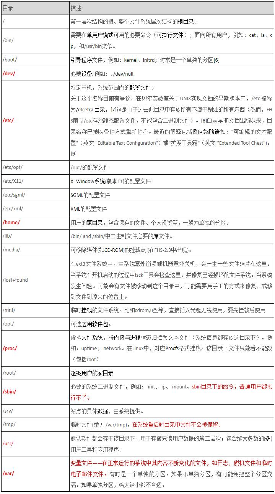
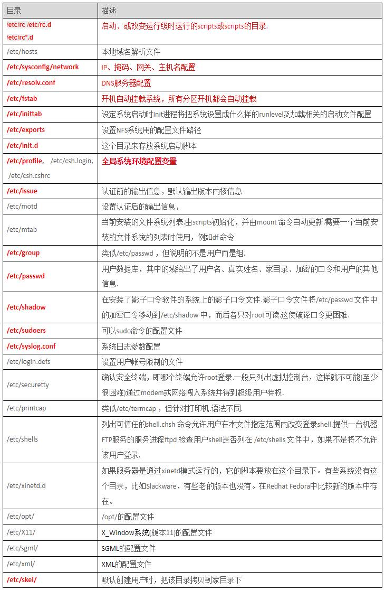
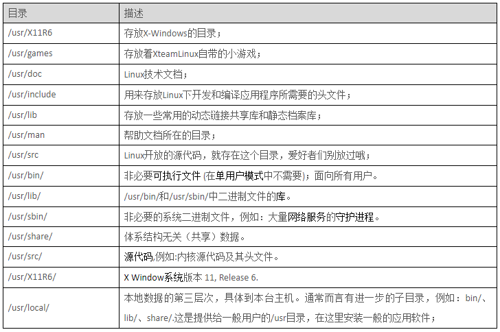
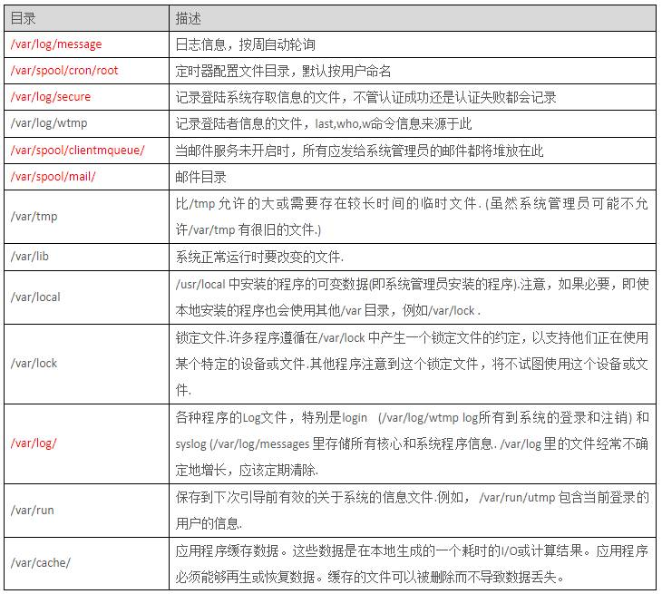
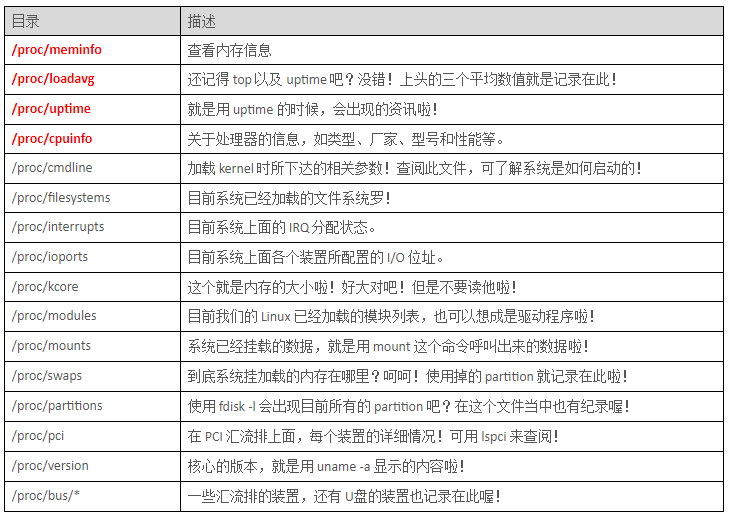
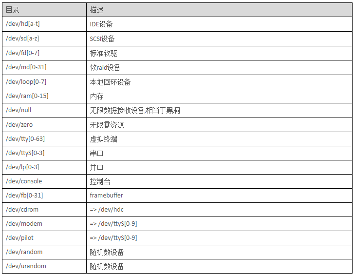

1. 树状目录结构图

    

2. /目录

    

1. /etc/目录

    特定主机系统范围内的配置文件

    

4. /usr/目录

    默认软件都会存于该目录下。用于存储只读用户数据的第二层次；包含绝大多数的用户工具和应用程序

    

5. /var/目录

    /var 包括系统一般运行时要改变的数据.每个系统是特定的，即不通过网络与其他计算机共享

    

6. /proc/目录

    

    虚拟文件系统，将内核与进程状态归档为文本文件(系统信息都存放这目录下)
    例如：uptime、 network。在Linux中，对应Procfs格式挂载。该目录下文件只能看不能改（包括root）

1. /dev/目录

    

    设备文件分为两种：块设备文件(b)和字符设备文件(c)
    设备文件一般存放在/dev目录下
