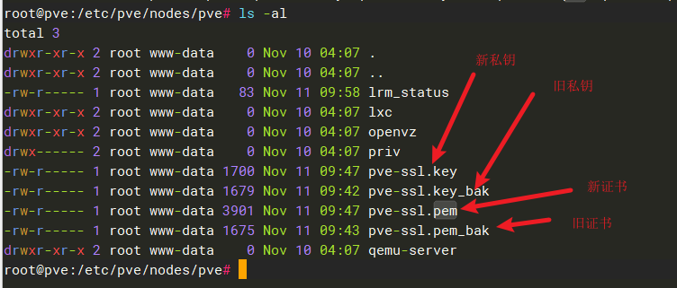

# PVE(Proxmox Virtual Environment) 安装与配置

## 1. 安装

> 暂略

## 2. 配置

### 2-1. https配置

- 登入pve主机

```shell
# 这边最后那个pve是pve的node名, 安装是起的
cd /etc/pve/nodes/pve

# 备份原来的密钥
mv pve-ssl.key pve-ssl.key_bak
mv pve-ssl.pem pve-ssl.pem_bak

# 添加自己的密钥, 名字为pve-ssl.key, pve-ssl.pem
# 查看
ls -al

## 然后重启生效, 先关闭其他虚拟机
reboot
```



