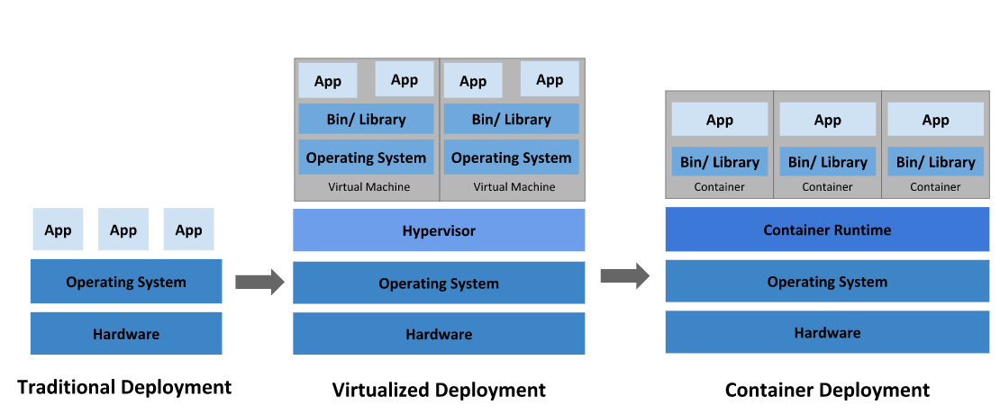
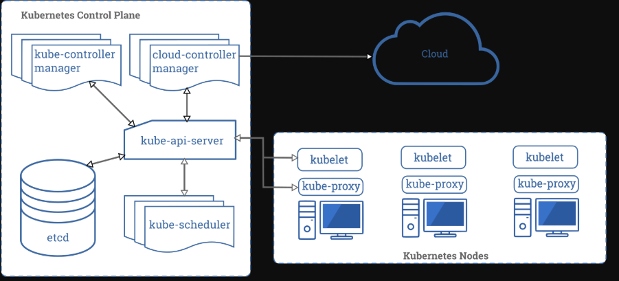
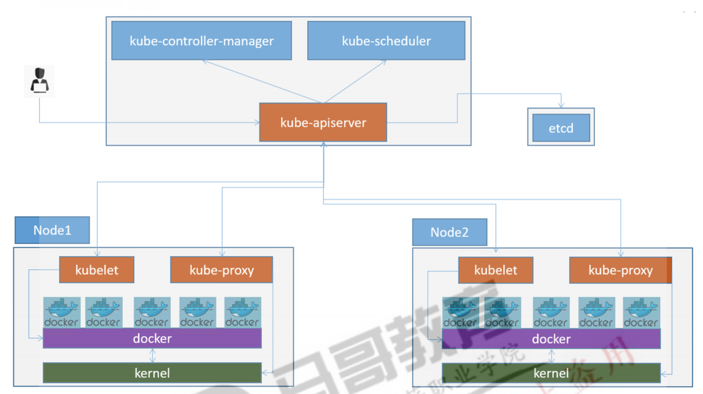
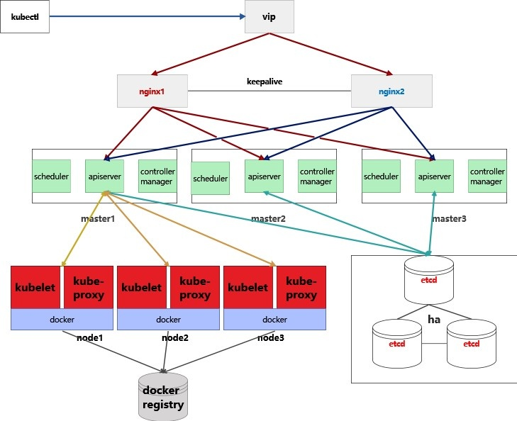
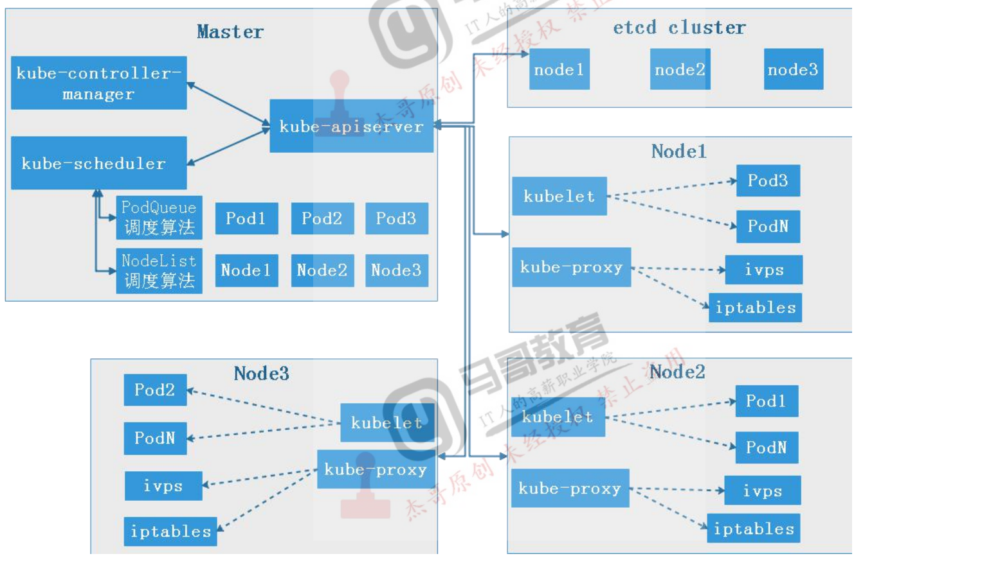

# k8s基本介绍

## 1. kubernetes地址

### 1-1. github地址

- [github.com](https://github.com/kubernetes/kubernetes)

### 1-2. 官方站点

- [kubernetes.io](https://kubernetes.io/)
- [kubernetes.io/docs](https://kubernetes.io/docs/)
- [kubernetes.io/zh](https://kubernetes.io/zh/)
- [kubernetes.org.cn](https://www.kubernetes.org.cn/)
- [github仓库](https://github.com/kubernetes/kubernetes)
- [docs.kubernetes.org.cn](http://docs.kubernetes.org.cn/)
- 在 [API conventions doc](https://github.com/kubernetes/community/blob/master/contributors/devel/sig-architecture/api-conventions.md) 中描述了API的全部协议。
- 在 [API Reference](https://kubernetes.io/docs/reference/) 文档中描述了API的端点、资源类型和示例。
- 在 [Controlling API Access doc](https://kubernetes.io/docs/concepts/security/controlling-access/) 中讨论了通过远程访问API的相关问题
- [CNCF](https://landscape.cncf.io/)

## 2. kubernetes基本介绍

### 2-1. kubernetes是什么？

> Kubernetes是一个可移植、可扩展的、开源的容器管理平台，简称k8s，可用于管理多个主机上的容器化应用程序。 提供应用程序的快速部署，维护和扩展的基本机制。Kubernetes提供了应用程序的快速部署、扩缩容，升级和回滚的能力，利用service可以实现服务注册、发现和四层负载均衡，通过coredns可实现域名解析，通过ingress可以实现七层负载均衡等功能。Kubernetes这个名字源于希腊语，意思是舵手或飞行员。谷歌在2014年开放了Kubernetes项目，Kubernetes建立在谷歌拥有大量运行生产工作量的十五年经验的基础上，结合了社区中的最佳创意和实践，社区活跃度很高。

### 2-2. kubernetes容器编排工具具有哪些优势？

#### 2-2-1. 灵活部署

> kubernetes支持在多种平台部署，可在私有云，公有云，混合云，openstack、openshift、VMware vSphere，VMware Workstation，虚拟机，物理机等环境部署。

#### 2-2-2. 安全高效，拥有完善的认证授权机制，自带审计功能

> 可以对多用户做细化的授权管理（如rbac授权），达到相互之间的操作完全隔离，互不影响，而且自身带有审计功能，可以对操作过程进行实时的日志记录，出现问题可以方便排查。

#### 2-2-3. 负载均衡

> 支持四层、七层负载均衡，可用于多种场景。

#### 2-2-4. 可扩展性强

> 拥有强大的集群扩展能力，可以根据业务规模自动增加和缩减主机节点的数量，确保服务可以承受大量并发带来的压力，保证业务稳定运行。

#### 2-2-5. 根据节点资源的使用情况对pod进行合理的调度

> 可以按照用户需要调度pod，例如保证Pod只在资源足够的节点上运行，会尝试把同一功能的pod分散在不同的节点上，还会尝试平衡不同节点的资源使用率等。

#### 2-2-6. 拥有完善的灾备预警方案

> 拥有多种灾备解决方案，支持备份和容灾，出现故障可以达到秒级切换，保证线上业务不受影响；

### 2-3. kubernetes的功能

#### 2-3-1. 多租户网络隔离

> Kubernetes支持多种网络插件，如flannel，calico，canel等，每个插件都有独特的性能，可以分别适用于多种场景，我们可以利用calico的network policy（网络策略）解决k8s中的网络隔离，对于多租户场景，可以每一个用户一个名称空间（namespace），然后对这个名称空间设置网络隔离。

#### 2-3-2. 高可用，高可扩展性

> kubernetes中支持多种高可用解决方案，如keepalive+nginx，keepalived+haproxy等，可以使访问流量分发到不同的主机节点，减轻节点压力，如果某个节点出现故障，可以实现妙级切换，达到高可用，保证业务不中断。

#### 2-3-3. 用户数据的持久化存储

> kubernetes支持多种持久化存储解决方案，保证数据可以得到很好的备份，降低用户数据丢失的风险，kubernetes中可使用的存储方案如下：
> 
> - 本地存储：emptyDir，hostPath
> - 网络连接类存储：
>   - SAN（存储局域网络）：iSCSI
>   - NAS（网络附加存储）：nfs，cifs
> - 分布式存储：glusterfs，ceph-块级别的存储，cephfs-文件系统级别的存储
> - 云存储：Azure Disk等

#### 2-3-4. 拥有多种更新回滚策略

> 通过管理kubernetes的控制器和service等，可以实现灰度发布，蓝绿部署，金丝雀发布等，达到业务的快速部署和回滚等操作，用以满足不同客户的不同升级需求。

#### 2-3-5. 弹性伸缩

> 根据访问的流量压力，可以实现pod的水平扩容和缩减，达到秒级扩容，让pod始终处于满足业务正常运行时所需的数量即可，避免了资源的浪费

#### 2-3-6. 节省资源，优化硬件资源的使用

> 根据流量进行业务组件的扩缩容，可节省机器资源。

### 2-4. kubernetes应用场景

#### 2-4-1. 通过kubernetes部署高效的日志管理系统

> 在生产环境中，日志对于排查问题至关重要，我们需要有一个日志管理系统，如efk这个最受欢迎的日志管理系统。kubernetes可以实现efk的快速部署和使用，通过statefulset控制器部署elasticsearch组件，es用来存储日志数据，还可通过动态volumeclaimtemplate动态生成pv实现es数据的持久化存储。通过deployment部署kibana组件，实现日志的可视化管理。通过daemonset控制器部署fluentd组件，来收集节点和k8s集群的日志。
> 
> kubernetes中部署efk可实现如下功能：
> 
> - 如果集群扩容，那么daemonset控制器会自动检测到新增加的node节点，就会在新的node节点上部署fluentd，完成日志收集，这就可以减少人为干预，提高工作效率，确保日志可以被正常收集。
> - 如果es数据量大，kubernetes可以实现集群中pod应用的水平扩展，完成应用的弹性扩容和收缩等操作。

#### 2-4-2. kubernetes在DevOps场景下的应用

> DevOps是一套完整的运维开发流程，可以实现快速的构建、测试和发布软件，整个流程包括敏捷开发->持续集成->持续交付->持续部署->DevOps，通过 Kubernetes，我们可以实现容器在多个计算节点上的统一调度，可以将容器对接到持久存储、虚拟网络，还可以实现弹性伸缩等，提高了产品的迭代速度。
> 
> kubernetes在DevOps中可以实现如下功能：
> 
> - 多集群管理：可以根据用户需求对开发，测试，生产环境部署多套kubernetes集群，每个环境使用独立的物理资源，相互之间避免影响。
> - 多环境一致性：Kubernetes是基于docker的容器编排工具，因为容器的镜像是不可变的，所以镜像把 OS、业务代码、运行环境、程序库、目录结构都包含在内，镜像保存在我们的私有镜像仓库，只要用户从我们提供的私有仓库拉取镜像，就能保证环境的一致性。
> - 持续集成，持续部署，持续交付：可以让产品快速迭代，自动部署，根据用户的要求达到持续交付的能力。

#### 2-4-3. kubernetes在微服务架构中的应用

> 微服务可以很好地保证未拆分的应用与已经拆分出来的微服务之间的互通和统一治理，不将业务代码与任何框架，平台或者服务绑定，管理微服务时，我们需要对这些微服务和它们的调用关系进行注册、为其分配资源、创建一定数量的节点副本、并发布到集群中去，同时还要为其配置好网络和负载均衡，使这些微服务能够被外部访问。在这些微服务的运行过程中，需要始终保持其可用性，一旦有节点出现问题，需要立即创建新的节点将其替换掉。运行过程中需要对这些微服务进行监控和日志收集，在负载发生变化的时候，还要能够迅速调整资源分配。
> 
> kubernetes在微服务中可以实现如下功能：
> 
> - 服务发现：通过service可以实现服务发现，支持4层和7层负载均衡，支持安全可靠的https协议和证书认证签发，可实现负载均衡，自修复，自动关联
> - 提供统一的配置管理中心：对于配置中心，K8S提供了configMap，可以在容器启动的时候，将配置注入到环境变量或者 Volume 里面。
> - 弹性伸缩：通过控制器创建指定数量的pod副本，通过hpa可以实现pod应用的水平扩容和回收
> - 集群监控：支持容器，集群和节点级别的监控，提供全面的监控指标，多途径的报警方式及可视化的监控报表
> - 高质量的调度和故障恢复策略：支持节点级别的亲和性调度，支持异地数据备份和故障恢复。
> - 通过jenkins实现持续集成/持续部署：
>   - 保证集群服务高可用：Jenkins Master和Jenkins Slave以Pod形式运行在Kubernetes集群的Node上，当Jenkins Master出现故障时，Kubernetes会自动创建一个新的Jenkins Master容器，并且将Volume分配给新创建的容器，保证数据不丢失，从而达到集群服务高可用。
>   - 动态伸缩：合理使用资源，每次运行Job时，会自动创建一个Jenkins Slave，Job完成后，Slave自动注销并删除容器，资源自动释放，而且Kubernetes会根据每个资源的使用情况，动态分配Slave到空闲的节点上创建，降低出现因某节点资源利用率高，还排队等待该节点的情况。
>   - 扩展性好：当Kubernetes集群的资源严重不足而导致Job排队等待时，可以很容易的添加一个Kubernetes Node到集群中，从而实现扩展。

### 2-5. Kubernetes特点

- 可移植: 支持公有云，私有云，混合云，多重云（multi-cloud）
- 可扩展: 可根据业务流量情况快速扩展kubernetes集群的节点数量。
- 自愈: 自动发布，自动重启，自动复制，自动扩展
- 进程协同：利用复合应用保证应用和容器一对一的模型。

### 2-6. kubernetes可实现的功能

- 存储系统挂载
- 分发密钥
- 应用健康检测：livenessprobe，readnessprobe
- 应用实例复制
- 水平自动扩展
- 命名和发现
- 负载均衡
- 滚动更新
- 资源监控
- 日志访问
- 自检和调试
- 识别和认证
- 这为PaaS提供了IaaS层的便利，提供了基础设施提供者间的可移植性。

### 2-7. kubernetes1.18+新增功能

> Kubernetes1.18是2020年发行的第一个新的版本，Kubernetes 1.18包含了38个增强功能，其中15个增强功能已趋于稳定，beta增强了11个，alpha增强了12个。
> 注：
> 
> - alpha：表示内测版本
> - beta：表示公测版本，还没有稳定
> - stable：表示稳定版本

## 3. 主要功能

### 3-1. KubernetesTopology Manager（kubernetes拓扑管理器）-beta版本

> 拓扑管理器是kubernetes1.18版中的beta功能，在引入拓扑管理器之前，CPU和设备管理器将做出彼此独立的资源分配决策，这可能会导致在多套接字系统上资源分配分配不均的问题，从而导致关键型应用程序的性能下降，拓扑管理器可以使CPU和设备实现NUMA对齐，这将使工作负载在针对低延迟而优化的环境中运行。

### 3-2. ServersideApply（服务端apply）-beta2版本

> 服务器端Apply在1.16中升级为Beta，现在在1.18中增强到第二版Beta，这个新版本将跟踪和管理所有新Kubernetes对象的字段更改，从而知道什么更改了资源以及何时更改。

### 3-3. ExtendingIngress with and replacing a deprecated annotation with IngressClass（使用IngressClass扩展Ingress并用IngressClass替换不推荐使用的注释）-stable版

> 在Kubernetes 1.18中，Ingress有两个重要的改进：pathType字段和IngressClass资源。pathType字段允许指定路径应如何匹配。除了默认ImplementationSpecific类型外，还有new Exact和Prefixpath类型。IngressClass资源用于描述Kubernetes集群中的Ingress类型。入口可以通过ingressClassName在入口上使用新字段来指定与它们关联的类。此新资源和字段替换了不建议使用的kubernetes.io/ingress.class注释。

### 3-4. SIG-CLIintroduces kubectl alpha debug（SIG-CLI引入kubectlalpha调试）-alpha版

> 随着临时容器的发展，我们可以通过在kubectl exec，该kubectl alpha debug命令的添加使开发人员可以轻松地在集群中调试其Pod，此命令允许创建一个临时容器，该容器在要检查的Pod旁边运行，并且还附加到控制台以进行交互式故障排除。

### 3-5. IntroducingWindows CSI support alpha for Kubernetes（为Kubernetes引入Windows CSI支持）-alpha版

> 随着Kubernetes1.18的发布，用于Windows的CSI代理的Alpha版本也已发布。CSI代理使非特权（预先批准）的容器能够在Windows上执行特权存储操作。现在，可以利用CSI代理在Windows中支持CSI驱动程序。

## 4. 传统部署和容器部署对比



### 4-1. 传统部署时代

> 早期，应用程序在物理服务器上运行。无法为物理服务器中的应用程序定义资源边界，这会导致资源分配问题。例如，如果在物理服务器上运行多个应用程序，则可能会出现一个应用程序占用大部分资源的情况，结果可能导致其他应用程序的性能下降。一种解决方案是在不同的物理服务器上运行每个应用程序，但是由于资源利用不足而无法扩展，并且许多物理服务器的维护成本也很高。

### 4-2. 虚拟化部署时代

> 作为解决方案，引入了虚拟化功能，它允许你在单个物理服务器的CPU 上运行多个虚拟机（VM）。虚拟化功能允许应用程序在 VM 之间隔离，并提供安全级别，因为一个应用程序的信息不能被另一应用程序自由地访问。因为虚拟化可以轻松地添加或更新应用程序、降低硬件成本等，所以虚拟化可以更好地利用物理服务器中的资源，并可以实现更好的可伸缩性。每个VM 是一台完整的计算机，在虚拟化硬件之上运行所有组件，包括其自己的操作系统。

### 4-3. 容器部署时代

> 容器类似VM，但是它们具有轻量级的隔离属性，可以在应用程序之间共享操作系统（OS）。因此，容器被认为是轻量级的。容器与VM 类似，具有自己的文件系统、CPU、内存、进程空间等。由于它们与基础架构分离，因此可以跨云和OS分发进行移植。容器因具有许多优势而变得流行起来。
> 
> 容器的一些好处：

- 敏捷应用程序的创建和部署

> 与使用VM镜像相比，提高了容器镜像创建的简便性和效率。

- 持续开发、集成和部署

> 通过快速简单的回滚(由于镜像不可变性)，提供可靠且频繁的容器镜像构建和部署。

- 关注开发与运维的分离

> 在构建/发布时而不是在部署时创建应用程序容器镜像，从而将应用程序与基础架构分离。

- 可观察性
  
  > 不仅可以显示操作系统级别的信息和指标，还可以显示应用程序的运行状况和其他指标信号

- 跨开发、测试和生产的环境一致性

> 在便携式计算机上与在云中相同地运行。

- 云和操作系统分发的可移植性

> 可在 Ubuntu、RHEL、CoreOS、本地、Google Kubernetes Engine 和其他任何地方运行。

- 以应用程序为中心的管理

> 提高抽象级别，从在虚拟硬件上运行 OS 到在 OS 上运行应用程序。

- 松散耦合、分布式、弹性、解放的微服务

> 应用程序被分解成较小的独立部分，并且可以动态部署和管理 - 而不是在一台大型单机上整体运行。

- 资源隔离

> 可预测的应用程序性能。

- 资源利用

> 高效率和高密度

## 5. [kubernetes组件介绍](https://kubernetes.io/zh/docs/reference/command-line-tools-reference/kube-apiserver/)

> 一个Kubernetes集群是由一组工作机器组成，这些机器称为节点，在这些节点上运行容器部署的应用程序。 每个k8s集群至少有一个工作节点。工作节点主要用来运行部署应用程序的pod。 control plane（控制平面也可成为master节点）用来管理工作节点和整个kubernetes集群的pod。 在生产环境中，master节点通常跨越多台计算机，集群通常运行多个节点，提供容错和高可用性。下面内容会给大家介绍kubernetes集群中涉及到的所有组件。
> 
> 以下是几张帮助理解的图：









### 5-1. 基础组件

> 控制平面的组件我们会找一台单独的机器来部署，我们习惯上把部署控制平面组件的机器称为master节点，以下都会用master节点来代替控制平面这个概念，master节点的组件能够对k8s的集群做出全局决策（例如，调度），以及检测和响应集群事件(例如，当部署的副本字段不满足时启动一个新的POD)。Master节点组件可以在k8s集群中的任何机器上运行。 然而，为了简单起见，通常会在同一台机器上启动所有控制平面组件，这台机器上最好不运行其他的容器化程序，所以我们就把专门部署控制平面组件的集群称为master节点。

#### 5-1-1. kube-apiserver

> kube-apiserver是Kubernetes master节点的组件，它公开了Kubernetes API。 API服务是Kubernetes master节点的前端。Kubernetes API服务是通过kube-apiserver组件实现的，kube-apiserver被设计成可以进行自动扩缩容，你可以运行多个kube-apiserver组件，通过keepalive+lvs或者其他负载均衡策略在这些组件之间平衡流量。kube-apiserver提供了资源操作的唯一入口，并提供认证、授权、访问控制、API注册和发现等机制，负责接收、解析、处理请求。

#### 5-1-2. kube-scheduler

> kube-scheduler是kubernetes master节点的组件，用来监视已经被创建但是没有调度到node节点的pod，然后选择一个node节点用来运行它，kube-scheduler主要是负责pod的调度，按照预定的调度策略（如亲和性，反亲和性等）将Pod调度到相应的机器上, 并记录到etcd上。
> 
> - 通过调度算法为带调度的pod列表的每个pod从可用的node列表中选择最合适的node, 并将信息写入etcd
> - node节点上的kubelet通过kube-apiserver监听到kubernetes scheduler产生的pod绑定信息, 然后获取对应的pod清单, 下载容器, 并部署
> 
> 删选策略:
> 
> 1. leastRequestedPriority: 优先从备选节点列表中选择资源消耗最小的节点(CPU+Mem)
> 2. CalculateNodeLabelPriority: 优先选择含有指定Label的节点
> 3. BalancedResourceAllocation: 优先从备选节点中现在各项资源使用率最均衡的接口点

#### 5-1-3. kube-controller-manager

> 控制器管理器，用来检测控制器健康状态的，控制器是负责维护集群的状态，检查pod的健康状态，比如故障检测、自动扩展、滚动更新等一些操作.
> 
> 作为集群的内部的管理中心, 负责集群内的node. pod, 服务端点, 命名空间, 服务账号, 资源定额,的管理, 当某个node宕机时会及时发现并执行自动化修复流程, 确保集群中的pod副本始终处于预期状态
> 
> - 控制器每间隔5秒检查一次节点状态
> - 没有收到节点心跳, 则标记为不可达
> - 标记不可达5分钟未回复, 控制器会删除当前node节点的所有pod并在其他节点重建

#### 5-1-4. etcd([官网](https://etcd.io))

> etcd是一个key/value形式的键值存储，保存了整个kubernetes集群的状态，在kubernetes中使用etcd时，需要对etcd做备份，保证高可用。整个kubernetes系统中一共有两个服务需要用到etcd，用etcd来协同和存储配置，分别是：
> 
> - 网络插件calico、对于其它网络插件也需要用到etcd存储网络的配置信息
> 
> - kubernetes本身，包括各种对象的状态和元信息配置
> 
> > 注意：网络插件操作etcd使用的是v2的API，而kubernetes操作etcd使用的v3的API，所以在下面我们执行etcdctl的时候需要设置ETCDCTL_API环境变量，该变量默认值为2，表示使用v2版本的etcd api，v3表示使用v3版本的etcd api

#### 5-1-5. docker(所有节点)

> 是一个容器引擎，用于运行容器

#### 5-1-6. kube-proxy(所有节点)

> k8s代理，是在集群中的每个节点上运行的网络代理，kube-proxy负责请求转发，一旦发现了某一个Service关联的Pod信息发生了改变（如IP、Port等），由Kube-Proxy就会把变化后的service转换成IPVS或IPtables规则中，完成对后端pod的负载均衡
> 
> kube-proxy 是集群中每个节点上运行的网络代理，是实现service资源功能组件之一。kube-proxy 建立了pod网络和service网络之间的关系，即 cluster ip 和 pod ip 中间的关系。不同node上的service流量转发规则会通过kube-proxy进行更新，其实是调用apiserver访问etcd进行规则更新。
> 
> 可以理解为它是service -> pod(serviceIP转发到podIP)的iptalbes或ipvs的规则管理器
> 
> **pod网络是由kubelet管理的，而不是kube-proxy, 而pod间通信的具体实现有cni网络插件负责**

```shell
# 查看ipvs 规则
ipvsadm -ln
#查看iptables规则
iptables -t nat -vnL
```

#### 5-1-7. CNI网络插件(所有节点)

> Kubernetes设计了网络模型，但是却将具体实现方式交给了网络插件来实现，CNI网络插件实现的是pod之间跨宿主机进行通信。默认情况下安装好node节点后，无法跨node进行宿主机通信, 主要是通过cni实现
> 
> CNI网络插件有很多，比如：Flannel、Calico、Canal、Contiv、OpenContrail等，其中最常用的是Flannel和Calico两种。Flannel在node节点比较少，不跨网段时性能比较好，也是市场占有率比较高的网络插件。
> 
> **pod网络是由kubelet管理的，而不是kube-proxy, 而pod间通信的具体实现有cni网络插件负责**

#### 5-1-8. coredns

> k8s1.11之前使用的是kube dns，1.11之后才有coredns，coredns是一个DNS服务器，能够为Kubernetes services提供DNS记录
> 
> 主要就是解析:  serviceName ->  serviceIP

#### 5-1-9. kubelet(所有节点)

> 负责apiserver进行通信的，接收到客户的请求，进行创建Pod，管理Pod，启动pod等相关操作
> 
> 1. 汇报node节点的状态信息
> 2. 接收指令并在节点中创建资源
> 3. 准备pod所需的数据卷
> 4. 返回pod的运行状态
> 5. 在node节点执行容器的健康检查
> 
> **pod网络是由kubelet管理的，而不是kube-proxy, 而pod间通信的具体实现有cni网络插件负责**

### 5-2. 附加组件

> 附件组件使用kubernetes的资源（如daemonset，deployment，statefulset等）实现集群功能，因为它们提供的是集群级别的属性，所以这些附件组件都需要部署到kube-system这个名称空间下。

### 5-2-2. Web UI（Dashboard）

> Dashboard是k8s集群的一个web ui界面，通过这个界面可以对k8s资源进行操作，如创建pod，创建存储，创建网络等，也可以监控pod和节点资源使用情况。

### 5-3-3. Ingress Controller

> 七层负载均衡控制器，可以通过创建nginx或者traefik这种七层负载组件，实现域名和https访问。

### 5-2-4. prometheus+alertmanager+Grafana

> 监控系统，可以对kubernetes集群本身的组件监控，也可对物理节点，容器做监控，对监控到的超过报警阀值的数据进行报警，这个报警会发送到指定的目标，如钉钉，微信，qq，slack等。

### 5-2-5. efk-（全称elasticsearch、fluentd、kibana）

> 日志管理系统，可以对物理节点和容器的日志进行统一收集，把收集到的数据在kibana界面展示，kibana提供按指定条件搜索和过滤日志。

### 5-2-6. metrics

> 用于收集资源指标，hpa需要基于metrics实现自动扩缩容
