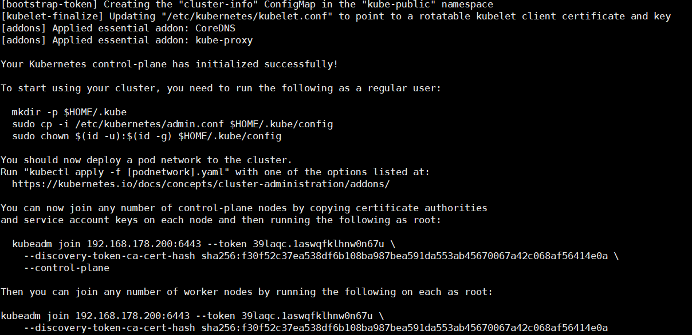
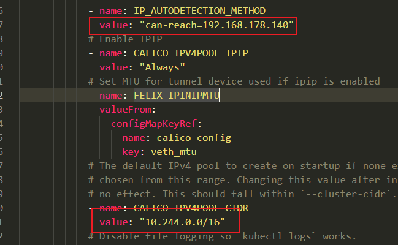
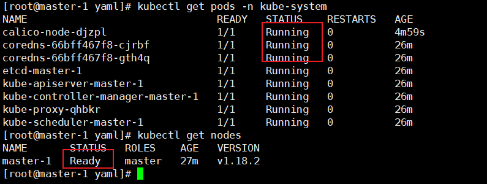
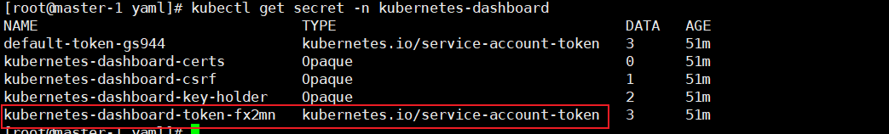
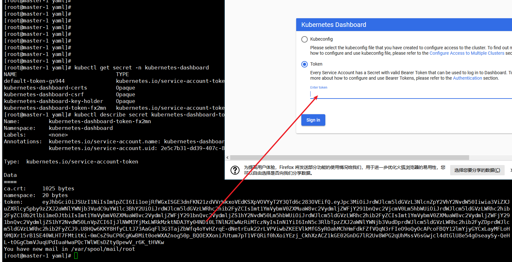
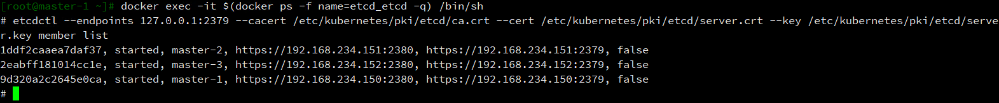

# k8s集群搭建

## 1. 配置集群master和node机器, 所有节点操作

### 1-1. 开启机器, 初始化, 配置ip等

```conf
#描述网卡对应的设备别名，例如ifcfg-ens32的文件中它为ens32
DEVICE=ens33
#设置网卡获得ip地址的方式，选项为static（静态），dhcp，bootp
BOOTPROTO=static
#类型=以太网络
TYPE=Ethernet
#代理模式
PROXY_METHOD=none
# 网卡物理设备名称
NAME=ens32
#启动或者重启网络时，是否启动该设备，yes是启动，no是不启动
ONBOOT=yes
IPADDR=192.168.178.141
NETMASK=255.255.255.0
#网关
GATEWAY=192.168.178.2
#DNS服务器地址
DNS1=192.168.178.2
# 默认路由
DEFROUTE=yes
# ipv4致命错误检测
IPV4_FAILURE_FATAL=no
# ipv6 自动初始化
IPV6INIT=yes
# ipv6自动配置
IPV6_AUTOCONF=yes
# ipv6 默认路由
IPV6_DEFROUTE=yes
# ipv6致命错误检测
IPV6_FAILURE_FATAL=no``
# ipv6地址生成模型
IPV6_ADDR_GEN_MODE=stable-privacy

BROWSER_ONLY=no
```

### 1-2. 配置yum源

```shell
# 备份
mv /etc/yum.repos.d/CentOS-Base.repo /etc/yum.repos.d/CentOS-Base.repo.backup
# 使用阿里源
wget -O /etc/yum.repos.d/CentOS-Base.repo https://mirrors.aliyun.com/repo/Centos-7.repo

# 个人建议卸载epel-release, 因为我们使用了阿里源, 不然每次安装老是要更新epel
yum erase epel-release -y
```

### 1-2. 配置安装k8s和docker需要的yum源

```shell
# k8s
cat > /etc/yum.repos.d/kubernetes.repo <<-EOF 
[kubernetes]
name=Kubernetes
baseurl=https://mirrors.aliyun.com/kubernetes/yum/repos/kubernetes-el7-x86_64
enabled=1
gpgcheck=0
EOF

# docker
yum-config-manager --add-repo http://mirrors.aliyun.com/docker-ce/linux/centos/docker-ce.repo
# 清理yum缓存 
yum clean all
# 生成缓存
yum makecache fast
```

### 1-3. 更新yum源, 安装软件包

```shell
yum -y update
# , yum-utils 提供了 yum-config-manager ，并且 device mapper 存储驱动程序需要 device-mapper-persistent-data 和 lvm2
yum -y install yum-utils device-mapper-persistent-data lvm2

yum -y install net-tools nfs-utils lrzsz gcc gcc-c++ make cmake libxml2-devel openssl-devel curl curl-devel unzip ntp libaio-devel wget vim ncurses-devel autoconf automake zlib-devel  python-devel openssh-server keepalived socat ipvsadm conntrack ntpdate
```

### 1-4. 其他配置

#### 1-4-1. 关闭防火墙

```shell
systemctl stop firewalld && systemctl disable firewalld
```

#### 1-4-2. 设置时间

```shell
rm -f /etc/localtime
cp /usr/share/zoneinfo/Asia/Shanghai /etc/localtime
# 或
ln -sfn /usr/share/zoneinfo/Asia/Shanghai /etc/localtime

ntpdate ntp1.aliyun.com
# 设置定时同步时间
crontab -e
* */1 * * * /usr/sbin/ntpdate ntp1.aliyun.com
```

### 1-5. 禁用SELINUX

```shell
vim /etc/selinux/config
# 或执行命令
sed -i 's/SELINUX=enforcing/SELINUX=disabled/'  /etc/selinux/config
# 当前临时关闭selinux
setenforce 0
```

### 1-5. 关闭交换分区

```shell
# 临时关闭
swapoff -a
# 永久关闭
sed -i 's/.*swap.*/#&/' /etc/fstab
```

### 1-6. 配置路由参数,防止kubeadm报路由警告(<font color=green>这步可以不做...后面有做了</font>)

> CentOS 7上的某些用户报告了由于iptables被绕过而导致流量被错误路由的问题。你应该确保net.bridge.bridge-nf-call-iptables在你的sysctl配置中设置为1。试验下来即使是firewalld的也要修改配置

```shell
cat > /etc/sysctl.d/k8s.conf <<- EOF
net.ipv4.ip_forward = 1
net.bridge.bridge-nf-call-iptables = 1
net.bridge.bridge-nf-call-ip6tables = 1
net.bridge.bridge-nf-call-arptables = 1
net.ipv4.tcp_tw_recycle = 0
net.ipv4.tcp_tw_reuse = 0
net.core.somaxconn = 32768
net.netfilter.nf_conntrack_max=1000000
vm.swappiness = 0
vm.max_map_count=655360
fs.file-max=6553600
net.ipv4.tcp_keepalive_time = 600
net.ipv4.tcp_keepalive_intvl = 30
net.ipv4.tcp_keepalive_probes = 10
EOF

# 立即生效
sysctl --system
```

### 1-7. 设置主机名和配置主机解析

```shell
# 设置主机名
hostnamectl --static set-hostname 主机名

# 配置主机解析
vim /etc/hosts

192.168.178.140     master-1
192.168.178.141     master-2
192.168.178.142     master-3
192.168.178.145     node-1
192.168.178.146     node-2
192.168.178.147     node-3
```

### 1-8. 所有节点准备好镜像资源和yaml文件

```shell
# 资源到拷贝到这个文件夹, 并解压, 之后都在这个文件夹下操作
mkdir -p ~/workspace/k8s
```

> 链接：[url](https://pan.baidu.com/s/1qtrpl6To7BQN9J08ky9b0Q)
> 
> 提取码：kmez

### 1-9.  重启

```shell
reboot
```

## 2. 安装/卸载docker

### 2-1. 查看版本

```shell
yum list docker-ce --showduplicates |sort -r
```

### 2-2. 安装

```shell
yum install -y docker-ce-19.03.7-3.el7

# 启动docker, 设置开机启动
systemctl enable docker && systemctl start docker
```

### 2-3. 配置docker

#### 2-3-1. 修改docker配置文件

> [设置阿里云镜像加速](https://cr.console.aliyun.com/cn-hangzhou/instances/mirrors)
> 
> 镜像中心 -> 镜像加速器, 根据文档配置

```shell
cat > /etc/docker/daemon.json <<-EOF
{
  "registry-mirrors": ["https://docker.mirrors.ustc.edu.cn"], 
  "insecure-registries": [],
  "max-concurrent-downloads": 10,
  "exec-opts": ["native.cgroupdriver=systemd"],
  "log-driver": "json-file",
  "log-level": "warn",
  "log-opts": {
    "max-size": "10m",
    "max-file": "3"
    },
  "data-root": "/var/lib/docker",
  "storage-driver": "overlay2",
  "storage-opts": [
        "overlay2.override_kernel_check=true"
    ]
}
EOF
```

#### 2-3-2. 这边dockers一定要重启, 否则上面的配置不生效, 会出问题

```shell
systemctl daemon-reload && systemctl restart docker

# 查看Cgroup Driver: systemd 才可以
docker info | grep "Cgroup Driver"
```

### 2-4. 设置网桥包经IPTables，core文件生成路径，配置永久生效

> vm.swappiness, Linux内核参数，控制换出运行时内存的相对权重。swappiness参数值可设置范围在0到100之间。 低参数值会让内核尽量少用交换，更高参数值会使内核更多的去使用交换空间。默认值为60（参考网络资料：当剩余物理内存低于40%（40=100-60）时，开始使用交换空间）。对于大多数操作系统，设置为100可能会影响整体性能，而设置为更低值（甚至为0）则可能减少响应延迟
> 
> vm.swappiness = 0 当剩余空闲内存低于vm.min_free_kbytes limit时，使用交换空间
> 
> net.ipv4.ip_forward 路由转发

```shell
# 立即生效
echo 1 > /proc/sys/net/bridge/bridge-nf-call-iptables
echo 1 > /proc/sys/net/bridge/bridge-nf-call-ip6tables

echo """
net.ipv4.ip_forward = 1
net.bridge.bridge-nf-call-iptables = 1
net.bridge.bridge-nf-call-ip6tables = 1
net.bridge.bridge-nf-call-arptables = 1
net.ipv4.tcp_tw_recycle = 0
net.ipv4.tcp_tw_reuse = 0
net.core.somaxconn = 32768
net.netfilter.nf_conntrack_max=1000000
vm.swappiness = 0
vm.max_map_count=655360
fs.file-max=6553600
net.ipv4.tcp_keepalive_time = 600
net.ipv4.tcp_keepalive_intvl = 30
net.ipv4.tcp_keepalive_probes = 10
""" > /etc/sysctl.d/k8s.conf

sysctl -p
```

### 2-5. 开启ipvs

> 不开启ipvs将会使用iptables，但是效率低，所以官网推荐需要开通ipvs内核
> 
> 使用EOF是里面有$变量要使用\$, 或EOF加引号"EOF", 否则有可能会被直接执行

```shell
cat > /etc/sysconfig/modules/ipvs.modules <<-"EOF"
#!/bin/bash
ipvs_modules="ip_vs ip_vs_lc ip_vs_wlc ip_vs_rr ip_vs_wrr ip_vs_lblc ip_vs_lblcr ip_vs_dh ip_vs_sh ip_vs_fo ip_vs_nq ip_vs_sed ip_vs_ftp nf_conntrack"
for kernel_module in ${ipvs_modules}; do
    /sbin/modinfo -F filename ${kernel_module} > /dev/null 2>&1
    if [ $? -eq 0 ]; then
        /sbin/modprobe ${kernel_module}
    fi
done
EOF

# 修改权限, 加载, 查看
chmod 755 /etc/sysconfig/modules/ipvs.modules && bash /etc/sysconfig/modules/ipvs.modules && lsmod | grep ip_vs
```

## 3. 安装kubernetes 1.18.2

### 3-1. master安装及配置

#### 3-1-1. 安装kubeadm和kubelet

```shell
# 有时yum install kubeadm后其他的当作依赖也装上了
yum install kubeadm-1.18.2 kubelet-1.18.2 kubectl-1.18.2 -y
systemctl enable kubelet


# 如果要改k8s驱动的话
vim /etc/systemd/system/kubelet.service.d/10-kubeadm.conf

# 找到[Service] 底下的的添加
Environment="KUBELET_CGROUP_ARGS=--cgroup-driver=systemd"

systemctl daemon-reload
```

#### 3-1-2. 安装镜像(自己打包好的镜像)

> master上需要镜像,镜像都保存在百度网盘: kubernetes1.18镜像
> 
> - kube-proxy
> - pause
> - etcd
> - coredns
> - calico
> - kube-apiserver
> - kube-scheduler
> - kubernetes-dashboard-amd64
> - addon-resizer
> - metrics-server-amd64
> - kube-controller-manager
> - traefik

```shell
docker load -i images/1-18-kube-apiserver.tar.gz
docker load -i images/1-18-kube-scheduler.tar.gz
docker load -i images/1-18-kube-controller-manager.tar.gz
docker load -i images/1-18-pause.tar.gz
docker load -i images/1-18-coredns.tar.gz
docker load -i images/1-18-etcd.tar.gz
docker load -i images/1-18-kube-proxy.tar.gz
```

> 直接使用一下命令也可以查看并安装所需组件

```shell
kubeadm config images list
kubeadm config images pull
```

#### 3-1-3. 部署keepalive+lvs

> 实现master节点高可用-对apiserver做高可用

##### 3-1-3-1. 安装keepalive+lvs

> 在1-3中安装过就不用了

```shell
yum install -y socat keepalived ipvsadm conntrack
```

##### 3-1-3-2. 配置master节点keepalived, 所有master上都要配置

> keepalived需要配置BACKUP，而且是非抢占模式nopreempt，假设master1宕机，启动之后vip不会自动漂移到master1，这样可以保证k8s集群始终处于正常状态，因为假设master1启动，apiserver等组件不会立刻运行，如果vip漂移到master1，那么整个集群就会挂掉，这就是为什么我们需要配置成非抢占模式了
> 启动顺序master1->master2->master3，在master1、master2、master3依次执行如下命令
> 
> 参数说明
> 
> - state BACKUP    master1停机vip会跳到其他master节点上
> 
> - nopreempt   非抢占模式 , 如果master1开机vip会跳到master1但是此时master1很多组件还未启动, 所以要配置非抢占模式

```shell
# 文件里面原有的内容可以删掉
vim /etc/keepalived/keepalived.conf
```

```conf
#priority 100 需要变动, 其余IP实际情况变动
global_defs {
    router_id LVS_DEVEL
}
vrrp_instance VI_1 {
    state BACKUP
    nopreempt
    interface ens33
    virtual_router_id 80
    priority 100
    advert_int 1
    authentication {
        auth_type PASS
        auth_pass baccba
    }
    virtual_ipaddress {
        192.168.178.149
    }
}
virtual_server 192.168.178.149 6443 {
    delay_loop 6
    lb_algo loadbalance
    lb_kind DR
    net_mask 255.255.255.0
    persistence_timeout 0
    protocol TCP
    real_server 192.168.178.141 6443 {
        weight 1
        SSL_GET {
            url {
                path /healthz
                status_code 200
            }
            connect_timeout 3
            nb_get_retry 3
            delay_before_retry 3
        }
    }
    real_server 192.168.178.142 6443 {
        weight 1
        SSL_GET {
            url {
                path /healthz
                status_code 200
            }
            connect_timeout 3
            nb_get_retry 3
            delay_before_retry 3
        }
    }
    real_server 192.168.178.143 6443 {
        weight 1
        SSL_GET {
            url {
                path /healthz
                status_code 200
            }
            connect_timeout 3
            nb_get_retry 3
            delay_before_retry 3
        }
    }
}
```

##### 3-1-3-3. 启动keepalive

```shell
systemctl enable keepalived  && systemctl start keepalived && systemctl status keepalived
```

##### 3-1-3-4. 配置kubeadm[参考](https://kubernetes.io/zh/docs/setup/production-environment/tools/kubeadm/control-plane-flags/)

> 以下两种方式都要指定control-plane-endpoint， 没有的话好像不能做高可用只能单机

###### 3-1-3-4-1. yaml 文件init

> 编辑kubeadm-init.yaml
> 
> 可以使用查看default init config, 因为每个版本的配置有可能不一样

```shell
# 这个一般够用啦
kubeadm config print init-defaults
# 更多的配置执行以下两条命令
kubeadm config print init-defaults --component-configs KubeletConfiguration
kubeadm config print init-defaults --component-configs KubeProxyConfiguration
```

> 这边我们就是用下面这个就行了

```yaml
apiVersion: kubeadm.k8s.io/v1beta2
kind: ClusterConfiguration
kubernetesVersion: v1.18.2
controlPlaneEndpoint: 192.168.178.155:6443
# 如果没有手动上传镜像到master之添加镜像仓库参数
# imageRepository: registry.aliyuncs.com/google_containers
apiServer:
    certSANs:
        - 192.168.178.140
        - 192.168.178.141
        - 192.168.178.142
        - 192.168.178.145
        - 192.168.178.146
        - 192.168.178.147
        - 192.168.178.155
networking:
    podSubnet: 10.244.0.0/16
---
apiVersion: kubeproxy.config.k8s.io/v1alpha1
kind: KubeProxyConfiguration
mode: ipvs
```

```shell
# 这条命令有时比较慢等个两分钟, 不行的话执行reset操作
kubeadm init --config yaml/kubeadm-init.yaml
```

###### 3-1-3-4-2. 命令行初始化

```shell
kubeadm init --control-plane-endpoint 192.168.178.140:6443 --pod-network-cidr 10.244.0.0/16 --service-cidr 10.96.0.0/16  --image-repository registry.aliyuncs.com/google_containers
```

###### 3-1-3-4-3. 查看集群配置

```shell
kubectl -n kube-system get cm kubeadm-config -o yaml
```

##### 3-1-3-5. 初始化失败

> 如果失败了先reset,解决失败原因再init

```shell
kubeadm reset
kubeadm init --config yaml/kubeadm-init.yaml
```



> 根据上面的提示配置admin操作权限, 有两个 kubeadm join命名要记录下来, 后面要用

```shell
mkdir -p $HOME/.kube
cp -i /etc/kubernetes/admin.conf $HOME/.kube/config
chown $(id -u):$(id -g) $HOME/.kube/config
```

##### 3-1-3-6. 安装calico

> 查看node和pods状态

```shell
kubectl get nodes
kubectl get pods -n kube-system -o wide
```

> 通过上面可以看到STATUS状态是NotReady，coredns是pending，是因为没有安装网络插件，需要安装calico或者flannel，接下来我们安装calico，在各节点安装calico网络插件, 需要镜像cni.tar.gz和calico-node.tar.gz
> 
> 所有master上都要安装

```shell
docker load -i images/calico-node.tar.gz
docker load -i images/cni.tar.gz
```

> 配置calico
> 
> 有两个ip参数改成自己的就好了



> 一个master上运行即可

```shell
kubectl apply -f yaml/calico.yaml
```

> 再次查看状态

```shell
kubectl get nodes
kubectl get pods -n kube-system -o wide
```



##### 3-1-3-7. 配置master2, master3

> 配置证书, 把master1运行生成的证书拷贝到其他master

```shell
# 其他master上运行
mkdir -p /etc/kubernetes/pki/etcd && mkdir -p ~/.kube/

# 以下在运行了kubeadm init --conifg 命令的master上运行, 我这边是master1
scp /etc/kubernetes/pki/ca.crt master-2:/etc/kubernetes/pki/ 
scp /etc/kubernetes/pki/ca.key master-2:/etc/kubernetes/pki/ 
scp /etc/kubernetes/pki/sa.key master-2:/etc/kubernetes/pki/ 
scp /etc/kubernetes/pki/sa.pub master-2:/etc/kubernetes/pki/ 
scp /etc/kubernetes/pki/front-proxy-ca.crt master-2:/etc/kubernetes/pki/ 
scp /etc/kubernetes/pki/front-proxy-ca.key master-2:/etc/kubernetes/pki/ 
scp /etc/kubernetes/pki/etcd/ca.crt master-2:/etc/kubernetes/pki/etcd/ 
scp /etc/kubernetes/pki/etcd/ca.key master-2:/etc/kubernetes/pki/etcd/ 

scp /etc/kubernetes/pki/ca.crt master-3:/etc/kubernetes/pki/ 
scp /etc/kubernetes/pki/ca.key master-3:/etc/kubernetes/pki/ 
scp /etc/kubernetes/pki/sa.key master-3:/etc/kubernetes/pki/ 
scp /etc/kubernetes/pki/sa.pub master-3:/etc/kubernetes/pki/ 
scp /etc/kubernetes/pki/front-proxy-ca.crt master-3:/etc/kubernetes/pki/ 
scp /etc/kubernetes/pki/front-proxy-ca.key master-3:/etc/kubernetes/pki/ 
scp /etc/kubernetes/pki/etcd/ca.crt master-3:/etc/kubernetes/pki/etcd/ 
scp /etc/kubernetes/pki/etcd/ca.key master-3:/etc/kubernetes/pki/etcd/
```

> 加入高可用集群master节点上运行, master2 master3上运行, 下面命令是之前运行kubeadm init是输出的, 都不一样

```shell
kubeadm join 192.168.178.200:6443 --token j90jnr.0toqcc46fapbeami \
    --discovery-token-ca-cert-hash sha256:9317b9a8df641260b8ccafb18f9363ab22f15108ba8437dcfe67bb5a047363a4 \
    --control-plane
```

> 如果忘记了可以在次生成一个, 在输出的里面加上 --control-plane运行即可

```shell
kubeadm  token create --print-join-command
```

> 添加权限

```shell
mkdir -p $HOME/.kube
cp -i /etc/kubernetes/admin.conf $HOME/.kube/config
chown $(id -u):$(id -g) $HOME/.kube/config
```

### 3-2. node安装及配置

> node下只要三个基础镜像就好了
> 
> - kube-proxy
> - calico
> - cni
> - pause

#### 3-2-1. 安装kubeadm和kubelet

```shell
yum install kubeadm-1.18.2 kubelet-1.18.2 kubectl-1.18.2 -y
systemctl enable kubelet
```

#### 3-2-2. 安装镜像

```shell
docker load -i images/cni.tar.gz
docker load -i images/calico-node.tar.gz
docker load -i images/1-18-pause.tar.gz
docker load -i images/1-18-kube-proxy.tar.gz
```

> 加入集群

```shell
kubeadm join 192.168.178.200:6443 --token j90jnr.0toqcc46fapbeami \
    --discovery-token-ca-cert-hash sha256:9317b9a8df641260b8ccafb18f9363ab22f15108ba8437dcfe67bb5a047363a4
```

> 如果忘记了可以在次生成一个

```shell
kubeadm  token create --print-join-command
```

#### 3-2-3. 查看状态

```shell
kubectl get nodes
kubectl get pods -n kube-system -o wide
```

## 4. 扩展组件安装

### 4-1. traefik安装, 所有节点安装(貌似不好用,还是用nginx-ingress吧)

> Traefɪk 是一个云原生的新型的 HTTP 反向代理、负载均衡软件，能轻易的部署微服务. 它支持多种后端 (Docker, Swarm, Mesos/Marathon, Consul, Etcd, Zookeeper, BoltDB, Rest API, file...) ,可以对配置进行自动化、动态的管理.

#### 4-1-1. 加载镜像, 所有节点

```shell
docker load -i images/traefik_1_7_9.tar.gz
```

#### 4-1-2. 生成证书, 在一台master上运行即可

```shell
mkdir ~/.ikube/tls/ -p

# 编辑配置
echo """
[req]
distinguished_name = req_distinguished_name
prompt = yes

[ req_distinguished_name ]
countryName                     = Country Name (2 letter code)
countryName_value               = CN

stateOrProvinceName             = State or Province Name (full name)
stateOrProvinceName_value       = XiaMen

localityName                    = Locality Name (eg, city)
localityName_value              = JiMei

organizationName                = Organization Name (eg, company)
organizationName_value          = Channelsoft

organizationalUnitName          = Organizational Unit Name (eg, section)
organizationalUnitName_value    = R & D Department

commonName                      = Common Name (eg, your name or your server\'s hostname)
commonName_value                = *.multi.io

emailAddress                    = Email Address
emailAddress_value              = 421168852@qq.com
""" > ~/.ikube/tls/openssl.cnf

# 生成证书
openssl req -newkey rsa:4096 -nodes -config ~/.ikube/tls/openssl.cnf -days 3650 -x509 -out ~/.ikube/tls/tls.crt -keyout ~/.ikube/tls/tls.key

# 创建kube证书
kubectl create -n kube-system secret tls ssl --cert ~/.ikube/tls/tls.crt --key ~/.ikube/tls/tls.key
```

#### 4-1-3. 创建traefik

```shell
# 一台master上运行即可
kubectl apply -f yaml/traefik.yaml

kubectl get pods -n kube-system -o wide
```

### 4-2. kubernetes-dashboard安装

> 这两个组件可以所有节点都装, 可以选几个节点装, 都行, 就跟是自己的服务部署一样, k8s会自动选择部署的节点, 这边只安装在个node-1上, yaml中配置了kubernetes.io/hostname: node-1

#### 4-2-1. 加载镜像

```shell
docker load -i images/dashboard_2_0_0.tar.gz
docker load -i images/metrics-scrapter-1-0-1.tar.gz
```

#### 4-2-2. 创建kubernetes-dashboard

```shell
# 一台master上运行即可
kubectl apply -f yaml/kubernetes-dashboard.yaml

# 如果失败查看详情, 解决问题删除重建
kubectl describe pods dashboard-metrics-scraper-694557449d-l5cm2 -n kubernetes-dashboard
kubectl delete -f kubernetes-dashboard.yaml
```

#### 4-2-3. 查看部署状态

```shell
kubectl get pods -n kubernetes-dashboard -o wide
kubectl describe pods dashboard-metrics-scraper-694557449d-f9454 -n kubernetes-dashboard
```

#### 4-2-4. 配置web访问

> 查看dashboard服务, TYPE为clusterIP

```shell
kubectl get svc -n kubernetes-dashboard
```

> 改为NodePort, type: ClusterIP改为type: NodePort

```shell
kubectl edit svc kubernetes-dashboard -n kubernetes-dashboard
```

> 获取token

```shell
kubectl get secret -n kubernetes-dashboard
```



> 复制token到浏览器

```shell
# 创建管理员token, 否则看不到所有空间
kubectl create clusterrolebinding dashboard-cluster-admin --clusterrole=cluster-admin --serviceaccount=kubernetes-dashboard:kubernetes-dashboard

# 查看 secret 列表
kubectl get secret -n kubernetes-dashboard

# 查看 secret token
kubectl describe secret kubernetes-dashboard-token-z7f9n -n kubernetes-dashboard
```



### 4-3. metrics-server资源指标收集安装, 部署后可以使用kubectl top命令

> 这两个组件可以所有节点都装, 可以选几个节点装, 都行, 就跟是自己的服务部署一样, k8s会自动选择部署的节点, 这边只安装在个node-1上, yaml中配置了kubernetes.io/hostname: node-1
> 加载镜像

```shell
docker load -i images/metrics-server-amd64_0_3_1.tar.gz
docker load -i images/addon.tar.gz
```

> 创建metrics

```shell
kubectl apply -f yaml/metrics.yaml
```

> 查看

```shell
kubectl get pods -n kube-system -o wide
kubectl top nodes
```

### 5. 移除节点操作

> 移除master很麻烦, 不是删除master就可以的..还要删除etcd里的配置
> 
> **PS:**
> 
> **cordon 停止调度**
>     影响最小，只会将node调为SchedulingDisabled
>     之后再发创建pod，不会被调度到该节点
>     旧有的pod不会受到影响，仍正常对外提供服务
> 
> **drain 驱逐节点**
>     首先，驱逐node上的pod，在其他节点重新创建
>     接着，将节点调为** SchedulingDisabled**
> 
> **恢复调度**
> kubectl uncordon node_name
> 
> **作用**
> 对节点执行维护操作之前（例如：内核升级，硬件维护等），您可以使用 kubectl drain 安全驱逐节点上面所有的 pod。
> 安全驱逐的方式将会允许 pod 里面的容器遵循指定的 PodDisruptionBudgets 执行优雅的中止。
> 注： 默认情况下，kubectl drain 会忽略那些不能杀死的系统类型的 pod，如果您想了解更多详细的内容，请参考kubectl drain
> 
> kubectl drain 返回成功表明所有的 pod （除了前面排除的那些）已经被安全驱逐（遵循期望优雅的中止期，并且没有违反任何应用程序级别的中断预算）。

### 5-1. 阻止调度并删除

```shel
kubectl drain node-1 --delete-emptydir-data --force --ignore-daemonsets

kubectl delete node node-1
```

### 5-2. reset, 清楚iptables

```shell
systemctl stop kubelet

## 查看iptables
iptables -t nat -vnL

# 重置, 清除iptables
kubeadm reset
iptables -F && iptables -t nat -F && iptables -t mangle -F && iptables -X
```

### 5-3. 删除相关文件

```shell
rm -rf /etc/kubernetes/*

# master要操作的
rm -rf $HOME/.kube
```

### 5-4. 再次join就好了

```shell
# master
kubeadm join 192.168.178.200:6443 --token j90jnr.0toqcc46fapbeami \
    --discovery-token-ca-cert-hash sha256:9317b9a8df641260b8ccafb18f9363ab22f15108ba8437dcfe67bb5a047363a4 \
    --control-plane
# node
kubeadm join 192.168.178.200:6443 --token j90jnr.0toqcc46fapbeami \
    --discovery-token-ca-cert-hash sha256:9317b9a8df641260b8ccafb18f9363ab22f15108ba8437dcfe67bb5a047363a4
```

### 5-5. 如果该节点有部署etcd, 可以登入etcd查看下该节点的etcd记录是否删除了

> 在其他master上或运行etcd的服务其上登录etcd

```shell
# etcd_etcd 是etcd容器的name的一部分
docker exec -it $(docker ps -f name=etcd-master -q) /bin/sh
# 或
kubectl exec -it etcd-master-1 -n kube-system -- /bin/sh
```

> 查看etcd集群列表

```shell
etcdctl --endpoints 127.0.0.1:2379 --cacert /etc/kubernetes/pki/etcd/ca.crt --cert /etc/kubernetes/pki/etcd/server.crt --key /etc/kubernetes/pki/etcd/server.key member list --write-out=table
```



>  如果移除的节点的etcd还在, 手动移除要删除的master集群

```shell
etcdctl --endpoints 127.0.0.1:2379 --cacert /etc/kubernetes/pki/etcd/ca.crt --cert /etc/kubernetes/pki/etcd/server.crt --key /etc/kubernetes/pki/etcd/server.key member remove 1ddf2caaea7daf37
```

> 删除etcd后如果想再加入(待续)

```shell
etcdctl --endpoints 127.0.0.1:2379 --cacert /etc/kubernetes/pki/etcd/ca.crt --cert /etc/kubernetes/pki/etcd/server.crt --key /etc/kubernetes/pki/etcd/server.key member add master-1 --peer-urls="https://192.168.234.150:2380"
```

<font size=7 color=red>注意:</font>

> - 如果有三台master每一台上都有etcd, 那么最少要有两台你master机器在运行状态集群才可用, 如果要关闭两台需要先进入etcd删除要关闭的etcd所在的节点上的记录,(同上5-5删除), 然后在关机, 因为集群需要故障不能过半
> - etcd 集群是一个 Raft Group，没有 shared。所以它的极限有两部分，一是单机的容量限制，内存和磁盘；二是网络开销，每次 Raft 操作需要所有节点参与，节点越多性能越低。所以扩展很多 etcd 节点是没有意义的，一般是 3、5、7，再多感觉也没意义了

## 6. k8s集群私有镜像仓库配置([参考](https://kubernetes.io/docs/tasks/configure-pod-container/pull-image-private-registry/))

### 6-1. docker login

> 先运行docker login 生成auth 的config, 默认在~/.docker/config.json

```shell
docker login http://my.harbor.com/
```

### 6-2. 创建secret

#### 6-2-1. 命令行创建

```shell
# .dockerconfigjson要写全路径
kubectl create secret generic regcred \
    --from-file=.dockerconfigjson=/root/.docker/config.json \
    --type=kubernetes.io/dockerconfigjson \
    -n namespace
```

#### 6-2-2. yaml文件创建

>  regcred.yaml

```yaml
apiVersion: v1
kind: Secret
data:
  # docker login 后的~/.docker/config.json的base64
  .dockerconfigjson: ewoJImF1dGhzIjogewoJCSJoYXJib3Iuc3p5LmNvbSI6IHsKCQkJImF1dGgiOiAiYW1WdWEybHVjem8wT1RoVVZHVmFNelIwVURJPSIKCQl9Cgl9Cn0=
metadata:
  name: regcred
  namespace: ztjy-app
type: kubernetes.io/dockerconfigjson
```

> 执行创建

```shell
kubectl apply -f regcred.yaml
```

### 6-3. 查看

```shell
kubectl get secret -n ztjy-app
kubectl get secret regcred -o yaml -n ztjy-app
# 解码查看, 和config.json内容一样
kubectl get secret regcred -n ztjy-app --output="jsonpath={.data.\.dockerconfigjson}" | base64 --decod
```

### 6-4. 添加pod的secret

#### 6-4-1. pod中直接设置imagePullSecrets

```yaml
apiVersion: v1
kind: Pod
metadata:
  name: private-reg
spec:
  containers:
  - name: private-reg-container
    image: <your-private-image>
  imagePullSecrets:
  - name: regcred
```

#### 6-4-2. 通过serviceAccount访问([参考](https://kubernetes.io/docs/tasks/configure-pod-container/configure-service-account/))

> 创建一个ServiceAccount

```yaml
kind: ServiceAccount
apiVersion: v1
metadata:
  name: default
imagePullSecrets:
- name: regcred
```

> pod 配置中添加访问serviceaccount

```yaml
apiVersion: v1
kind: Pod
metadata:
  name: private-reg
spec:
  containers:
  - name: private-reg-container
    image: <your-private-image>
  serviceAccountName: default
```
