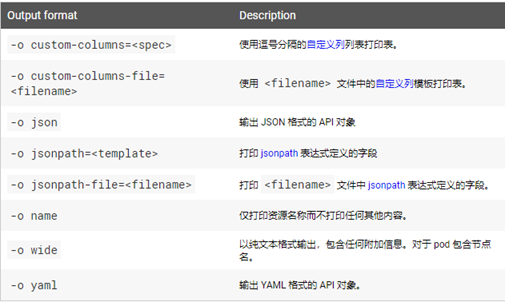

# kubectl 命令使用

## 1. kubectl简介

> kubectl是操作k8s集群的命令行工具，安装在k8s的master节点，kubectl在$HOME/.kube目录中查找一个名为config的文件, 你可以通过设置Kubeconfig环境变量或设置--kubeconfig来指定其他的kubeconfig文件。kubectl通过与apiserver交互可以实现对k8s集群中各种资源的增删改查。接下来将会介绍kubectl语法，命令行的操作，并介绍常见的示例。命令的详细信息、参数和子命令可在[kubectl](https://kubernetes.io/docs/reference/generated/kubectl/kubectl-commands)参考文档中查看。
> 
> [中文文档](http://docs.kubernetes.org.cn/683.html)

## 2. kubectl语法

> kubectl语法格式如下，可在k8s集群的master节点执行:

```shell
kubectl [command] [TYPE] [NAME] [flags]
```

> 上述语法解释说明:

- command: 指定要对一个或多个资源执行的操作，例如create、get、describe、delete等。

- type:指定资源类型。资源类型不区分大小写，可以指定单数、复数或缩写形式。例如，以下命令输出相
  同的结果:

```shell
 kubectl get pod pod1
 kubectl get pods pod1
 kubectl get po pod1
```

- NAME:指定资源的名称。名称区分大小写。如果省略名称，则显示所有资源的详细信息:kubectl get pods

- flags: 指定可选的参数。例如，可以使用-s或-server参数指定 Kubernetes API服务器的地址和端口

> 注意事项说明:

1. 从命令行指定的参数会覆盖默认值和任何相应的环境变量。

2. 在对多个资源执行操作时，可以按类型、名称、一个或者多个文件指定每个资源:
   
   - 按类型和名称指定资源:
     
     - 要对所有类型相同的资源进行分组，请执行以下操作:
     - TYPE1 name1 name2 name<#>。
     - 例子:kubectl get pod example-pod1 example-pod2
     - 分别指定多个资源类型:
     - TYPE1/name1 TYPE1/name2 TYPE2/name3 TYPE<#>/name<#>。
     - 例:kubectl get pod/example-pod1 deployment/example-rc1
   
   - 用一个或多个文件指定资源:-f file1 -f file2 -f file<#>
     
     - 使用YAML而不是JSON，因为YAML更容易使用，特别是用于配置文件时。
     - 例子:kubectl get pod -f ./pod.yaml

> kubectl –-help
> 
> 可查看kubectl的帮助命令

## 3. kubectl操作命令

### 3-1. annotate

> 添加或更新一个或多个资源的注释

```shell
kubectl annotate (-f FILENAME | TYPE NAME | TYPE/NAME) KEY_1=VAL_1 … KEY_N=VAL_N [--overwrite] [--all] [--resource-version=version] [flags]
```

### 3-2. api-versions

> 常用
> 
> 列出可用的api版本

```shell
kubectl api-versions [flags]
```

### 3-3. apply

> 常用
> 
> 从文件或stdin对资源的应用配置进行更改

```shell
kubectl apply -f FILENAME [flags]
```

```shell
# 使用 example-service.yaml 中的定义创建服务。
kubectl apply -f example-service.yaml

# 使用 example-controller.yaml 中的定义创建 replication controller。
kubectl apply -f example-controller.yaml

# 使用 <directory> 路径下的任意 .yaml, .yml, 或 .json 文件 创建对象。
kubectl apply -f <directory>
```

### 3-4. attach

> 一般不用
> 
> 附加到正在运行的容器，查看输出流或与容器交互

```shell
kubectl attach pod-name -c container-name  [-i] [-t] [flags]
```

### 3-5. autoscale

> 常用
> 
> 自动扩缩容由副本控制器管理的一组 pod

```shell
kubectl autoscale (-f FILENAME | TYPE NAME | TYPE/NAME) [--min=MINPODS] --max=MAXPODS [--cpu-percent=CPU] [flags]
```

### 3-6. cluster-info

> 显示有关集群中的主服务器和服务的端点信息

```shell
kubectl cluster-info [flags]
```

### 3-7. config

> 修改kubeconfig文件

```shell
kubectl config SUBCOMMAND [flags]
```

### 3-8. create

> 一般不用，用apply替代这个
> 
> 从文件或标准输入创建一个或多个资源

```shell
kubectl create -f FILENAME [flags]
```

### 3-9. delete

> 常用
> 
> 从文件、标准输入或指定标签选择器、名称、资源选择器或资源中删除资源。

```shell
kubectl delete (-f FILENAME | TYPE [NAME | /NAME | -l label | --all]) [flags]
```

```shell
# 使用 pod.yaml 文件中指定的类型和名称删除 pod。
kubectl delete -f pod.yaml

# 删除标签名= <label-name> 的所有 pod 和服务。
kubectl delete pods,services -l name=<label-name>

# 删除所有具有标签名称= <label-name> 的 pod 和服务，包括未初始化的那些。
kubectl delete pods,services -l name=<label-name> --include-uninitialized

# 删除所有 pod，包括未初始化的 pod。
kubectl delete pods --all

# 强制删除, 有些Terminating的pod 使用delete删不掉, 可以使用以下命令
kubectl delete pods httpd-app-6df58645c6-cxgcm --grace-period=0 --force
```

### 3-10. describe

> 常用
> 
> 显示一个或多个资源的详细状态

```shell
kubectl describe (-f FILENAME | TYPE [NAME_PREFIX | /NAME | -l label]) [flags]
```

```shell
# 显示名称为 <node-name> 的节点的详细信息。
kubectl describe nodes <node-name>

# 显示名为 <pod-name> 的 pod 的详细信息。
kubectl describe pods/<pod-name>

# 显示由名为 <rc-name> 的副本控制器管理的所有 pod 的详细信息。
# 记住：副本控制器创建的任何 pod 都以复制控制器的名称为前缀。
kubectl describe pods <rc-name>

# 描述所有的 pod
kubectl describe pods
```

### 3-11. diff

> 将 live 配置和文件或标准输入做对比 (BETA版)

```shell
kubectl diff -f FILENAME [flags]
```

### 3-12. edit

> 常用
> 
> 使用默认编辑器编辑和更新服务器上一个或多个资源的定义

```shell
kubectl edit (-f FILENAME | TYPE NAME | TYPE/NAME) [flags]
```

### 3-13. exec

> 常用
> 
> 对 pod 中的容器执行命令

```shell
kubectl exec POD-name [-c CONTAINER-name] [-i] [-t] [flags] [-- COMMAND [args...]]
```

```shell
# 从 pod <pod-name> 中获取运行 'date' 的输出。默认情况下，输出来自第一个容器。
kubectl exec <pod-name> -- date

# 运行输出 'date' 获取在容器的 <container-name> 中 pod <pod-name> 的输出。
kubectl exec <pod-name> -c <container-name> -- date

# 获取一个交互 TTY 并运行 /bin/bash <pod-name >。默认情况下，输出来自第一个容器。
kubectl exec -ti <pod-name>  -c <container-name> -- /bin/bash
```

> 例子, 登录到pod中的容器的命令

```shell
kubectl exec calico-node-cblk2 -n kube-system -i -t -- /bin/sh
```

### 3-14. explain

> 常用
> 
> 获取多种资源的文档。例如 pod, node, service 等，相当于帮助命令，可以告诉我们怎么创建资源

```shell
kubectl explain [--recursive=false] [flags]
```

### 3-15. expose

> 常用
> 
> 将副本控制器、服务或pod作为新的Kubernetes服务进行暴露

```shell
kubectl expose (-f FILENAME | TYPE NAME | TYPE/NAME) [--port=port] [--protocol=TCP|UDP] [--target-port=number-or-name] [--name=name] [--external-ip=external-ip-of-service] [--type=type] [flags]
```

### 3-16. get

> 常用
> 
> 列出一个或多个资源

```shell
kubectl get (-f FILENAME | TYPE [NAME | /NAME | -l label]) [--watch] [--sort-by=FIELD] [[-o | --output]=OUTPUT_FORMAT] [flags]
```

```shell
列出一个或多个资源。
# 以纯文本输出格式列出所有 pod。
kubectl get pods

# 以纯文本输出格式列出所有 pod，并包含附加信息(如节点名)。
kubectl get pods -o wide

# 以纯文本输出格式列出具有指定名称的副本控制器。提示：你可以使用别名 'rc' 缩短和替换 'replicationcontroller' 资源类型。
kubectl get replicationcontroller <rc-name>

# 以纯文本输出格式列出所有副本控制器和服务。
kubectl get rc,services

# 以纯文本输出格式列出所有守护程序集。
kubectl get ds

# 列出在节点 server01 上运行的所有 pod
kubectl get pods --field-selector spec.nodeName=server01

# 列出状态为Running 的pod
kubectl get pod -n kube-system -o wide --field-selector status.phase=Running

# 列出在某台节点的pod
kubectl get pod --field-selector spec.nodeName=cn-hangzhou.192.168.131.23
```

### 3-17. label

> 添加或更新一个或多个资源的标签

```shell
kubectl label (-f FILENAME | TYPE NAME | TYPE/NAME) KEY_1=VAL_1 … KEY_N=VAL_N [--overwrite] [--all] [--resource-version=version] [flags]
```

### 3-18. logs

> 常用
> 
> 在 pod 中打印容器的日志

```shell
kubectl logs POD [-c CONTAINER] [--follow] [flags]
```

```shell
# 从 pod 返回日志快照。
kubectl logs <pod-name>

# 从 pod <pod-name> 开始流式传输日志。这类似于 'tail -f' Linux 命令。
kubectl logs -f <pod-name>
```

### 3-19. patch

> 更新资源的一个或多个字段

```shell
kubectl patch (-f FILENAME | TYPE NAME | TYPE/NAME) --patch PATCH [flags]
```

### 3-20. port-forward

> 将一个或多个本地端口转发到Pod

```shell
kubectl port-forward POD [LOCAL_PORT:]REMOTE_PORT [...[LOCAL_PORT_N:]REMOTE_PORT_N] [flags]
```

### 3-21. proxy

> 运行Kubernetes API服务器的代理

```shell
kubectl proxy [--port=PORT] [--www=static-dir] [--www-prefix=prefix] [--api-prefix=prefix] [flags]
```

### 3-22. replace

> 从文件或标准输入中更新/替换资源

```shell
# 默认不会删除原来资源
kubectl replace -f FILENAM

# 加 --force参数会直接删除就资源, 再创建新资源
kubectl replace --force -f FILENAM
```

### 3-23. run

> 常用
> 
> 在集群上运行指定的镜像

```shell
kubectl run NAME --image=image [--env=“key=value”] [--port=port] [--dry-run=server | client | none] [--overrides=inline-json] [flags]
```

> 例子, 可以创建一个nginx应用, 实际创建pod应用都是通过编写资源清单文件进行创建

```shell
kubectl run nginx --image=nginx

# 这是网上的工具镜像， 适用于集群内部调试
kubectl run -i --tty --image busybox:1.28 busybox --restart=Never --rm
```

### 3-24. scale

> 更新指定副本控制器的大小

```shell
kubectl scale (-f FILENAME | TYPE NAME | TYPE/NAME) --replicas=COUNT [--resource-version=version] [--current-replicas=count] [flags]
```

### 3-25. version

> 显示运行在客户端和服务器上的 Kubernetes 版本

```shell
kubectl version [--client] [flags] 
```

### 3-26. api-resources

> 查看资源类型清单

```shell
kubectl api-resources
```

### 3-27. -n

> 指定命名空间

### 3-28. -o/--out

> 输出选项, [有关每个命令支持哪种输出格式的详细信息，可参考](https://kubernetes.io/docs/user-guide/kubectl/)



```shell
kubectl [command] [TYPE] [NAME] -o=<output_format>
```

> 单个 pod 的详细信息输出为 YAML 格式的对象

```shell
kubectl get pod web-pod-13je7 -o yaml
```

> 自定义列,要定义自定义列并仅将所需的详细信息输出到表中，可以使用custom-columns 选项。你可以选择内联定义自定义列或使用模板文件,-o=custom-columns=spec 或 -o=custom-columns-file=filename

- 内联
  
  ```shell
  kubectl get pods pod-name -o custom-columns=NAME:.metadata.name,RSRC:.metadata.resourceVersion
  
  # rules底下是个list, 可以用索引选择,也可以用 ..
  # 获取第一个
  get ingress -o custom-columns=name:.metadata.name,hosts:.spec.rules[0].host
  #获取所有
  get ingress -o custom-columns=name:.metadata.name,hosts:.spec.rules..host
  
  # 如果有个建有特殊字符的要加转义
  # 这边cattle.io/timestame 整体是个键, 要加转义并把整个字符串用引号引起来
  kubectl get deploy yiautos-notice -o custom-columns=Annotations:".spec.template.metadata.annotations.cattle\.io/timestamp"

  ## 获取节点污点
  kubectl get node -o custom-columns=NAME:.metadata.name,Taints:.spec.taints
  ```

- 模板文件, 其中，template.txt文件内容是:
  
  ```conf
  NAME          RSRC
  metadata.name metadata.resourceVersion
  ```
  
  ```shell
  kubectl get pods pod-name -o custom-columns-file=template.txt
  ```
  
  > 运行任何一个命令的结果是:
  
  ```output
  NAME           RSRC
  submit-queue   610995
  ```

> server-side 列
> 
> kubectl支持从服务器接收关于对象的特定列信息。 这意味着对于任何给定的资源，服务器将返回与该资源相关的列和行，以便客户端打印。 通过让服务器封装打印的细节，这允许在针对同一集群使用的客户端之间提供一致的人类可读输出。默认情况下，此功能在kubectl 1.11及更高版本中启用。要禁用它，请将该--server-print=false参数添加到 kubectl get 命令中。

```shell
kubectl get pods pod-name --server-print=false
```

> 排序列表对象
> 
> 要将对象排序后输出到终端窗口，可以将--sort-by参数添加到支持的kubectl命令。通过使用--sort-by参数指定任何数字或字符串字段来对对象进行排序。要指定字段，请使用jsonpath表达式。

```shell
kubectl [command] [TYPE] [NAME] --sort-by=jsonpath_exp
```

```shell
kubectl get pods -n kube-system --sort-by=.metadata.name
kubectl get pods -n kube-system -o wide --sort-by=.spec.nodeName
```

```output
NAME                               READY   STATUS    RESTARTS   AGE
calico-node-cblk2                  1/1     Running   40         7d8h
calico-node-q84kx                  1/1     Running   31         7d8h
coredns-66bff467f8-f2nrb           1/1     Running   3          5d21h
coredns-66bff467f8-x24ff           1/1     Running   4          5d21h
etcd-master1                       1/1     Running   7          7d8h
kube-apiserver-master1             1/1     Running   22         7d8h
kube-controller-manager-master1    1/1     Running   81         7d8h
kube-proxy-4xlzz                   1/1     Running   4          7d8h
kube-proxy-pxjlx                   1/1     Running   5          7d8h
kube-scheduler-master1             1/1     Running   72         7d8h
metrics-server-8459f8db8c-lvx9x    2/2     Running   2          5d21h
traefik-ingress-controller-c8dm6   1/1     Running   4          7d8h
traefik-ingress-controller-nr4n6   1/1     Running   6          7d8h
```

### 3-29. rollout

> 管理资源
> 
> 可用资源包括：
> 
> - deployments
> - daemonsets
> 
> 子命令
> 
> - [*history*](http://docs.kubernetes.org.cn/645.html)（查看历史版本）
> - [*pause*](http://docs.kubernetes.org.cn/647.html)（暂停资源）
> - [*resume*](http://docs.kubernetes.org.cn/650.html)（恢复暂停资源）
> - [*status*](http://docs.kubernetes.org.cn/652.html)（查看资源状态）
> - [*undo*](http://docs.kubernetes.org.cn/654.html)（回滚版本）
> 
> 语法
> 
> ```sehll
> kubectl rollout SUBCOMMAND
> ```

```shell
# 回滚
kubectl rollout undo deployment/abc
#查看状态
kubectl rollout status daemonset/foo
```
