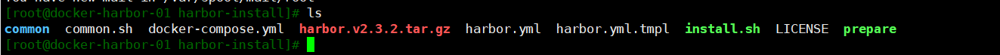
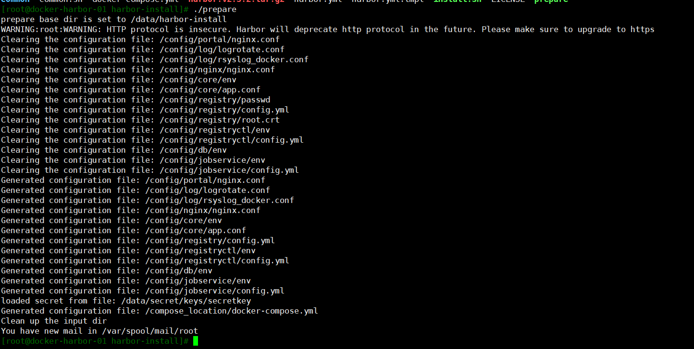

# docker基本介绍

- Docker的基本组成：客户端，守护进程，镜像，容器，仓库
- [Docker官网](https://docs.docker.com/)
- [Docker的github地址](https://github.com/docker/docker)
- [docker hub 官网](https://registry.hub.docker.com)

> 如果docker官方registry拉取镜像速度很慢，可以尝试[daocloud](https://dashboard.daocloud.io/mirror)提供的加速器服务

## 1. docker是什么？

> Docker 是一个开源的应用容器引擎，让开发者可以打包他们的应用以及依赖包到一个可移植的镜像中，然后发布到任何流行的 Linux或Windows 机器上，也可以实现虚拟化。容器是完全使用沙箱机制，相互之间不会有任何接口。

## 2. docker的优点

- 隔离应用依赖
- 创建应用镜像并进行复制
- 创建容易分发的即启即用的应用
- 允许实例简单、快速地扩展
- 测试应用并随后销毁它们
- 自动化测试和持续集成、发布
- 快
- 运行时的性能可以获取极大提升
- 管理操作(启动，停止，开始，重启等等) 都是以秒或毫秒为单位的。
- 敏捷
- 像虚拟机一样敏捷，而且会更便宜，在bare metal(裸机)上布署像点个按钮一样简单。
- 灵活
- 将应用和系统"容器化"，不添加额外的操作系统，
- 轻量
- 你会拥有足够的"操作系统"，仅需添加或减小镜像即可。在一台服务器上可以布署100~1000个Containers容器。
- 便宜
- 开源的，免费的，低成本的。由现代Linux内核支持并驱动。注* 轻量的Container必定可以在一个物理机上开启更多"容器"，注定比VMs要便宜。

## 3. docker缺点

- 所有容器共用linux kernel资源，资源能否实现最大限度利用，所以在安全上也会存在漏洞。

## 4. 设置阿里云镜像加速

> 访问 https://cr.console.aliyun.com/cn-hangzhou/instances/mirrors
> 
> 镜像中心 -> 镜像加速器, 根据文档配置

```shell
mkdir -p /etc/docker
tee /etc/docker/daemon.json <<-'EOF'
{
    "registry-mirrors": ["https://9hqvpv7p.mirror.aliyuncs.com"]
}
EOF
```

> 配置生效

```shell
sudo systemctl daemon-reload
sudo systemctl restart docker
```

## 5. docker的基本用法([命令参考](https://docs.docker.com/engine/reference/run/))

### 5-1. 镜像

> 查看官网镜像

```shell
docker search centos
```

> 下载镜像

```shell
docker pull centos
```

> 查看镜像

```shell
docker images
```

> 删除镜像

```shell
docker rmi centos
# 或
docker images rm centos
```

### 5-2. 启动容器

#### 5-2-1. 以交互式方式启动并进入到容器

```shell
docker pull centos
docker run --name=hello -it centos /bin/bash

# ctrl+p，ctrl+q退出容器或者输入exit，这样容器可以在后台运行
```

#### 5-2-2. 以守护进程方式启动容器

```shell
docker run --name=hello1 -itd centos /bin/bash
```

> 查看正在运行的容器, 可以看见刚才启动的两个容器hello

```shell
docker ps
```

> 停止容器

```shell
docker stop hello
```

> 启动已经停止的容器

```shell
docker start hello
```

> 进入容器

```shell
docker exec -it hello /bin/bash
```

### 5-3. 进入容器部署简单的nginx

> 创建一个映射了80端口的交互式容器

```shell
docker run --name nginx -p 80 -itd centos
# 或
docker run --name nginx -p 12222:80 -itd centos
```

> 进入容器

```shell
docker exec -it nginx /bin/bash 
```

> 安装nginx

```shell
yum install wget -y
yum install nginx -y 
```

> 安装文本编辑器vim

```shell
yum install vim-enhanced -y
```

> 创建静态页面

```shell
mkdir /var/www/html -p
cd /data/web/html
cat > index.html <<"EOF"
<html>
<head>
    <title>nginx in docker</title>
</head>
<body>
    <h1>hello,docker</h1>
</body>
</html>
EOF
```

> 修改nginx配置文件
> 
> 修改nginx配置文件中的root路径，如下

```sehll
vim /etc/nginx/nginx.conf
```

> 添加

```conf
root /data/web/html;
```

> 然后启动nginx

```shell
/usr/sbin/nginx
```

> 验证网站访问,复制一个终端窗口，执行如下命令

```shell
# 查看nginx映射的端口
docker ps
# 或
docker port nginx
```

> 查看网站

```shell
curl http://192.168.0.6:3278
```

> 查看容器的ip
> 
> 登录到容器

```shell
docker exec -it nginx /bin/bash

# 执行
ip addr
```

> 流量走向
> 
> 访问物理节点ip:port（物理节点端口）--容器ip:port（容器里部署的服务的端口）->就可以访问到容器里部署的应用了

> 替换镜像中的执行命令

```shell
# 注意--entrypoint 要放在 镜像参数前面, 否则无效
docker run -it --entrypoint /bin/bash fc9c81b288d9
```

### 5-4. 使用dockerfile构建镜像

> 编辑dockerfile

```shell
mkdir dockerfile
cd dockerfile/
vim dockerfile
```

> 输入以下内容

```conf
FROM centos
MAINTAINER aly
RUN yum install wget -y
RUN yum install nginx -y
COPY index.html /usr/share/nginx/html/
EXPOSE 80
ENTRYPOINT ["/usr/sbin/nginx","-g","daemon off;"]
```

> 编写一个页面

```shell
cat > index.html <<EOF
<html>
<head>
    <title>page added to dockerfile</title>
</head>
<body>
    <h1>i am in df_test </h1>
</body>
</html>
EOF
```

> java1.8添加字体

```dockerfile
FROM bitnami/java:1.8

WORKDIR /opt

# 把需要的字体下载到fonts目录中， windows路径 C:\Windows\Fonts
COPY fonts /usr/share/fonts/win/

RUN apt-get update && \
    apt-get -y --no-install-recommends install fontconfig \
    && chmod -R 755 /usr/share/fonts/win  \
    &&  fc-cache -fv && fc-list \
    && apt-get autoclean && rm -rf /var/lib/apt/lists/*

ENTRYPOINT []
```

> 构建镜像

```shell
docker build -t="dockerfile/nginx" .
```

> 查看镜像是否构建成功

```shell
docker images | grep nginx
```

> 显示如下说明镜像部署成功

```output
dockerfile/nginx   latest        baee97a76499   About a minute ago   344MB
```

> 基于刚才的镜像启动容器：

```shell
docker run -d  -p 80 --name html2 dockerfile/nginx
```

## 6. dockerfile指令

1. FROM

> 基础镜像，必须是可以下载下来的

2. MAINTAINER

> 指定镜像的作者信息

3. RUN

> 指定在当前镜像构建过程中运行的命令
> 
> 包含两种模式

- shell模式，这个是最常用的，需要记住

```sehll
RUN <command>
RUN /bin/sh -c command
RUN echo hello
```

- exec模式

```shell
RUN ["executable"，"param1"，"param2"]
RUN ["/bin/bash","-c","echo hello"]
```

4. EXPOSE指令

> 指定运行该镜像容器使用的端口，可以是一个或者多个端口，也可以指定多个EXPOSE
>
> 1. 在使用 -P 参数时expose端口会被映射的主机的随机端口上
> 2. 在使用--net=host时会被直接映射expose端口到主机端口
> 3. 在使用-p参数时可以自定义绑定, 此时expose的端口没有啥用处, 只是为了让使用者看的比较清楚而已, -p也可以映射expose以外的端口

5. CMD

> 该指令是在容器运行时执行的命令，docker run 启动的时候如果指定参数，则会覆盖dockerfile中的CMD后面的内容的
>
> 有enterypoint时, 会追加到enterypoint后面作为参数
> 
> 最后一个生效

```shell
CMD["executable"，"param1"，"param2"]
CMD command param1 param2

# 作为ENTRYPOINT指令的默认参数
CMD ["param1","param2"]
```

6. ENTERYPOINT

> 最后一个生效
>
> 不会被docker run 的命令覆盖, docker run 后面的命令会被追加到enterypoint后面作为参数, 可以使用--enterypoint 覆盖

```shell
ENTERYPOINT ["executable","param1","param2"]
ENTERYPOINT command param1 param2
```

7. ADD

```shell
ADD <src>...<dest>
ADD ["<src>"..."<dest>"]
```

8. COPY

```shell
COPY<src>..<dest>
COPY["<src>"..."<dest>"]
```

> ADD vs COPY
> 
> ADD包含类似tar的解压功能
> 
> 如果单纯复制文件，docker推荐使用COPY

9. VOLUME

> 对数据有持久化的功能
> 
> 数据卷是经过特殊设计的目录，可以绕过联合文件系统（UFS），为一个或者多个容器提供访问，数据卷设计的目的，在于数据的永久话，它完全独立与容器的生存周期，因此，docker不会在容器删除时删除其挂载的数据卷，也不会存在类似的垃圾收集机制，对容器引用的数据卷进行处理，同一个数据卷可以只支持多个容器的访问。

> dockerfile挂载

```dockerfile
# 其实VOLUME指令只是起到了声明了容器中的目录作为匿名卷
# 但是并没有将匿名卷绑定到宿主机指定目录的功能
# 这个主要是防止忘记run -v时删除容器后数据丢失
# run -v 指定相同目录以-v 为准
VOLUME ["/data"]
```

> 命令行挂载

```shell
docker run -v /datavolume:/data -it centos /bin/bash

# 添加权限, 只读
docker run --name volume1 -v ~/datavolume1:/data:ro -itd centos
```

> 数据卷容器

```shell
# 与后面跟的容器共享卷数据
docker run --volumes-from [container name]
```

10. WORKDIR（填写绝对路径）

> 工作目录, 为run, cmd, entrypoint, copy, add执行命令指定运行目录

11. ENV

> 设置环境变量

```shell
ENV <key><value>
ENV <key>=<value>...
```

12. USER

> 运行用户, 为run, cmd, entrypoint 执行命令指定运行用户

15. ONBUILD

```shell
ONBUILD [INSTRUCTION]
```

> 为镜像添加触发器
> 当一个镜像被其他镜像作为基础镜像时需要写上OBNBUILD
> 会在构建时插入触发器指令

## 7. docker数据卷的备份和还原

### 7-1. 数据备份, 新起一个容器, 关联数据卷容器, 执行备份

```shell
docker run --volumes-from [container name] -v $(pwd):/backup centos tar czvf /backup/backup.tar [container data volume]
```

### 7-2. 数据还原, 新起一个容器, 关联数据卷容器, 执行还原

```shell
docker run --volumes-from [container name] -v $(pwd):/backup centos tar xzvf /backup/backup.tar.gz -C  [container data volume]
```

## 8. docker部署tomcat

```dockerfile
FROM centos
MAINTAINER aly
ADD jdk-8u45-linux-x64.rpm /usr/local/
ADD apache-tomcat-8.0.26.tar.gz /usr/local/
RUN yum install wget -y && cd /usr/local && rpm -ivh jdk-8u45-linux-x64.rpm && mv /usr/local/apache-tomcat-8.0.26 /usr/local/tomcat8

ENV JAVA_HOME=/usr/java/jdk1.8.0_45
ENV JRE_HOME=$JAVA_HOME/jre
ENV CLASSPATH=.:$JAVA_HOME/lib/dt.jar:$JAVA_HOME/lib/tools.jar:$JRE_HOME/lib:$CLASSPATH
ENV PATH=/sbin:$JAVA_HOME/bin:$PATH

EXPOSE 8080
ENTRYPOINT /usr/local/tomcat8/bin/startup.sh && tail -f /usr/local/tomcat8/logs/catalina.out
```

> **注: 上面entrypoint 需要加后面的 tail -f, 否则容器会退出,**[详情参见](https://blog.csdn.net/ystyaoshengting/article/details/102503022)

### 8-1. build镜像

```shell
docker build -t="tomcat8:v7" .
```

### 8-2. 运行一个容器

```shell
mkdir /usr/local/tomcat8/webapps -p

docker run --name tomcat8_v7  -v /usr/local/tomcat8/webapps:/usr/local/tomcat8/webapps -itd -p 8080 tomcat8:v7 /bin/bash
```

## 9. docker 容器的网络连接([参考](http://www.docker.org.cn/dockerppt/111.html))

>  docker run创建Docker容器时，可以用–net选项指定容器的网络模式，Docker有以下4种网络模式：

* bridge模式：使--net =bridge指定，默认设置
* host模式：使--net =host指定
* none模式：使--net =none指定
* container模式：使用--net =container:NAME orID指定

## 10. 容器互联

### 10-1. ip互联, 启动连个容器, 通过ip互联

```sehll
docker run --name test1 -itd inter-image
docker run --name test2 -itd inter-image

# 进入test2
docker exec -it test2 /bin/bash
访问test1
curl http://172.17.0.20
```

### 10-2. 通过代号连接, 通过IP连接容器重启后ip会改变

```shell
docker run --link=[CONTAINER_NAME]:[ALIAS] IMAGE
```

```sehll
docker run --name test3 -it inter-image /bin/bash

docker run --name test5 -it --link=test3:webtest inter-image /bin/bash
ping webtest
```

### 10-3.拒绝容器互联

```shell
vim /etc/sysconfig/docker

在最后一行添加如下参数：
other_args="-icc=false"
```

## 11. 镜像/容器打包

> - docker save 保存的是镜像（image），docker export 保存的是容器（container）；
> - docker load 用来载入镜像包，docker import 用来载入容器包，但两者都会恢复为镜像；
> - docker load 不能对载入的镜像重命名，而 docker import 可以为镜像指定新名称。

```shell
docker save 64e5dfd8d597 | gzip > calico.tar.gz
docker save 64e5dfd8d597 -o calico.tar.gz
docker save 64e5dfd8d597 > calico.tar.gz

# 查看镜像构建历史
docker history 64e5dfd8d597
```

## 11. java jar 镜像dockerfile

```dockerfile
# 基础镜像
FROM openjdk:8-jdk-alpine

LABEL MAINTAINER "aly"


# 设置时区, 及创建app目录
RUN sed -i 's/dl-cdn.alpinelinux.org/mirrors.aliyun.com/g' /etc/apk/repositories \
    && apk update \
    && apk add tzdata \
    && cp /usr/share/zoneinfo/Asia/Shanghai /etc/localtime \
    && echo "Asia/Shanghai" > /etc/timezone \
    &&  mkdir /app

# 拷贝jar包
COPY server.jar /app/app.jar

# 开放端口
EXPOSE 8000

# 设置jar包运行参数
ENV JAVA_OPTS="-XX:+PrintCompilation -verbose:gc -Dlog.path.prefix=/home/admin/ -Dspring.cloud.config.enabled=true -Dspring.cloud.config.uri=http://debug-config-server.szy.net:8099 -Dspring.cloud.config.label=develop -Xloggc:/home/admin/ztjy-bd-ka-base-server/logs/gc.log -XX:+PrintGCDetails -XX:+PrintGCDateStamps -XX:+HeapDumpOnOutOfMemoryError -XX:HeapDumpPath=/home/admin -XX:CICompilerCount=4 -agentlib:jdwp=transport=dt_socket,server=y,suspend=n,address=8000"
# 启动命令
ENTRYPOINT [ "sh", "-c", "java $JAVA_OPTS -jar /app/app.jar" ]
```

## 12. docker 私服配置与搭建

### 12-1. docker harbor 搭建

#### 12-1-1. harbor 组件

- nginx: harbor 的反向代理组件, 代理registry, ui, token 等服务, 这个代理会转发harbor web 和docker client 的各种请求到后端
- harbor-adminserver: harbor 系统管理接口, 可以修改系统配置以及获取系统信息
- docker-db: 存储项目的元数据, 用户, 规则, 复制策略等信息
- harbor-jobservice: harbor里面主要是为了镜像仓库之间的同步使用的
- harbor-log: 收集其他harbor的日志信息
- harbor-ui: 一个用户界面, 用来管理registry
- registry: 存储docker images 的服务, 并且提供pull/push服务
- reids: 存储缓存信息
- webhook: 当registry中的image状态发生变化的时候去记录更新日志, 复制等操作
- token service: 在docker client 进行pull/push 的时候负责token 的发放

#### 12-1-2. 安装

> [下载地址](https://github.com/vmware/harbor/releases)
> 
> [文档地址](https://goharbor.io/docs/2.3.0/install-config/configure-https/)
> 
> 本次下载: https://github.com/goharbor/harbor/releases/download/v2.3.2/harbor-offline-installer-v2.3.2.tgz

1. 解压

```shell
tar -zxvf harbor-offline-installer-v2.3.2.tgz
```



2. 拷贝harbor.yml.tmpl 为harbor.yml, 并修改配置(这边只改了访问域名和去除https配置)
3. 执行安装(主机必须先安装doccker和docker-compose)

```shell
# 安装docker-compose
sudo curl -L "https://github.com/docker/compose/releases/download/1.29.2/docker-compose-$(uname -s)-$(uname -m)" -o /usr/local/bin/docker-compose

# --with-trivy 开启会对镜像扫描, 一般不开启, 比较耗资源
# –-with-chartmuseum 支持helmchart 仓库
./install.sh --with-trivy --with-chartmuseum

## 后续如果修改了配置文件需要重新加载配置文件
./prepare --with-trivy --with-chartmuseum
# 然后重启
docker-compose stop
docker-compose start

# 这边的harbor的容器是可以删除的..如果改了配置后起不来可以把老的容器全部删掉,,再重新instal
# 数据不会丢失, 只要配置中的配置的数据目录不要删除即可
# 重新执行install
docker rm -fv `docker ps -a -q`
./install.sh
```



4. 客户端的配置

```shell
# 注册镜像库地址, 添加insecure-registries
# docker客户端如果配置中添加了insecure-registary配置，就不需要在docker 客户端配置上对应证书
# 如果不配置就需要在/etc/docker/certs.d/目录中添加对应证书才能正常登录
vim /etc/docker/daemon.json
"insecure-registries": ["harbor.local.com"]
# 执行
systemctl daemon-reload && systemctl restart docker

# 登录, 输入账号密码
docker login http://harbor.local.com/
```

## 13. docker非root用户使用docker命令的配置

```shell
# 添加jenkins用户到docker 用户组
gpasswd -a jenkins docker
```

## 14. nginx dockefile

```dockerfile
#
#
#base image for nginx
FROM centos:7.8.2003

maintainer  "Aly"

RUN yum install -y epel-release && yum install -y vim wget tree  lrzsz gcc gcc-c++ automake pcre pcre-devel zlib zlib-devel openssl openssl-devel iproute net-tools iotop

#COPY nginx-1.16.1.tar.gz /usr/local/src/
ADD nginx-1.16.1.tar.gz /usr/local/src/

RUN cd /usr/local/src/nginx-1.16.1 && ./configure --prefix=/apps/nginx --with-http_sub_module && make && make install
RUN useradd nginx -u 2022
ADD nginx.conf /apps/nginx/conf/nginx.conf 
ADD code.tar.gz /data/nginx/html
#ADD run_nginx.sh /apps/nginx/sbin/run_nginx.sh
#RUN chmod a+x /apps/nginx/sbin/run_nginx.sh
EXPOSE 80 443

#RUN useradd aly
#USER aly
#WORKDIR /opt
#run mkdir 123
#WORKDIR 123


#ENTRYPOINT ["/apps/nginx/sbin/run_nginx.sh"]

ENTRYPOINT ["/apps/nginx/sbin/nginx"]
CMD  ["-g","daemon off;"]
```
