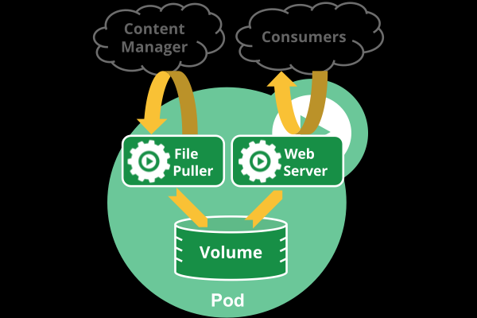
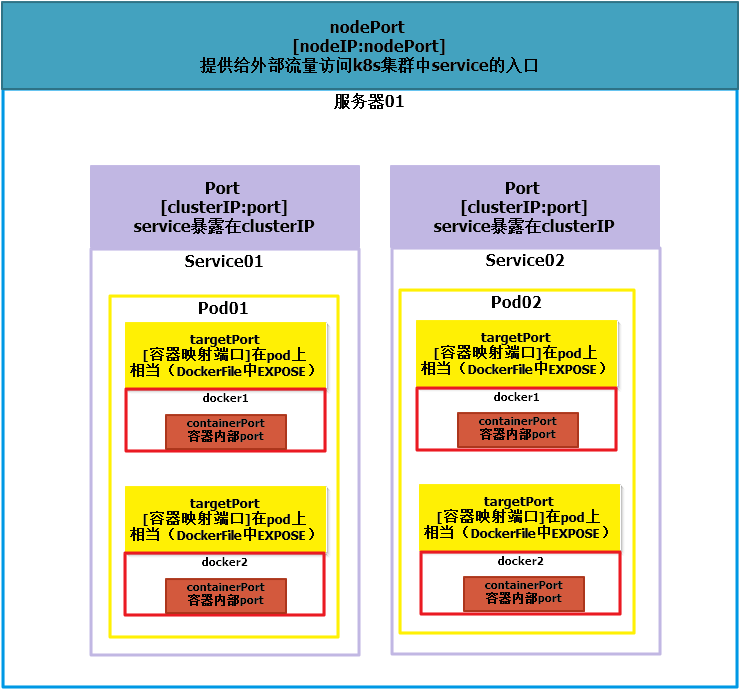

# Pod 基本介绍及使用

## 1. 官方解释

> Pod是Kubernetes应用程序的最基本执行单元—是你创建或部署Kubernetes对象模型中的最小和最简单的单元。 Pod表示在集群上运行的进程。Pod封装了应用程序的容器（或者在某些情况下是多个容器）、存储资源、唯一的网络标识(IP地址)以及控制容器应该如何运行的选项。 Pod表示一个部署单元：Kubernetes中的应用程序的单个实例，该实例可能由单个容器或少量紧密耦合并共享资源的容器组成。Docker是Kubernetes Pod中最常见的容器，但Pods也支持其他容器。Kubernetes集群中的Pod是如何管理容器的：
> 
> - pod里运行单个容器： pod里只运行一个容器是最常见的Kubernetes使用案例。在这种情况下，你可以将Pod视为单个容器的封装，Kubernetes直接管理Pod，而不是直接管理容器。
> 
> - pod里运行多个需要协同工作的容器：Pod可能封装了一个应用程序，该应用程序由紧密关联并且需要共享资源的多个共同协作的容器组成。这些共同协作的容器可能形成一个统一的服务单元-一个容器将文件从共享卷提供给所有容器使用，而一个单独的“ sidecar”容器则刷新或更新这些文件。Pod将这些容器和存储资源包装在一起，成为一个可管理的实体。

## 2. Pod是如何管理多个容器的?

> Pod中可以同时运行多个容器。同一个Pod中的容器会自动的分配到同一个 node 上。同一个Pod中的容器共享资源、网络环境，它们总是被同时调度，在一个Pod中同时运行多个容器是一种比较高级的用法，只有当你的容器需要紧密配合协作的时候才考虑用这种模式。例如，你有一个容器作为web服务器运行，需要用到共享的volume，有另一个“sidecar”容器来从远端获取资源更新这些文件
> 
> 一些Pods有init容器和应用容器。 在应用程序容器启动之前，运行初始化容器。Pods为它组成的容器提供两种共享资源：网络和存储。



### 2-1. 网络

> 每个pod都被分配唯一的IP地址，POD中的每个容器共享网络名称空间，包括IP地址和网络端口。 Pod内部的容器可以使用localhost相互通信。 当POD中的容器与POD之外的实体通信时，它们必须使用共享网络资源（如端口）。

### 2-2. 存储

> Pod可以指定一组共享存储卷。 POD中的所有容器都可以访问共享卷，允许这些容器共享数据。 卷也允许Pod中的持久数据在需要重新启动的情况下存活。 有关Kubernetes如何在POD中实现共享存储的更多信息，[参考](https://kubernetes.io/docs/concepts/storage/volumes/)

## 3. Pod工作?

> 我们很少在Kubernetes中直接创建单个Pod。这是因为Pods被设计成相对短暂的、一次性的实体。 当一个POD被创建（直接创建，或间接由控制器创建）时，它被安排在集群中的节点上运行。 在进程终止、pod对象被删除、pod由于缺乏资源而被驱逐或节点失败之前，POD仍然位于该节点上
> 
> <font color=red size=5>注意:</font> 不要将重新启动Pod中的容器与重新启动Pod混淆。POD不是一个进程，而是一个运行容器的环境。Pod一直存在直到被删除为止
> 
> pod本身无法自我修复。如果将Pod调度到发生故障的节点，或者调度操作本身失败，则将Pod删除；同样，由于缺乏资源或Node维护，Pod也被删除。Kubernetes使用称为控制器的更高级别的抽象来处理管理相对一次性的Pod实例的工作。因此，虽然可以直接使用Pod，但在Kubernetes中使用控制器来管理Pod更为常见。

## 4. Pod和控制器关系

>  你可以使控制器创建和管理多个pod。控制器在pod失败的情况下可以处理副本、更新以及自动修复。例如，如果某个节点发生故障，则控制器会注意到该节点上的Pod已停止工作，并创建了一个替换Pod。调度程序将替换的Pod放置到健康的节点上。可以使用deployment、statefulset、daemonset等控制器管理pod。

### 4-1. Pod

> Pod 可以用于托管垂直集成的应用程序栈（例如，LAMP），但最主要的目的是支持位于同一位置的、共同管理的程序，例如：
> 
> 1.内容管理系统、文件和数据加载器、本地缓存管理器等。
> 
> 2.日志和检查点备份、压缩、旋转、快照等。
> 
> 3.数据更改监视器、日志跟踪器、日志和监视适配器、事件发布器等。
> 
> 4.代理、桥接器和适配器
> 
> 5.控制器、管理器、配置器和更新器

### 4-2. Pod模板(重点)

> 控制器（如deployment、daemonset、statefulset等）是通过创建pod模板来创建和管理pod的，PodTemplate是用于创建pod的规范，并且包含在deployment、job和daemonset中。每个控制器使用自己内部的Pod模板来创建实际的Pod。PodTemplate是运行应用程序所需的任何控制器的一部分。下面的示例是一个简单的Job的清单，包含一个podtemplate，这个是用来生成pod的模板。该Pod中的容器会打印一条消息，然后暂停

## 5. 和Pod相关的api对象

> [官方参考](https://github.com/kubernetes/community/blob/master/contributors/devel/sig-architecture/api-conventions.md#resources)

```shell
# 查看和pod相关的api对象有哪些，也就是通过资源清单yaml部署一个pod时需要哪些字段
kubectl explain pods
kubectl explain pods.metadata
kubectl explain pods.spec.containers

# apiVersion
kubectl api-versions
```

## 6. Pod的持久性

> 一般来说，用户不需要直接创建 Pod。他们几乎都是使用控制器进行创建，即使对于单例的 Pod 创建也一样使用控制器，例如[Deployments](https://kubernetes.io/docs/concepts/workloads/controllers/deployment/)控制器提供集群范围的自修复以及副本数和滚动管理。 像[StatefulSet](https://kubernetes.io/docs/concepts/workloads/controllers/statefulset.md)这样的控制器还可以提供支持有状态的Pod。
> 
> - Deployments, 主要时针对无状态pod的管理, 即挂掉一个pod对整个服务无影响
> - satefulset, 主要时针对有状态pod的管理, 即一个pod挂点对整个运行有影响, 例如, mysql主从 读写分离

## 7. Pod生命周期

> 同一个pod中可以运行多个容器，我们在创建一个pod时可以通过创建多个容器来实现pod的整个生命周期，一个pod的创建包含如下过程

### 7-1. Init容器(初始化容器)

> Init容器就是做初始化工作的容器。可以有一个或多个，如果多个按照定义的顺序依次执行，只有所有的初始化容器执行完后，主容器才启动。由于一个Pod里的存储卷是共享的，所以Init Container里产生的数据可以被主容器使用到，Init Container可以在多种K8S资源里被使用到，如Deployment、DaemonSet, StatefulSet、Job等，但都是在Pod启动时，在主容器启动前执行，做初始化工作。

### 7-2. 主容器

#### 7-2-1. 容器钩子

> 对于pod资源来说，容器钩子是在pods.spec.containers.lifecycle下定义的
> 
> 初始化容器启动之后，开始启动主容器，在主容器启动之前有一个post start hook（容器启动后钩子）和pre stop hook（容器结束前钩子）
> 
> - postStart：该钩子在容器被创建后立刻触发，通知容器它已经被创建。如果该钩子对应的hook handler执行失败，则该容器会被杀死，并根据该容器的重启策略决定是否要重启该容器，这个钩子不需要传递任何参数,
> 
> - preStop：该钩子在容器被删除前触发，其所对应的hook handler必须在删除该容器的请求发送给Docker daemon之前完成。在该钩子对应的hook handler完成后不论执行的结果如何，Docker daemon会发送一个SGTERN信号量给Docker daemon来删除该容器，这个钩子不需要传递任何参数
>   
>     在容器被终止前的任务，用于优雅关闭应用程序、通知其他系统等, 使用场景:
>   
>         1.关闭前等待某一个状态完成；
>       
>         2.关闭前同步一些状态（数据）到其他的地方；
>       
>         3.关闭前通知某一个系统或者更新一个状态；

> 查看postStart和preStop如何定义

```shell
kubectl explain  pods.spec.containers.lifecycle.postStart

kubectl explain  pods.spec.containers.lifecycle.preStop
```

## 8. 容器探针

### 8-1. livenessProbe

> 指示容器是否正在运行。如果存活探测失败，则 kubelet 会杀死容器，并且容器将受到其[重启策略](https://k8smeetup.github.io/docs/concepts/workloads/pods/pod-lifecycle/#restart-policy)的影响。如果容器不提供存活探针，则默认状态为Success。
> 
> 在容器启动的时候不能立即做探测，因为容器里的应用可能还没启动，我们需要在等一会在做探测，为的是容器里的应用可以起来，所以叫做初始化时的延迟等待时间(initialDelaySeconds)
> 
> 探针类型有三种：
> 
> - ExecAction
> 
> - TCPSocketAction
> 
> - HTTPGetAction

> 查看帮助

```shell
kubectl explain pods.spec.containers.livenessProbe
kubectl explain pods.spec.containers.livenessProbe.ExecAction
```

### 8-2. readinessProbe

> 指示容器是否准备好服务请求。如果就绪探测失败，端点控制器将从与 Pod 匹配的所有Service 的端点中删除该 Pod 的 IP 地址。初始延迟之前的就绪状态默认为Failure。如果容器不提供就绪探针，则默认状态为Success
> 
> service给pod提供一个入口地址，service和pod关联是通过标签选择器，我们后端只要创建一个pod，那么就会根据标签选择器被service关联到，但是新创建的pod里面的应用程序可能没有启动，我们在通过service访问的时候，可能会访问到刚创建的pod，但是访问时失败的，这个在生产环境是不被允许的，所以需要做容器做就绪性探测
> 
> 探针类型有三种：
> 
> - ExecAction
> 
> - TCPSocketAction
> 
> - HTTPGetAction

> 查看帮助

```shell
kubectl explain pods.spec.containers.readinessProbe
kubectl explain pods.spec.containers.livenessProbe.HTTPGetAction
```

## 9. Pod常见状态

- Pending：挂起，我们在请求创建pod时，条件不满足，调度没有完成，没有任何一个节点能满足调度条件。已经创建了但是没有适合它运行的节点叫做挂起，调度没有完成。

- Running：运行状态

- Failed：表示失败

- Succeeded：表示成功状态

- Unknown：未知状态，所谓pod是什么状态是apiserver和运行在pod节点的

## 10. Pod重启策略(restartPolicy)

- Always：只要容器挂了就重启, 默认
- OnFailure：只有容器状态为错误的时候才重启
- Never：从不重启容器

> 查看帮助

```shell
kubectl explain pods.spec.restartPolicy
```

## 11. 名称空间(namespace)

> namespace叫做命名空间，可以把k8s集群划分成多个名称空间，然后对不同的名称空间的资源做隔离，可以控制各个名称空间的入栈，出栈策略，是一种在多个用户之间划分群集资源的方法

> 查看命名空间

```shell
kubectl get namespace
```

## 12. Pod Label

> 标签其实就一对 key/value ，被关联到对象上，比如Pod,标签的使用我们倾向于能够标示对象的特殊特点，并且对用户而言是有意义的（就是一眼就看出了这个Pod是干什么的），标签可以用来划分特定组的对象（比如版本，服务类型等），标签可以在创建一个对象的时候直接给与，也可以在后期随时修改，每一个对象可以拥有多个标签，但是，key值必须是唯一的

### 12-1. Pod label具体操作

```shell
# 查看所有pod资源对象的标签
kubectl get pods --show-labels

# 查看带有指定标签的pod, 没有这个标签的会显示为空
kubectl get pods -L web1

# 显示所有资源对象下web1这个标签的标签值, 没有整个标签的不显示
kubectl get pods -l web1 --show-labels

kubectl get pods -l 'environment in (production),tier in (frontend)'

# 修改资源的标签，比方说想给web加上个release标签
# 给资源对象打标签要使用label命令，指定给某个类型下的某个资源打标签，资源中的key/value可以是多个，因此在web（pod名字）这个资源下再打个标签release，用如下命令
kubectl label pods web release=new

# 删除label, key后加-, key-
kubectl label pods web release-
```

## 13. Node Label / Node Name

### 13-1. Node Label 的具操作

```shell
# 查看nodes节点的标签
kubectl get nodes --show-labels

# 给node节点打标签：
kubectl label nodes node1 node011=haha

# 删除label, key后加-, key-
kubectl label nodes web release-
```

### 13-2. Pod节点选择器nodeSelector([帮助](https://kubernetes.io/docs/concepts/configuration/assign-pod-node/))

```shell
# 查看帮助
kubectl explain pods.spec.nodeSelector
```

>  上面有一个nodeSelector，这个是节点标签选择器，可以限制pod运行在哪个节点上

> 栗子: vim pod.yaml

```yaml
apiVersion: v1
kind: Pod
metadata:
 name: web
 namespace: default
 labels:
  web1: tomcat
spec:
 containers:
   - name: tomcat1
     image: tomcat:8.5-jre8-alpine
 nodeSelector:
   node011: haha
```

> 创建资源

```shell
kubectl delete -f pod.yaml
kubectl apply -f pod.yaml 
kubectl get pods -o wide 
```

> pod会在有标签node01=haha的node上运行
> 
>  如果都有node011=haha这个标签，那么nodeSelector则根据调度策略调度pod到相应的node节点上。

### 13-3. nodeName

>  指定pod节点运行在哪个具体node上，不存在调度说法

>  查看 nodeName帮助命令

```shell
kubectl explain pods.spec.nodeName
```

## 14. k8s的标签选择器

>  与name和UID不同，label不提供唯一性。通常，我们会看到很多对象有着一样的label。通过标签选择器，客户端/用户能方便辨识出一组对象。

>  API目前支持两种标签选择器：基于等值的和基于集合的标签选择器。一个label选择器可以由多个必须条件组成，由逗号分隔。在多个必须条件指定的情况下，所有的条件都必须满足，因而逗号起着AND逻辑运算符的作用。

>  一个空的label选择器（即有0个必须条件的选择器）会选择集合中的每一个对象。
> 
> 一个null型label选择器（仅对于可选的选择器字段才可能）不会返回任何对象。

### 14-1 基于等值关系的标签选择器(=, ==, !=)

> 基于相等性或者不相等性的条件允许用label的键或者值进行过滤。匹配的对象必须满足所有指定的label约束，尽管他们可能也有额外的label。有三种运算符是允许的，“=”，“==”和“!=”。前两种代表相等性（他们是同义运算符），后一种代表非相等性

### 14-2 基于集合的标签选择器(in ， notin 和 exists)

> 基于集合的label条件允许用一组值来过滤键。支持三种操作符: in ， notin ,和 exists(仅针对于key符号)

<a href="https://kubernetes.io/docs/concepts/overview/working-with-objects/labels/"><font size="5"> Label 和 Seletctor官方解释</font></a>

## 15. Pod中的port

- port

> port是k8s集群内部访问service的端口，即通过clusterIP: port可以访问到某个service

- nodePort

> nodePort是外部访问k8s集群中service的端口，通过nodeIP: nodePort可以从外部访问到某个service。

- targetPort

> targetPort是pod的端口，从port和nodePort来的流量经过kube-proxy流入到后端pod的targetPort上，最后进入容器。

- containerPort

> containerPort是在pod控制器中定义的、pod中的容器需要暴露的端口。是pod内部容器的端口, targetPort映射到containerPort。

- hostPort

>  这是一种直接定义Pod网络的方式。hostPort是直接将容器的端口与所调度的节点上的端口路由，这样用户就可以通过宿主机的IP加上来访问Pod了



## 16. [污点(taints)和容忍度(tolerations)](https://kubernetes.io/zh/docs/concepts/scheduling-eviction/taint-and-toleration/)

> 节点亲和性（详见[这里](https://kubernetes.io/zh/docs/concepts/scheduling-eviction/assign-pod-node/#affinity-and-anti-affinity)） 是 [Pod](https://kubernetes.io/docs/concepts/workloads/pods/pod-overview/) 的一种属性，它使 Pod 被吸引到一类特定的[节点](https://kubernetes.io/zh/docs/concepts/architecture/nodes/)。 这可能出于一种偏好，也可能是硬性要求。 Taint（污点）则相反，它使节点能够排斥一类特定的 Pod。
> 
> 容忍度（Tolerations）[污点和容忍度 | Kubernetes](https://kubernetes.io/zh/docs/concepts/scheduling-eviction/taint-and-toleration/)是应用于 Pod 上的，允许（但并不要求）Pod 调度到带有与之匹配的污点的节点上。
> 
> 污点和容忍度（Toleration）相互配合，可以用来避免 Pod 被分配到不合适的节点上。 每个节点上都可以应用一个或多个污点，这表示对于那些不能容忍这些污点的 Pod，是不会被该节点接受的。

> 添加污点
> 
> 给节点 `node1` 增加一个污点，它的键名是 `key1`，键值是 `value1`，效果是 `NoSchedule`。 这表示只有拥有和这个污点相匹配的容忍度的 Pod 才能够被分配到 `node1` 这个节点

```shell
kubectl taint nodes node1 key1=value1:NoSchedule
```

> 查看污点

```shell
kubectl describe nodes node1
```

> 列出说有节点污点
> 
> 创建文件
> 
> list-taints.tmpl, 添加以下内容
> 
> ```text
> {{printf "%-50s %-12s\n" "Node" "Taint"}}
> {{- range .items}}
>     {{- if $taint := (index .spec "taints") }}
>         {{- .metadata.name }}{{ "\t" }}
>         {{- range $taint }}
>             {{- .key }}={{ .value }}:{{ .effect }}{{ "\t" }}
>         {{- end }}
>         {{- "\n" }}
>     {{- end}}
> {{- end}}
> ```
> 
> 执行
> 
> ```shell
> kubectl get nodes -o go-template-file="list-taints.tmpl"
> ```

> 删除污点
> 
> ```shell
> kubectl taint nodes node1 key1=value1:NoSchedule-
> ```

## 17. Pod的使用

### 17-1. 通过yaml创建一个简单pod

> 自主式pod, 线上一般不用, 线上一般都是用控制器创建pod
> 
> 这种pod被删除后不会自动重启一个pod

```yaml
apiVersion: v1
kind: Pod
metadata:
  name: web01
  namespace: default
  labels:
    web1: tomcat
spec:
# 一个pod多个容器
  containers:
  - name: tomcat
    image: tomcat:8.5.41-jre8-alpine
    imagePullPolicy: IfNotPresent
  - name: nginx1
    image: nginx:stable-alpine
    imagePullPolicy: IfNotPresent
  nodeSelector:
    # 部署在有标签service=rest的node上
    service: rest
```

```shell
# 创建pod
kubectl apply -f test.yaml
# 删除pod
kubectl delete -f test.yaml

# 查看日志, 如果有两个容器需要指定容器
kubectl logs web
# 两个容器
kubectl logs web nginx1
# 或
kubectl logs -c nginx1 web


# 终端登入
kubectl exec -it web -c nginx1 -- /bin/bash
# 或 有时/bin/bash 会不存在
kubectl exec -it web -c nginx1 -- /bin/sh

# 重启pod
kubectl replace --force -f test.yaml

# 无yaml文件重启pod
kubectl get pod web -n default -o yaml | kubectl replace --force -f -
```

### 17-2. 通过yaml创建一个带探针的pod

```yaml
apiVersion: v1
kind: Pod
metadata:
  name: web
  namespace: default
  labels:
    web1: livenessProbe
spec:
# 一个pod多个容器
  containers:
  - name: tomcat1
    image: tomcat:8.5.41-jre8-alpine
    imagePullPolicy: IfNotPresent
    ports:
    - name: tomcat
      containerPort: 80
  - name: nginx1
    image: nginx:stable-alpine
    imagePullPolicy: IfNotPresent
    ports:
    - name: nginx
      containerPort: 80
    livenessProbe:
      # livenessProbe如果检测失败，则认为容器不健康，那么 Kubelet 将根据 Pod 中设置的 restartPolicy （重启策略）来判断，Pod 是否要进行重启操作，如果容器配置中没有配置 livenessProbe 存活探针，Kubelet 将认为存活探针探测一直为成功状态
      httpGet:
        # 这边可以直接使用spec.containers.ports.name
        port: nginx
        path: /index.html
      initialDelaySeconds: 1
      periodSeconds: 3
    readinessProbe:
      # 当检测失败后，将 Pod 的 IP:Port 从对应的 EndPoint 列表中删除, 并不会重启容器
      httpGet:
        # 这边可以直接使用spec.containers.ports.name
        port: nginx
        path: /index.html
      initialDelaySeconds: 1
      periodSeconds: 3

  nodeSelector:
    # 部署在有标签service=dubbo的node上
    service: dubbo
```

### 17-3. 通过yaml创建一个带hook的pod

```yaml
apiVersion: v1
kind: Pod
metadata:
  name: web
  namespace: default
  labels:
    web: postStart
spec:
  containers:
  - name: tomcat1
    image: tomcat:8.5.41-jre8-alpine
    imagePullPolicy: IfNotPresent
    ports:
    - name: tomcat
      containerPort: 80
    lifecycle:
      # 执行失败, pod会根据restartPolicy策略重启
      postStart:
        exec:
          command: ["/bin/sh", "-c", "echo poststart >> /usr/share/nginx/html/index.html"]
  - name: nginx1
    image: nginx:stable-alpine
    imagePullPolicy: IfNotPresent
    ports:
    - name: nginx
      containerPort: 80
    livenessProbe:
      httpGet:
        # 这边可以直接使用spec.containers.ports.name
        port: nginx
        path: /index.html
      initialDelaySeconds: 1
      periodSeconds: 3
  nodeSelector:
    # 部署在有标签service=rest的node上
    service: rest
```

## 17-4. pod 清单详解-1

```yaml
apiVersion: v1 # 指定api版本, 必须在kubectl api-versions中有
kind: Pod # 指定创建的资源, 必须在kubectl api-resources
metadata: # 资源的元数据
  name: web # 资源的名字, 在同一个namespace中必须唯一
  namespace: default # 所属空间
  labels: # 标签
    web: postStart
spec: # 指该资源的内容
  # 重启策略, 默认Always, 容器退出后会立即创建一个相同的容器, 还有OnFailure,Never
  restartPolicy: Always
  containers:
  - name: tomcat # 容器名
    image: tomcat:8.5.41-jre8-alpine # 镜像
    # 镜像拉取策略# Always,每次都检查,  Never,每次都不检查（不管本地是否有）, IfNotPresent,如果本地有就不检查,如果没有就拉取
    imagePullPolicy: IfNotPresent
    #启动容器的运行命令,将覆盖容器中的Entrypoint,对应Dockefile中的ENTRYPOINT
    command: ['/bin/sh', "-c" ]
    args: ["${catalina_path} run"] #启动容器的命令参数,对应Dockerfile中CMD参数
    env: # 指定容器中的环境变量
    - name: catalina_path # 变量的名字
      value: "/usr/local/tomcat/bin/catalina.sh" #变量的值
    resources: # 资源管理
      requests: # 容器运行时,最低资源需求,也就是说最少需要多少资源容器才能正常运行
        # CPU资源（核数）,两种方式,浮点数或者是整数+m,0.1=100m,最少值为0.001核（1m）, m表示千分之一的意思
        cpu: 0.1
        memory: 100Mi # 内存使用量
      limits: # 资源限制
        cpu: 0.5
        memory: 200Mi
    ports:
    - name: tomcat # 名称
      containerPort: 80 # 容器开放对外端口
      protocol: TCP # 端口协议
    lifecyle:
      preStop:
        exec:
          command: ['/usr/local/tomcat/bin/catalina.sh', 'stop']

  - name: nginx
    image: nginx:stable-alpine
    imagePullPolicy: IfNotPresent
    ports:
    - name: nginx
      containerPort: 80
    lifecycle: # 生命周期管理
      # 执行失败, pod会根据restartPolicy策略重启
      postStart: # 容器创建成功后立即运行
        exec:
          command: ["/bin/sh", "-c", "echo poststart >> /usr/share/nginx/html/index.html"]
      preStop: # 在容器被终止前的任务，用于优雅关闭应用程序、通知其他系统等等
        exec:
          # 先退出nignx
          command: ['/usr/local/nginx/sbin/nginx', '-s', 'quit']
    livenessProbe:
      httpGet: # 通过httpget检查健康,返回200-399之间,则认为容器正常
        # 这边可以直接使用spec.containers.ports.name
        port: nginx
        path: /index.html # URI
        # host: 127.0.0.1 # 主机
        scheme: HTTP # 协议
      initialDelaySeconds: 1 # 表明第一次检测在容器启动后多长时间后开始
      periodSeconds: 3 # 检查间隔时间
      timeoutSeconds: 5 # 检测的超时时间
      #也可以用这种方法
      #exec: 执行命令的方法进行监测,如果其退出码不为0,则认为容器正常
      #  command:
      #    - cat
      #    - /tmp/health
      #也可以用这种方法
      #tcpSocket: //通过tcpSocket检查健康
      #  port: number
    volumeMounts:  # 挂在在容器的pod卷
    - name: volume # 挂载设备的名字,与volumes[*].name 需要对应
      mountPath: /data # 挂载到容器的某个路径下
      readOnly: True
  nodeSelector: # 节点选择器
    # 部署在有标签service=rest的node上
    service: rest

  volumes: # 定义一组挂载设备
  - name: volume # 定义一个挂载设备的名字
    # emptyDir: {}
    hostPath:
      path: /opt # 挂载设备类型为hostPath,路径为宿主机下的/opt,这里设备类型支持很多种
```

### 17-5. pod 清单属性列表

```yaml
apiVersion: v1
kind: Pod
metadata
  name        <string>            # 在一个名称空间内不能重复
  namespace   <string>            # 指定名称空间，默认defalut
  labels      <map[string]string> # 标签
  annotations <map[string]string> # 注释，不能作为被筛选
spec
  containers                <[]Object>  -required-      # 必选参数
    name                    <string>    -required-      # 指定容器名称，不可更新
    image                   <string>    -required-      # 指定镜像
    imagePullPolicy         <string>                    # 指定镜像拉取方式
      # Always: 始终从registory拉取镜像。如果镜像标签为latest，则默认值为Always
      # Never: 仅使用本地镜像
      # IfNotPresent: 本地不存在镜像时才去registory拉取。默认值
    env                     <[]Object>                  # 指定环境变量
      name                  <string>    -required-      # 变量名称
      value                    <string>                    # 变量值
      valueFrom                <Object>                    # 从文件中读取，不常用
    command                 <[]string>                  # 以数组方式指定容器运行指令，替代docker的ENTRYPOINT指令
    args                    <[]string>                  # 以数组方式指定容器运行参数，替代docker的CMD指令
    workingDir              <string>                    # 指定工作目录，不指定则使用镜像默认值
    ports                   <[]Object>                  # 指定容器暴露的端口
      containerPort         <integer>   -required-      # 容器的监听端口
      name                  <string>                    # 为端口取名，该名称可以在service种被引用
      protocol              <string>                    # 指定协议:UDP, TCP, SCTP，默认TCP
      hostIP                <string>                    # 绑定到宿主机的某个IP
      hostPort              <integer>                   # 绑定到宿主机的端口
    resources               <Object>                    # 资源设置
      limits                <map[string]string>         # 消耗的最大资源限制，通常设置cpu和memory
      requests              <map[string]string>         # 最低资源要求，在scheduler中被用到，通常设置cpu和memory
    volumeMounts            <[]Object>                  # 指定存储卷挂载
      name                  <string>    -required-      # 存储卷名称
      mountPath             <string>    -required-      # 容器内挂载路径
      subPath               <string>                    # 存储卷的子目录
      readOnly              <boolean>                   # 是否为只读方式挂载
    volumeDevices           <[]Object>                  # 配置块设备的挂载
      devicePath            <string>    -required-      # 容器内挂载路径
      name                  <string>    -required-      # pvc名称
    readinessProbe          <Object>                    # 就绪性探测，确认就绪后提供服务
      initialDelaySeconds   <integer>                   # 容器启动后到开始就绪性探测中间的等待秒数
      periodSeconds         <integer>                   # 两次探测的间隔多少秒，默认值为10
      successThreshold      <integer>                   # 连续多少次检测成功认为容器正常，默认值为1。不支持修改
      failureThreshold      <integer>                   # 连续多少次检测失败认为容器异常，默认值为3
      timeoutSeconds        <integer>                   # 探测请求超时时间
      exec                  <Object>                    # 通过执行特定命令来探测容器健康状态
        command             <[]string>                  # 执行命令，返回值为0表示健康，不自持shell模式
      tcpSocket             <Object>                    # 检测TCP套接字
        host                <string>                    # 指定检测地址，默认pod的IP
        port                <string>  -required-        # 指定检测端口
      httpGet               <Object>                    # 以HTTP请求方式检测
        host                <string>                    # 指定检测地址，默认pod的IP
        httpHeaders         <[]Object>                  # 设置请求头，很少会需要填写
        path                <string>                    # 设置请求的location
        port                <string>  -required-        # 指定检测端口
        scheme              <string>                    # 指定协议，默认HTTP
    livenessProbe           <Object>                    # 存活性探测，确认pod是否具备对外服务的能力,该对象中字段和readinessProbe一致
    lifecycle               <Object>                    # 生命周期
      postStart             <Object>                    # pod启动后钩子，执行指令或者检测失败则退出容器或者重启容器
        exec                <Object>                    # 执行指令，参考readinessProbe.exec
        httpGet             <Object>                    # 执行HTTP，参考readinessProbe.httpGet
        tcpSocket           <Object>                    # 检测TCP套接字，参考readinessProbe.tcpSocket
      preStop               <Object>                    # pod停止前钩子，停止前执行清理工作,该对象中字段和postStart一致
    startupProbe            <Object>                    # 容器启动完毕的配置，该配置与readinessProbe一致，在lifecycle和Probe之前运行，失败则重启
    securityContext         <Object>                    # 与容器安全相关的配置，如运行用户、特权模式等
  initContainers            <[]Object>                  # 初始化容器，执行完毕会退出，用户数据迁移、文件拷贝等
  volumes                   <[]Object>                  # 存储卷配置,https://www.yuque.com/duduniao/k8s/vgms23#Ptdfs
  restartPolicy             <string>                    # Pod重启策略，Always, OnFailure,Never，默认Always
  nodeName                  <string>                    # 调度到指定的node节点, 强制要求满足
  nodeSelector              <map[string]string>         # 指定预选的node节点, 强制要求满足
  affinity                  <Object>                    # 调度亲和性配置
    nodeAffinity            <Object>                    # node亲和性配置
      preferredDuringSchedulingIgnoredDuringExecution   <[]Object>  # 首选配置
        preference          <Object>    -required-      # 亲和偏好
          matchExpressions  <[]Object>                  # 表达式匹配
            key             <string>    -required-      # label的key
            values          <[]string>                  # label的value,当operator为Exists和DoesNotExist时为空
            operator        <string>    -required-      # key和value的连接符，In,NotIn,Exists,DoesNotExist,Gt,Lt
          matchFields       <[]Object>                  # 字段匹配,与matchExpressions一致
        weight              <integer>   -required-      # 权重
      requiredDuringSchedulingIgnoredDuringExecution      <Object>    # 强制要求的配置
        nodeSelectorTerms   <[]Object>  -required-      # nodeselect配置，与preferredDuringSchedulingIgnoredDuringExecution.preference一致
    podAffinity             <Object>                    # pod亲和性配置
      preferredDuringSchedulingIgnoredDuringExecution   <[]Object>  # 首选配置
        podAffinityTerm     <Object>    -required-      # 选择器
          labelSelector     <Object>                    # pod标签选择器
            matchExpressions<[]Object>                  # 表达式匹配
            matchLabels     <map[string]string>         # 标签匹配
          namespaces        <[]string>                  # 对方Pod的namespace,为空时表示与当前Pod同一名称空间
          topologyKey       <string>    -required-      # 与对方Pod亲和的Node上具备的label名称
        weight              <integer>   -required-      # 权重
      requiredDuringSchedulingIgnoredDuringExecution    <[]Object>  # 强制配置，与requiredDuringSchedulingIgnoredDuringExecution.podAffinityTerm一致
    podAntiAffinity         <Object>                    # Pod反亲和性配置,与podAffinity一致
  tolerations               <[]Object>                  # 污点容忍配置
    key                     <string>                    # 污点的Key，为空表示所有污点的Key
    operator                <string>                    # key和value之间的操作符，Exists,Equal。Exists时value为空，默认值 Equal
    value                   <string>                    # 污点的值
    effect                  <string>                    # 污点的影响行为，空表示容忍所有的行为
    tolerationSeconds       <integer>                   # 当Pod被节点驱逐时，延迟多少秒
  hostname                  <string>                    # 指定pod主机名
  hostIPC                   <boolean>                   # 使用宿主机的IPC名称空间，默认false
  hostNetwork               <boolean>                   # 使用宿主机的网络名称空间，默认false
  hostPID                   <boolean>                   # 使用宿主机的PID名称空间，默认false
  serviceAccountName        <string>                    # Pod运行时的使用的serviceAccount
  imagePullSecrets          <[]Object>                  # 当拉取私密仓库镜像时，需要指定的密码密钥信息
    name                    <string>                    # secrets 对象名
```

> 访问

```shell
curl https://podip:port:containerPort

# 通过pod部署应用的时候，访问应用时需要经过的数据走向
# podip:port-->containerip:port-->container容器里具体的服务(服务暴漏的端口跟我们请求pod ip:port保持一致)
# 感觉containerPort的声明没有用 
```
