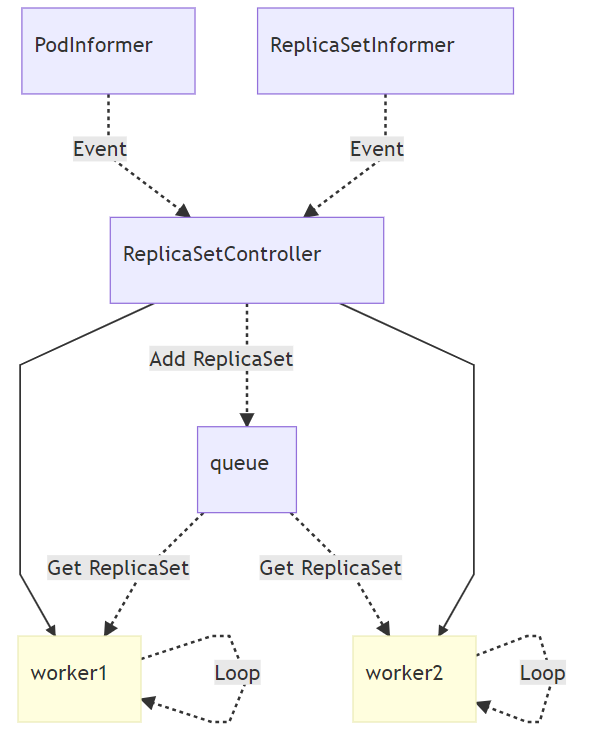

# Replicaset 基本介绍及使用

## 1. Replicaset基本介绍

### 1-1. Replicaset概念
> Kubernetes中的ReplicaSet主要的作用是维持一组Pod副本的运行，它的主要作用就是保证一定数量的 Pod 能够在集群中正常运行，它会持续监听这些 Pod 的运行状态，在 Pod 发生故障时重启pod，pod数量减少时重新运行新的 Pod 副本，因此，它通常被用来保证特定数量相同的Pods的可用性。

### 1-2. replicaset怎么工作
> ReplicaSet由字段定义，包括一个选择器，该选择器指定如何找到它所管理的Pod、维护多少个pod，以及pod的模板。ReplicaSet通过创建和删除Pod来满足期望的pod数量。当ReplicaSet需要创建新的Pod时，它将使用其Pod模板。ReplicaSet通过Pods的metadata.ownerReferences字段链接到其Pod，该字段指定当前对象所拥有的资源。由ReplicaSet获取的所有Pod在其ownerReferences字段中都有其自己的ReplicaSet的标识信息。通过此链接，ReplicaSet可以知道它正在维护的Pod的状态，并据此计划。
>
> ReplicaSet通过使用其选择器标识要获取的新Pod。如果存在没有OwnerReference的Pod或OwnerReference不是控制器，并且它与ReplicaSet的选择器匹配，它将由所述的ReplicaSet立即获取

### 1-3. 什么时候使用replicaset
>  replicaSet确保在任何给定时间都运行指定数量的Pod副本。但是，Deployment是一个高级概念，用于管理副本集，并提供对Pod的声明性更新以及许多其他有用的功能。因此，除非你需要自定义更新编排或根本不需要更新，否则我们使用Deployment而不是直接使用replicaset。这实际上意味着你可能永远不需要操纵ReplicaSet对象：改用Deployment，然后在spec部分中定义你的应用程序。

### 1-4 实现原理

> 所有 ReplicaSet 对象的增删改查都是由 ReplicaSetController 控制器完成的，该控制器会通过 Informer 监听 ReplicaSet 和 Pod 的变更事件并将其加入持有的待处理队列



> ReplicaSetController 中的 queue 其实就是一个存储待处理 ReplicaSet 的『对象池』，它运行的几个 Goroutine 会从队列中取出最新的数据进行处理，上图展示了事件从发生到被处理的流向。

> 如果我们在 Kubernetes 集群中删除一个 ReplicaSet 持有的 Pod，那么控制器会重新同步 ReplicaSet 的状态并启动一个新的 Pod，但是如果删除集群中的 ReplicaSet 所有相关的 Pod 也都会被删除：

## 2. Replicaset的使用([Template参考](https://kubernetes.io/docs/concepts/workloads/pods/#pod-templates))

```yaml
apiVersion: apps/v1
kind: ReplicaSet
metadata:
  name: replicaset-nginx
  labels:
    app: guestbook
    tier: backend
spec:
  replicas: 3
  selector:
    matchLabels:
      # 以下的labels不能重复, 如果有其他pod使用这两个标签会被ReplicaSet识别到
      app: guestbook
      tier: backend
  # pod 配置    
  template:
    metadata:
      name: replicaset-nginx
      labels:
        # 尽量与spec.selector.matchLabels一致
        app: guestbook
        tier: backend
    spec:
      containers:
      - name: replicaset-nginx
        image: nginx:stable-alpine
```

> 操作

```shell
# 删除
kubectl delete replicaset replicaset-nginx
kubectl delete -f replicaset-nginx.yaml

# 更新
kubectl apply -f replicaset-nginx.yaml
```

## 3. 总结

> Kubernetes 中的 ReplicaSet 并不是一个工程师经常需要直接接触的对象，常用的 Deployment ，其实使用 ReplicaSet 实现了很多复杂的特性，例如滚动更新，虽然作为使用者我们并不会经常直接与 ReplicaSet 这一对象打交道，但是如果需要对 Kubernetes 进行一些定制化开发，可能会用 ReplicaSet 和其他对象实现一些更复杂的功能