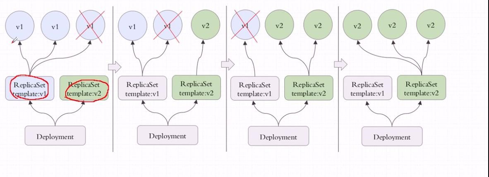

# Deployment

## 1. 简介

## 1-1. 概念

>  Deployment控制器为 Pod 和 ReplicaSet 提供了一个声明式更新的方法，在Deployment对象中描述一个期望的状态，Deployment控制器就会按照一定的控制速率把实际状态改成期望状态，通过定义一个Deployment控制器会创建一个新的ReplicaSets控制器，通过replicaset创建pod，删除Deployment控制器，也会删除Deployment控制器下对应的ReplicaSet控制器和pod资源

>  Deployment可以用来管理上面说到的那种蓝绿发布情况的，建立在rs之上的，一个Deployment可以管理多个rs，有多个rs存在，但实际运行的只有一个，当你更新到一个新版本的时候，只是创建了一个新的rs，把旧的rs替换掉了
>
> 



> rs的v1控制三个pod，删除一个，在rs的v2上重新建立一个，依次类推，直到全部都是由rs2控制，如果rs v2有问题，还可以回滚，Deployment是建构在rs之上的，多个rs组成一个Deployment，但是只有一个rs处于活跃状态


>  上面是Deployment,下面是rs，绿色的表示处于活跃状态的rs，一般只保留历史10个版本;

>  Deployment可以使用声明式定义，直接在命令行通过纯命令的方式完成对应资源版本的内容的修改，也就是通过打补丁的方式进行修改；Deployment能提供滚动式自定义自控制的更新；对Deployment来讲，我们在实现更新时还可以实现控制更新节奏和更新逻辑，什么叫做更新节奏和更新逻辑呢？
>
> 比如说ReplicaSet控制5个pod副本，pod的期望值是5个，但是升级的时候需要额外多几个pod，那么我们控制器可以控制在5个pod副本之外还能再增加几个pod副本；比方说能多一个，但是不能少，那么升级的时候就是先增加一个，再删除一个，增加一个删除一个，始终保持pod副本数是5个，但是有个别交叉之间是6个；还有一种情况，最多允许多一个，最少允许少一个，也就是最多6个，最少4个，第一次加一个，删除两个，第二次加两个，删除两个，依次类推，可以自己控制更新方式，这种是滚动更新的，需要加readinessProbe和livenessProbe探测，确保pod中容器里的应用都正常启动了才删除之前的pod；启动的第一步，刚更新第一批就暂停了也可以；假如目标是5个，允许一个也不能少，允许最多可以10个，那一次加5个即可；这就是我们可以自己控制节奏来控制更新的方法

## 1-2. 典型的使用场景：

- 创建无状态的应用, 即停止任何一个或多个对其他无影响的应用

- 滚动更新和回滚

## 2. deployment配置

### 2-1. 创建一个nginx deployment

```yaml

apiVersion: apps/v1
kind: Deployment
metadata:
  name: nginx-deploy
  namespace: app
spec:
  replicas: 5
  selector:
    matchLabels:
    # 必填, 必须与一下template下metadata.labels的一致
    # 例子
    # "release" : "stable", "release" : "canary"
	# "environment" : "dev", "environment" : "qa", "environment" : "production"
	# "tier" : "frontend", "tier" : "backend", "tier" : "cache"
	# "partition" : "customerA", "partition" : "customerB"
 	# "track" : "daily", "track" : "weekly"
      app: nginx
      release: stable
      tier: slb
      partition: website
  # 滚动升级时，容器准备就绪时间, 这段时间会堵塞, 停止更新
  minReadySeconds: 2
  # 控制保存历史版本的数量, 历史版本可用于回滚，要记录历史版本需要在创建Deployment时使用 --record选项
  # kubectl apply -f nginx.yaml --record
  revisionHistoryLimit: 3
  strategy:
    # 默认RollingUpdate: 滚动更新, 还可以是Recreate: 先删除让后重建
    type: "RollingUpdate"
    ## maxSurge, maxUnavailable 都可以是0值, 但是不能同时设置为0
    # 以 replicas: 5, maxSurge: 1, maxUnavailable: 1 为例
    # 先会创建一个pod, 存活6个, 然后终止两个存, 活4个, 然后再创建两个, 然后在启动两个, 存活6g个, 在终止两个, 知道旧的pod全部更新完成, 存活的数量最少4个, 最多6个
    # 如果replicas=maxSurge, 相当于蓝绿发布
    rollingUpdate:
      # 浪涌, 最多额外的pod数量, 可以是数量也可以是百分比, 100%会立即启动总数量的pod
      maxSurge: 1
      # 可以是数值也可以是百分比, 最多不可用pod数量, 为0 表示在pod启动就绪之前不要关闭旧pod
      maxUnavailable: 0
  template:
    metadata:
      labels:
        app: nginx
        release: stable
        tier: slb
        partition: website
        version: v1.12
    spec:
      containers:
      - name: nginx-pod
        image: nginx:stable-alpine
        lifecycle:
          postStart:
            exec:
              command:
                - /bin/bash
                - -c
                - "echo 'health check ok!' > /usr/share/nginx/html/health.html"
        readinessProbe: 
          initialDelaySeconds: 5
          httpGet:
            port: 80
            path: /health.html
        livenessProbe:
          initialDelaySeconds: 10
          periodSeconds: 5
          httpGet:
            port: 80
            path: /health.html
```

> 创建

```shell
kubectl apply -f nginx.yaml --record
```

> 查看

```shell
kubectl describe deployment nginx-deploy
kubectl get rs -n app -l partition=website -o wide
kubetctl get pods -n app -l partition=website

# 查看历史
kubectl rollout history deployment nginx-deploy -n app
# 查看replicaset, 多个ReplicaSet对应不同版本
kubectl get rs -n app -l tier=slb -L version
# 查看过程状态变化
kubectl rollout status deployment nginx-deploy -n app
kubectl get pod -n app -l partition=website -L version -w
```

2-2. 模拟蓝绿发布

```yaml
apiVersion: apps/v1
kind: Deployment
metadata:
  name: nginx-deploy
  namespace: app
spec:
  replicas: 5
  selector:
    matchLabels:
      app: nginx
      release: stable
      tier: slb
      partition: website
  strategy:
    rollingUpdate:
      # 最大浪涌数量为5
      maxSurge: 5
      maxUnavailable: 0
  template:
    metadata:
      labels:
        app: nginx
        release: stable
        tier: slb
        partition: website
        # 修改版本信息，用于查看当前版本
        version: v1.13
    spec:
      containers:
      - name: nginx-pod
        # 修改镜像
        image: nginx:stable-alpine
        lifecycle:
          postStart:
            exec:
              command:
                - /bin/bash
                - -c
                - "echo 'health check ok!' > /usr/share/nginx/html/health.html"
        readinessProbe: 
          initialDelaySeconds: 5
          httpGet:
            port: 80
            path: /health.html
        livenessProbe:
          initialDelaySeconds: 10
          periodSeconds: 5
          httpGet:
            port: 80
            path: /health.html
```

> 创建

```shell
kubectl apply -f nginx-v1.13.yaml --record
```

### 2-3. 滚动发布

> 通过定义 maxsurge 和 maxUnavailable 来实现滚动升级的速度，滚动升级中，可以使用 kubectl rollout pause 来实现暂停

```yaml

apiVersion: apps/v1
kind: Deployment
metadata:
  name: nginx-deploy
  namespace: app
spec:
  replicas: 5
  selector:
    matchLabels:
      app: nginx
      release: stable
      tier: slb
      partition: website
  strategy:
    rollingUpdate:
      # 以下两项，控制升级速度
      maxSurge: 1
      maxUnavailable: 0
  template:
    metadata:
      labels:
        app: nginx
        release: stable
        tier: slb
        partition: website
        # 修改版本
        version: v1.14
    spec:
      containers:
      - name: nginx-pod
        # 修改镜像版本
        image: nginx:stable-alpine
        lifecycle:
          postStart:
            exec:
              command:
                - /bin/bash
                - -c
                - "echo 'health check ok!' > /usr/share/nginx/html/health.html"
        readinessProbe: 
          initialDelaySeconds: 5
          httpGet:
            port: 80
            path: /health.html
        livenessProbe:
          initialDelaySeconds: 10
          periodSeconds: 5
          httpGet:
            port: 80
            path: /health.html
```

> 创建

```shell
kubectl apply -f nginx-v1.14.yaml --record
```
> 查看

```shell
# replicaset 数量增加
kubectl get rs -n app -l tier=slb -L version
```

### 2-4.  模拟灰度(金丝雀)发布

> 灰度发布在不同场景中实现方式不同，如果当前灰度机器仅对测试开放，可以定义一个新的deployment来配合service来实现。如果需要切入一部分随机真实用户的流量，可以将生产机器中一台机器作为灰度机器，通过灰度后再升级其它的机器
>
> yaml 只要修改镜像文件即可

> 创建

```shell
kubectl apply -f nginx-v1.15.yaml --record=true && kubectl rollout pause deployment nginx-deploy -n app
```

> 查看

```shell
kubectl get rs -n app -l tier=slb -L version

kubectl get pod -n app -l partition=website -L version -w

# 手动暂停
kubectl rollout resume deployment nginx-deploy -n app && kubectl rollout pause deployment nginx-deploy -n app
kubectl get pod -n app -l partition=website -L version -w
# 升级剩余所有机器
kubectl rollout resume deployment nginx-deploy -n app
```

## 2-5. 版本回滚

```shell
# 查看历史版本记录
kubectl rollout history deployment nginx-deploy -n app
# 回退到上一版本
kubectl rollout undo deployment nginx-deploy -n app
# 
kubectl rollout history deployment nginx-deploy -n app
```

> 常用命令

```shell
kubectl rollout status deployment nginx-deploy -n app  # 查看版本升级过程
kubectl rollout history deployment nginx-deploy -n app # 查看版本升级历史
kubectl apply -f nginx-v1.15.yaml --record=true  # 升级且记录升级命令
kubectl rollout undo deployment nginx-deploy -n app    # 回滚到上个版本
kubectl rollout undo deployment nginx-deploy --to-revision=3 -n app # 回滚到版本3
```

