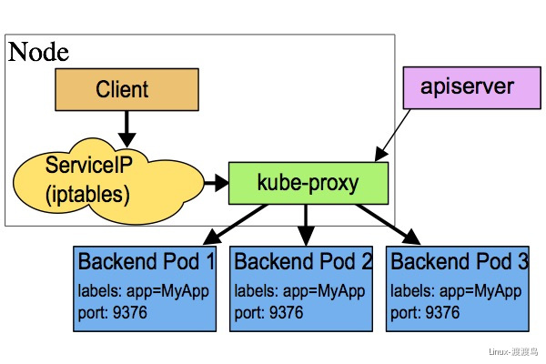
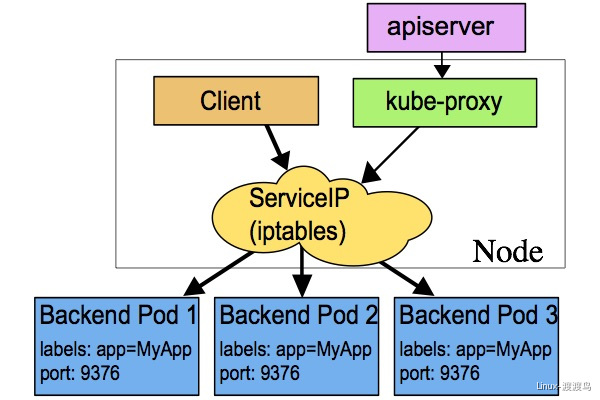
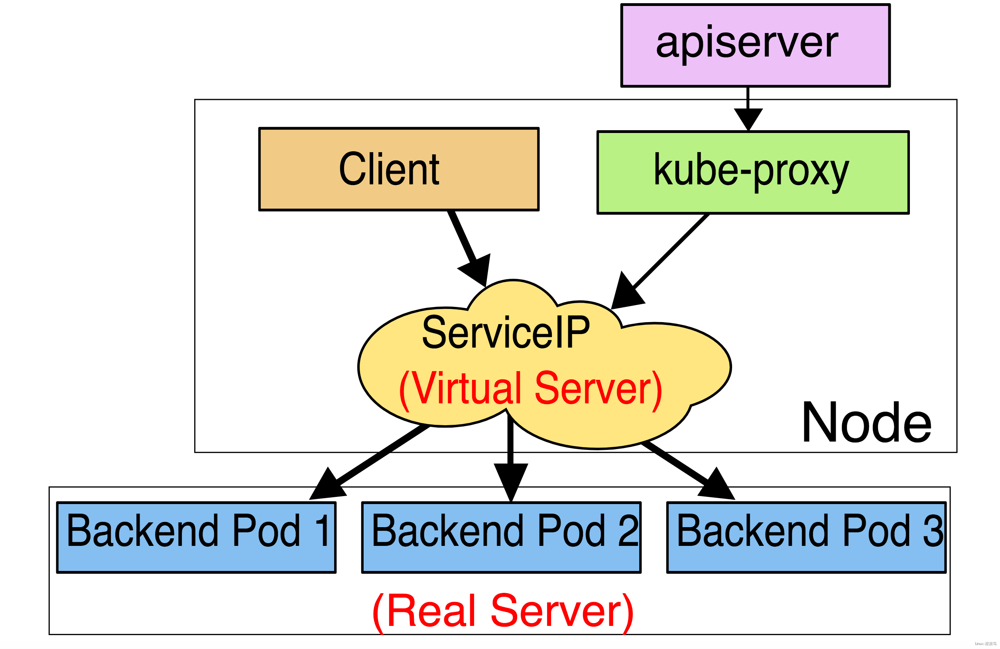

# Service

## 1. 参考文档

- [Service官方文档](https://kubernetes.io/docs/concepts/services-networking/service/)
- [Service官方中文解释](https://github.com/kubernetes/ingress-nginx)
- [其他参考](https://www.yuque.com/duduniao/k8s/lk14ka)

## 2. 基本介绍

> Pod控制器实现了对一组pod的版本、副本数和配置的控制，但是Pod本身被创建和消除会导致IP地址不断变化，Service为一组pod提供了一个固定的VIP，所有通过该VIP地址的请求都会被转发到后端的pod上。Service是工作在四层网络之上的，支持三种工作模式。
> 
> 在 Kubernetes v1.0 版本，代理完全在 userspace。在 Kubernetes v1.1 版本，新增了 iptables 代理，但并不是默认的运行模式。 从 Kubernetes v1.2 起，默认就是 iptables 代理。在Kubernetes v1.8.0-beta.0中，添加了ipvs代理。

## 3. 转发模式

### 3-1. userspace模式

> 客户端请求到内核空间后，由iptables规则将其转发到用户空间的 kube-proxy，kube-proxy 将其调度到各个node上的目标Pod。这种模式需要多次切换用户空间和内核空间，性能很差，生产环境不再使用。



### 3-2. iptables模式

> iptables模式中，客户端的请求进入内核态后，直接由iptables将请求转发到各个pod上，这种模式中随着iptables规则的增加，性能越来越差，而且iptables规则查看和管理难度很大，生产环境中尽量少用。



### 3-3. ipvs模式

> ipvs模式中，客户端的请求进入内核态后，直接由ipvs规则将请求转发到各个pod上，这种模式相当于内嵌一套lvs集群，性能比iptables强大，更重要的是支持lvs中调度算法，生产环境中ipvs模式优先考虑使用。ipvs内部时使用ipset维护映射关系，由于是hash链表，因此查询速度远远大于iptables的遍历速度。



## 4. yaml配置模板

```yaml
apiVersion: v1
kind: Service
metadata
  name        <string>            # 在一个名称空间不能重复
  namespace   <string>            # 指定名称空间，默认defalut
  labels      <map[string]string> # 标签
  annotations <map[string]string> # 注释
spec
  selector                    <map[string]string> # 仅支持key/value方式定义选择器
  type                        <string>            # service暴露方式
        # ClusterIP: 通过集群的VIP方式，这种方式下仅能在集群内部访问，默认值
        # NodePort: 通过暴露node端口来将流量路由到clusterIP，从而实现从集群外部访问service功能，且需要宿主机开启监听端口，容易出现端口冲突
        # LoadBalancer: 使用云提供商的负载均衡器，可以向外部暴露服务。外部的负载均衡器可以路由到NodePort服务和ClusterIP服务
        # ExternalName: 通过返回 CNAME 和它的值，可以将服务映射到 externalName 字段的内容
  clusterIP                   <string>            # 定义集群VIP地址
        # 当指定确定IP地址时，会以该IP地址为准
        # 当指定为None时，为 headless service
  ports                       <[]Object>          # 指定端口映射
    name                    <string>            # 端口名称
    port                    <integer> -required-# 指定service端口
    targetPort              <string>            # 指定pod端口
    nodePort                <integer>           # 指定node端口，仅在NodePort类型使用.3000-29999之间
  sessionAffinity            ClientIP            # 是否启用粘性会话，
  sessionAffinityConfig:
    clientIP:
      timeoutSeconds: 10800
```

## 5. spec.type

### 5-1. ClusterIP

- #### 不指定VIP的service

> 这种模式是生产中使用最多的，由集群内部访问时通过service域名解析得到cluster IP，客户端访问cluster IP时,系统会通过iptable或者ipvs将流量负载均衡到后端Pod上。

```yaml
apiVersion: v1
kind: Service
metadata:
  name: slb-s1
  namespace: app
spec:
  selector:
    app: nginx
    release: stable
    partition: website
    tier: slb
  ports:
  - name: http
    port: 80
    targetPort: 80
```

- #### 指定VIP的service

> 大部分情况下，不需要指定vip，因为内部pod通过域名的方式访问service，此处只是作为演示。

```yaml
apiVersion: v1
kind: Service
metadata:
  name: slb-s2
  namespace: app
spec:
  selector:
    app: nginx
    release: stable
    partition: website
    tier: slb
  clusterIP: 192.168.10.100
  ports:
  - name: http
    port: 80
    targetPort: 80
```

- headless service

> 将service的发布文件中的clusterip=none ，不让其获取clusterip ， DNS解析的时候直接走pod
> 
> headless service不会分配群集IP，kube-proxy不会处理这些服务，并且平台也不会为它们进行负载平衡或代理。如何自动配置DNS取决于服务是否定义了选择器
> 
> Headless service并不对外提供Cluster IP和负载均衡的能力，它提供的是服务发现功能，通过dns解析svc域名，得到对应的endpoint的Pod地址。最终由客户端自行决定如何处理这些Pod地址。

```yaml
apiVersion: v1
kind: Service
metadata:
  name: slb-s4
  namespace: app
spec:
  selector:
    app: nginx
    release: stable
    partition: website
    tier: slb
  clusterIP: None
  ports:
  - name: http
    port: 80
    targetPort: 80
```

### 5-2. NodePort

> 这种Service会占用宿主机的端口，默认可用的端口范围在 30000-32767 之间，可以在安装apiserver时修改。一般场景中，很少使用NodePort，因为容易端口冲突和混乱，不方便管理。

```yaml
apiVersion: v1
kind: Service
metadata:
  name: slb-s3
  namespace: app
spec:
  selector:
    app: nginx
    release: stable
    partition: website
    tier: slb
  type: NodePort
  ports:
  - name: http
    port: 80
    targetPort: 80
    nodePort: 3080
```

### 5-3. LoadBalancer

> 在那些支持外部负载均衡器的云提供者上面，将type字段设置为"LoadBalancer"会为你的Service设置好一个负载均衡器。该负载均衡器的实际的创建是异步进行的，并且该设置好均衡器会在该Service的status.loadBalancer字段中显示出来。

1. 阿里云

```yaml
apiVersion: v1
kind: Service
metadata:
  annotations:
    # 注解参考文档： https://help.aliyun.com/document_detail/86531.html#section-3pu-lhe-9wm
    service.beta.kubernetes.io/alibaba-cloud-loadbalancer-acl-id: acl-xxxx
    service.beta.kubernetes.io/alibaba-cloud-loadbalancer-acl-status: "on"
    service.beta.kubernetes.io/alibaba-cloud-loadbalancer-acl-type: white
    service.beta.kubernetes.io/alibaba-cloud-loadbalancer-cert-id: xxxx-xxxx
    service.beta.kubernetes.io/alibaba-cloud-loadbalancer-protocol-port: "https:10443"
    service.beta.kubernetes.io/alicloud-loadbalancer-address-type: intranet
    service.beta.kubernetes.io/alicloud-loadbalancer-id: lb-xxxxxxxx
    service.beta.kubernetes.io/alicloud-loadbalancer-force-override-listeners: "true"
    service.beta.kubernetes.io/alibaba-cloud-loadbalancer-health-check-flag: "on"
    service.beta.kubernetes.io/alibaba-cloud-loadbalancer-health-check-type: "http"
    service.beta.kubernetes.io/alibaba-cloud-loadbalancer-health-check-uri: "/healthz"
    service.beta.kubernetes.io/alibaba-cloud-loadbalancer-healthy-threshold: "3"
    service.beta.kubernetes.io/alibaba-cloud-loadbalancer-unhealthy-threshold: "3"
    service.beta.kubernetes.io/alibaba-cloud-loadbalancer-health-check-timeout: "3"
    service.beta.kubernetes.io/alibaba-cloud-loadbalancer-health-check-interval: "3"
    # get,head
    service.beta.kubernetes.io/alibaba-cloud-loadbalancer-health-check-method: "get"
    # http_2xx,http_3xx,http_4xx,http_5xx
    service.beta.kubernetes.io/alibaba-cloud-loadbalancer-health-check-httpcode: "http_2xx,http_3xx"
  name: xxxxxx-external
  namespace: xxxxxx
spec:
  # https://help.aliyun.com/document_detail/390170.html
  # 1.22版本后，默认开启支持配置负载均衡类型的服务不分配节点端口（ServiceLBNodePortControl）特性。该特性适用于直接将流量路由到容器组的场景，基于该特性，可以通过配置类型为负载均衡的.spec.allocateLoadBalancerNodePorts为false，从而禁用节点端口的分配
  allocateLoadBalancerNodePorts: true
  # https://help.aliyun.com/document_detail/86531.html
  # 默认externalTrafficPolicy为Cluster模式，会将集群中所有节点挂载到后端服务器。Local模式仅将Pod所在节点作为后端服务器
  externalTrafficPolicy: Local
  # https://kubernetes.io/docs/concepts/services-networking/service-traffic-policy/#:~:text=Service%20Internal%20Traffic%20Policy%20enables%20internal%20traffic%20restrictions,can%20help%20to%20reduce%20costs%20and%20improve%20performance.
  internalTrafficPolicy: Cluster
  ports:
  - name: xxxx-xxxxx
    nodePort: 32100
    # Port需要和alibaba-cloud-loadbalancer-protocol-port保持对应关系。
    port: 10443
    protocol: TCP
    targetPort: 5601
  selector:
    app: opensearch-dashboards
  sessionAffinity: None
  type: LoadBalancer
```
