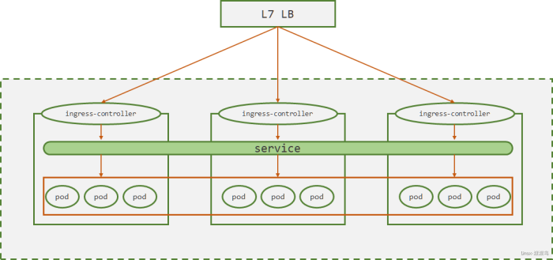

# Ingress和IngressController

## 1. 参考文档

- [Ingress和IngressController官方文档](https://kubernetes.io/docs/concepts/services-networking/ingress/)
- [ingress-nginx github](https://github.com/kubernetes/ingress-nginx)
- [ingress-nginx 文档](https://kubernetes.github.io/ingress-nginx/)
- [treafik官方文档](https://doc.traefik.io/traefik/)
- [treafik中文文档](https://docs.traefik.cn/)

## 2. 说明

> Service虽说是为集群内部pod访问一组微服务提供固定接入点，其实NodePort、LoadBalancer方式可以通过在Node上配置端口映射实现外部集群访问内部service。这种方式存在以下问题：
> 
> - 仅支持L4调度，不支持域名和Loctation方式分发流量
> - 对于SSL会话卸载，需要在pod内部完成，比较复杂
> - 当业务数量增加时，容易出现端口冲突
> 
> Ingress 是 Kubernetes 的一种 API 对象，是实现HTTP/HTTPS、基于路径和域名进行流量转发的一组规则，实现了将集群外部七层流量转发到集群内部。IngressController是将Ingress规则实现的一种负载均衡器Pod，如Nginx、Traefik、HAProxy等。
> 
> IngressController有两种部署方式：一种是采用DaemonSet方式部署，一种是Deployment方式部署。为了降低复杂度，一般都采用DaemonSet方式部署。如下图所示：
> 
> - ingress-controller 采用DaemonSet方式部署在各个node节点之上
> - 集群外部部署一个七层负载均衡，如Nginx。Nginx负责做流量转发和SSL会话卸载
> - ingress-controller根据ingress规则将流量调度到指定的service上
> - 各service再将流量转发到各个pod上



> ingress yaml模板

```yaml
apiVersion: extensions/v1beta1
kind: Ingress
metadata
  name        <string>            # 在一个名称空间不能重复
  namespace   <string>            # 指定名称空间，默认defalut
  labels      <map[string]string> # 标签
  annotations <map[string]string> # 注释
spec
  backend                     <Object>                # 后端pod对应的服务，仅在集群中仅单个service暴露时使用
    serviceName               <string> -required-     # 服务名
    servicePort               <string> -required-     # 服务接入端口
  rules                       <[]Object>              # 流量转发规则
    host                      <string>                # 基于server name进行转发
    http                      <Object>                # 基于path路径转发
      paths                   <[]Object> -required-   # 指定转发的path路径和后端service
        path                  <string>                # 指定path        
        backend               <Object> -required-     # 后端pod对应的服务
          serviceName         <string> -required-     # 服务名
          servicePort         <string> -required-     # 服务接入端口
```
