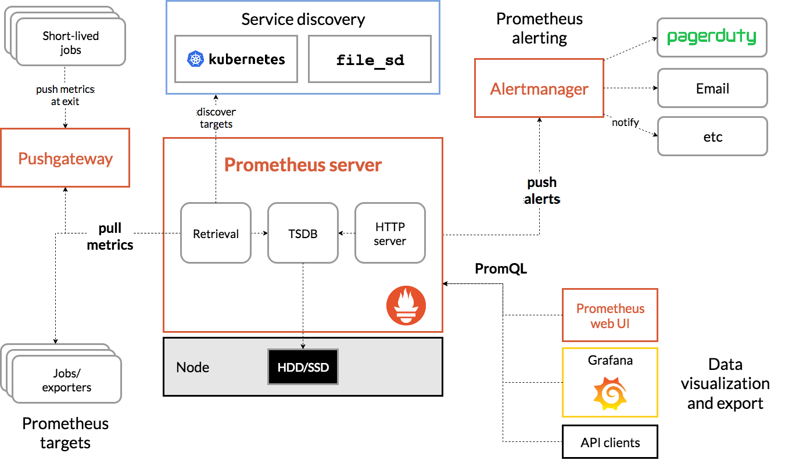
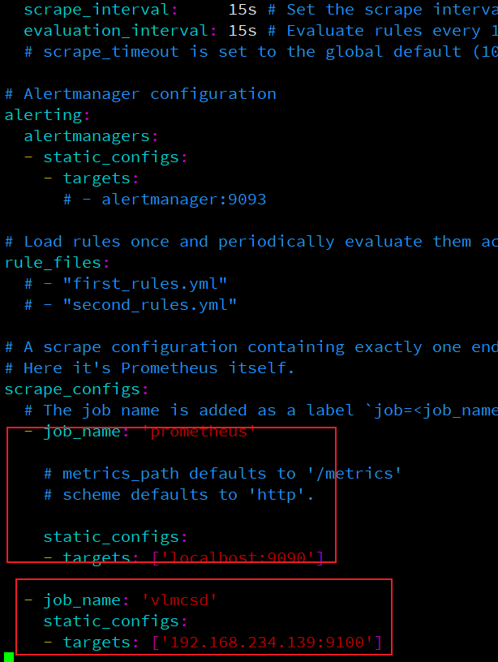

# Prometheus 的基本介绍与使用

## 1. 监控系统简介

### 1-1 监控系统组件(必备功能)

- 指标数据采集
- 指标数据存储
- 指标数据趋势分析及可视化
- 告警

## 1-2. 监控体系

- 系统层监控
    - 系统监控:  cpu, load, memory, swap, disk io, processes, kernel parameters, ....
    - 网络监控: 网络设备, 工作负载, 网络延迟, 丢包率
- 中间件及基础设施类监控
    - 消息中间件: kafaka, rocketMQ, RabbitMQ
    - web服务容器: tomcat和Jetty
    - 数据库及缓存系统: mysql, postgresql, mogoDb, elasticsearch, redis, ...
    - 数据库连接池: shardingSpere, ...
    - 存储系统: ceph, ...
- 应用层监控
    - 用于衡量应用代码程序代码的状态和性能
- 业务层监控
    - 用于衡量应用程序的价值, 例如电商网站上的销量
    - QPS, DAU日活, 转化率
    - 业务接口, 登录数, 注册数, 订单数, 搜索量和支付量等

## 1-3. 云原生时代的可观测性

- 可观测性系统
    - 指标监控(Metrics): 随时间推移产生的一些与监控相关的可聚合数据点
    - 日hi监控(Logging): 离散式的日志或事件
    - 链路跟踪(Tracing): 分布式应用调用链跟踪
- CNCF(Cloud Native Computing Foundation)将可观测性和数据分析归类一个单独的类别, 且划分成4个子类
    - 监控系统: 以Prometheus等为代表
    - 日志系统: 以ElasticStack和PLG stack等为代表
    - 分布式调用链跟踪系统: 以Zipkin, Jaeger, Sky Walking, Pinpoint等为代表
    - 混沌工程系统: 以ChaosMonkey和ChaosBlade等为代表

## 1-4. Google的四个黄金指标

- 延迟(Latency)
    - 服务请求所需要的时长, 例如http请求平均延迟
    - 需要区分失败请求和成功请求
- 流量(Traffic)
    - 衡量服务的容量需求, 例如每秒处理的http请求数或者数据库系统的事务数量
- 错误(Errors)
    - 请求失败率, 用于衡量错误发生的情况
    - 例如, http500错误数等显式失败, 返回错误内容或无效内容等隐式失败, 以及由策略原因导致的失败(强制要求响应时间为30毫秒的请求是为错误)
- 饱和度(Saturation)
    - 衡量资源的使用情况, 用于表达应用程序有多“满”
    - 例如内存, cpu, Io 磁盘等资源的使用量

## 2. Prometheus([官方文档](https://prometheus.io/docs/introduction/overview/))

- prometheus是一款时序(time series)数据库, 但它的功能却并非止步与TSDB, 而是一款设计用于进行目标(Target)监控的关键组件

- 结合生态系统内的其他组件, 例如pushgateway, altermanager 和grafana等构成一个完整的IT监控系统

- 基于http call 重配置文件中指定的网络端点(endpoint)上周期性获取指标数据

- prometheus支持三种类型的途径从目标上“抓取(Scrape)”指标数据

    - Exporters
    - Instrumentation
    - Pushgateway

- 主动从target上获取(pull)数据, 而非等待被监控端推送(push)

    - pull方式有利于将配置集中在prometheus server上完成, 包括指标及采集速率
    - prometheus的根本目标在于收集target上预先完成聚合型数据, 而非一款由事件驱动的存储系统

### 2-1. 时序数据

> 在一段时间内通过重复测量(measurement)而获得的观测值的集合; 将这些观测值的绘制于图形之上, 他会有一个数据轴和时间轴
>
> 服务器指标数据, 应用程序性能监控数据, 网络数据等都是时序数据

### 2-2. Prometheus的生态组件

> Prom负责时序型指标数据的采集及存储, 但数据的分析, 聚合及直观展示以及告警等功能并非由Prom server所负责


- Prometheus Server
> 收集和存储时间序列数据

- Client Library

> 客户端库, 目的子啊与为那些期望原生提供Instrumentation功能的应用程序提供便捷的开发途径

- Push Gateway

> 接收那些通常由短期作业生成的指标数据的网关, 并支持由Prome Server 进行指标拉取操作

- Exporters

> 用于暴露现有应用程序或服务(不支持Instrumentation)的指标给Prom Server

- Alertmanager

> 从Prom Server接收到告警通知后通过去重, 分组, 路由等预处理功能后以向用户完成告警信息发送

- Data Visualization

> Prom Web UI (Prom Server内建)及Grafana等

- Service Discovery

> 动态发现待监控的Target, 从而完成监控配置的重要组件, 在容器化环境中尤为有用, 该逐渐目前由Prom Server内建支持

### 2-3. Prometheus数据模型([官方文档](https://prometheus.io/docs/concepts/data_model/))

> Prom 仅用键值形式存储时序的聚合数据, 它并不支持存储文本信息
>
> - 其中 “键”称为指标(metric)
> - 同一指标可能会适配到多个目标或设备, 因而它使用“标签(Label)” 座位元数据, 从而为Metric田间更多的信息描述维度
> - 这些标签可以作为过滤器进行指标过滤及聚合运算

```text
key                         label                        value
cpu_usage                                                14.4
cpu_usage          {core="1", ip="127.0.0.1"} 			 14.4
```

### 2-4 指标类型(metric types)([官方文档](https://prometheus.io/docs/concepts/metric_types/))

### 2-5. 作业(Job)和实例(Instance)([官方文档](https://prometheus.io/docs/concepts/jobs_instances/))

### 2-6. 程序仪表(Instrumentation)和Exporters([官方文档](https://prometheus.io/docs/instrumenting/exporters/))

> Prom官方提供了大量的Exporters, [exiporter下载](https://prometheus.io/download/)

### 2-7. Alerts([官方文档](https://prometheus.io/docs/alerting/latest/overview/))

> 抓取到异常之后, Prom支持通过告警机制向用户发送反馈或告警, 以触发用户能够及时采取应对措施
>
> Prome Server仅负责生成告警, 具体的告警行为由另一个独立的应用程序AlertManager负责

### 2-8. PromQL

> Prom提供内置的数据查询语言PromQL(Prometheus Query Language), 支持用户进行实时的数据查询及聚合操作
>
> PromQl支持处理两种向量, 并内置提供了一组用于数据处理的函数
>
> - 即时向量
> - 事件范围向量

### 2-9. 生产使用架构图



### 2-10. Prometheus的局限

> Prom 是一款指标监控系统, 不适合存储事件及日志等, 它更多的展示的是趋势性的监控, 而非精准数据
>
> Prom认为只有最近的监控数据才有查询的需要, 其本地存储的设计初衷只是保存短期的数据, 因而不支持针对大量的历史数据进行存储, 若需要存储长期历史数据, 建议基于远端存储机制将数据保存于InfluxDB或OpenTSDB
>
> Prom的集群机制成熟度不高即便基于Thanos也是如此

## 3. Prom的安装及使用

### 3-1. Prom安装

> Prom安装很简单, 直接到[官网下载](https://prometheus.io/download/)二进制包运行即可, 默认端口为9090, IP:9090就可以访问UI页面了
>
> 但是没有数据, 需要配置([配置文档](https://prometheus.io/docs/prometheus/latest/configuration/configuration/))

### 3-2. node_exporters

> [官方的exiporter下载](https://prometheus.io/download/)

> 下载node_exporters

```shell
wget "https://github.com/prometheus/node_exporter/releases/download/v1.0.1/node_exporter-1.0.1.linux-amd64.tar.gz"

#解压
tar -zxvf node_exporter-1.0.1.linux-amd64.tar.gz

# 进入目录运行即可
./node_exporter

```

> 添加Prom Server 采集



### 3-3. 与Grafana配合使用

> [官方文档](https://prometheus.io/docs/visualization/grafana/)