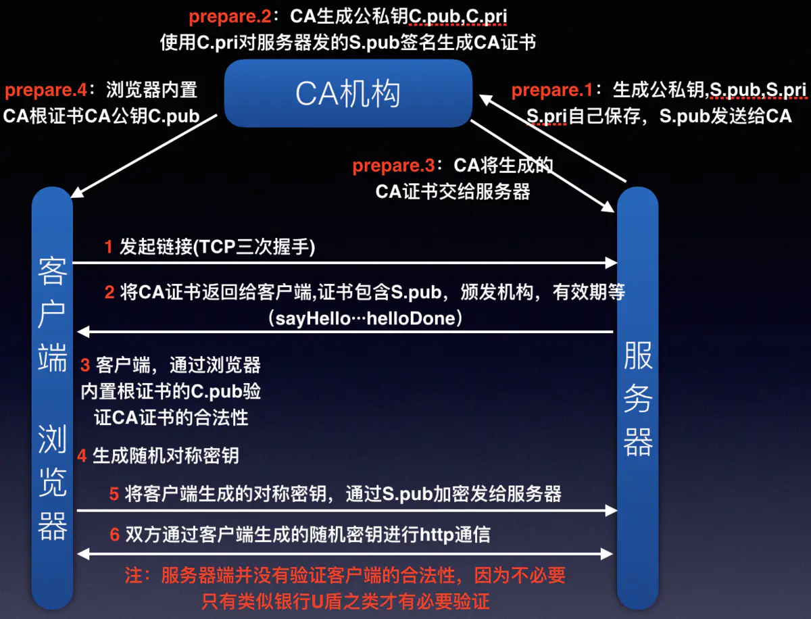

# 概述

------------

## 使用https过程中有三个角色:
> 1. CA认证机构:  证书颁发机构（CA, Certificate Authority）即颁发数字证书的机构。是负责发放和管理数字证书的权威机构，并作为电子商务交易中受信任的第三方，承担公钥体系中公钥的合法性检验的责任
> 2. 客户端(client), 以下用 browser 代替
> 3. 服务端(server), 以下用 nginx 代替

## CA:
> 证书颁发机构, 他也有自己的公钥和私钥 CA.pub, CA.rsa

## 服务端, 以nginx为例:
> nginx的配置如下
>```
> server {
  >     listen 443 ssl default_server;
  >     server_name _;
  >     ssl_certificate /data/ssl_keys/aa.pem;
  >     ssl_certificate_key /data/ssl_keys/aa.key;
  >     return 403
>}
>```
> 1. 服务器也有自己的公私钥, S.rsa和S.pub
> 2. ssl_certificate是证书, 其中包含info(公钥S.pub, 及站点信息, 站点信息包括颁发机构, 有效期, 域名等)通过hash算法生成消息摘要发给 CA , CA用其私钥CA.rsa 消息摘要加密得到一个签名, 在加上info组成证书
> 3.  ssl_certificate_key是服务器的私钥(S.rsa)

## 客户端访问流程, 客户端系统或浏览器会有内置的信任的CA, 也可以安装自己的CA(自制证书)

1. client请求到以上nginx, , nginx 把ssl_certificate配的证书(包含签名和info)发个client,,client用CA.pub 解密证书里的签名(用CA.rsa加密info  hash得到的), 与info hash之后的摘要对比, 确认CA是否合法(非对称加密)
2. 验证通过后, client会生成随机对称密钥, 把这个对称密钥用info中的服务器公钥S.pub加密, 发给nginx, 
3. nginx 用私钥(S.rsa, ssl_certificate_key)解密
4. client和nginx就用对称密钥加密进行http通信, 完成



