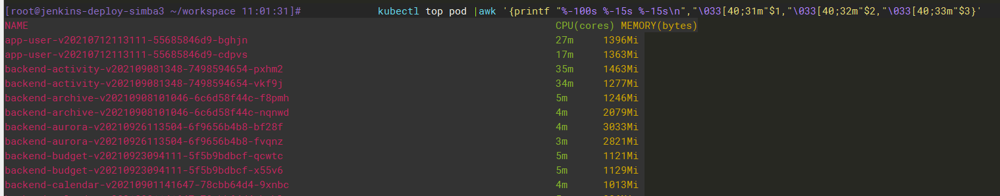

### 内置变量

- $number
  
    > 表示记录的字段。比如，$1表示第1个字段，$2表示第2个字段，如此类推。而$0比较特殊，表示整个当前行
- NR
  
    > 表示当前记录的编号（awk将第一个记录算作记录号1）
- FNR
  
    > 当前记录位于当前文件的顺序号，处理多个文件的时候有用
- FILENAME
  
    > 当前文件名
- NF
  
    > 表示当前记录中的字段数量
- FS
  
    > 表示字段分隔符
- RS
  
    > 记录分隔符，默认为换行符
- OFS
  
    > 指定以怎样的分隔符为输出数据的字段分隔符，默认为空格
- ORS
  
    > 输出记录分隔符，默认为换行
- OFMT
  
    > 输出顺序号的格式,默认为 0.6g
- SUBSEP
- ARGC
- ARGV
- ENVIRON


### 内置函数

- length(s)
    - 把参数值当做字符串所占有的长度,如果没有指定参数默认为当前记录的总长度
- srand
    - 设置随机谁的种子
- rand
    - 返回0~1之间的一个随机数
- int
    - 转换字符串成数值类型
- gsub(r,s)
    - 在整个$0中用s替代r
- gsub(r,s,t)
    - 在整个t中用s替代r
- index(s,t)
    - 返回s中字符串t的第一位置
- match(s,r)
    - 测试s是否包含匹配r的字符串
- split(s,a,fs)
    - 在fs上将s分成序列a
- sprint(fmt,exp)
    - 返回经fmt格式化后的exp
- sub(r,s)
    - 用$0中最左边最长的子串代替s
- substr(s,p)
    - 返回字符串s中从p开始的后缀部分
- substr(s,p,n)
    - 返回字符串s中从p开始长度为n的后缀部分
- system(cmd)
- tolower(str)
- toupper(str)


### 实战

> 可以用/var/log/messages测试

```
tail -n 10 /var/log/messages | awk 'BEGIN{FS=" ";OFS="\t\t"; print "行号","月份","日期","时间"}{print NR,$1,$2,$3} END{print "========\n",NR}'
```

> 带if

```shell
tail -n 10 /var/log/messages | awk 'FS=" "{if ($5 == "systemd:") {print $0} else {print $1}} '
```

> 内置函数

```shell
awk 'BEGIN{info="this is a test2010test!";gsub(/[0-9]+/,"!",info);print info}'  
```

> 对齐输出,并加颜色
>
> ```
> #%-30s表示输出字符串,宽度30位,左对齐.%-15s用来指定第二列的,左对齐,宽度15.两个百分号之间可以没有空格.使用\n对每一行的输出加上换行符
> ```

```shell
kubectl top pod |awk '{printf "%-100s %-15s %-15s\n","\033[40;31m"$1,"\033[40;32m"$2,"\033[40;33m"$3}'
```


