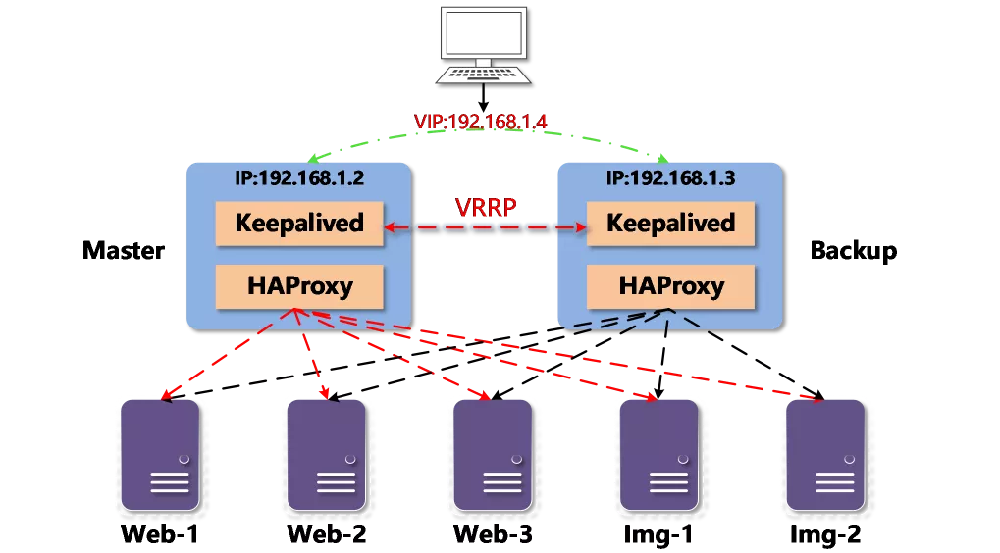

> **负载均衡是分布式系统中不可或缺的重要环节，通过负载均衡按照指定的调度算法将请求分发至网络中多个节点进行处理。本文将介绍基于开源软件HAProxy实现负载均衡并且通过Keepalived实现高可用的配置方法，希望读者通过参考本文的探索成果可以快速实现高可用的软件负载均衡，也希望读者能够举一反三、触类旁通，通过自我驱动进行更深入的研究来配置更多的功能来满足自身需求。**

**1. 概述**

软件负载均衡技术是指可以为多个后端服务器节点提供前端IP流量分发调度服务的软件技术。Keepalived和HAProxy是众多软负载技术中的两种，其中Keepalived既可以实现负载均衡也可以实现高可用，而HAProxy则更加专注于提供高性能TCP和HTTP反向代理和负载均衡能力。

**1.1 Keepalived**

Keepalived工作在OSI模型中的四层传输层。最初它是为了管理并监控Linux虚拟服务器（LVS）集群中各服务节点的状态，后来又加入了路由冗余协议（VRRP）来实现高可用功能，所以Keepalived除了可以管理配置LVS外，还可以作为Nginx、HAProxy等的高可用解决方案。

Keepalived同时运行于主服务器（Master）和备服务器（Backup）之上，所有的服务器上运行的Keepalived之间通过VRRP交互，VRRP设计目的是为了解决静态路由单点故障问题，保证个别节点宕机时，整个网络可以不间断的运行。

Keepalived不但可以实现主备服务器的高可用性，同时还可以管理LVS实现后端服务器的负载均衡并进行后端服务器节点的健康检查。它启动核心进程时读取keepalived.conf配置文件。在主服务器上keepalived进程按照配置文件配置的负载均衡策略开启LVS转发并对后端服务进行健康检查。利用VRRP协议主服务器周期性的发送广播至备服务器，备服务器将会判断主器服务器的状态，如果在配置的同步超时时间内主服务器节点未能发出广播，那么keepalived将启动高可用切换机制选出新的主服务器。切换过程中，原有主服务器上的虚拟地址（VIP）及负载能力将由新的主服务器来接替承载。

**1.2 HAProxy**

HAProxy 是一款TCP/HTTP 反向代理负载均衡服务器软件，可工作在OSI模型中的四层传输层以及七层应用层。HAProxy特别适用于那些负载压力大的web站点，这些站点通常需要会话保持或七层处理。HAProxy运行在时下的服务器上，可以支持数以万计的并发连接。并且它的运行模式使得它可以很简单安全地整合进现有的系统架构中，同时可以保护web服务器不被暴露到网络上。HAproxy允许用户定义多组服务代理，代理由前端和后端组成，前端定义了服务监听的IP及端口，后端则定义了一组服务器及负载均衡的算法。通过服务代理将流量由前端负载均衡至后端服务器节点上。

**1.3 Keepalived和HAProxy组合**

由于HAProxy会存在单点故障问题，可以由Keepalived来为HAProxy提供高可用服务，而HAProxy提供四层或七层高性能负载均衡及反向代理服务，两者共同实现高可用负载均衡，结构如图1所示。



图1 Keepalived+HAProxy


**2. Keepalived功能及安装配置**

**2.1 核心功能**

1．管理LVS负载均衡软件

Keepalived最初是专为解决LVS的问题而诞生的。因此，Keepalived和LVS可紧密结合。

2．实现对LVS集群节点健康检查

当LVS集群中某个节点服务器发生故障时，Keepalived服务会自动将失效的节点从正常队列中剔除，并将请求调度到别的正常的节点服务器上，从而保证用户访问不受影响。当故障节点被修复后，Keepalived服务又会自动切换回来。

3．网络服务高可用功能

Keepalived可以实现任意两台主机之间，如Master服务器和Backup服务器间的故障转移和自动切换。假设某个服务是不能停机的，如LVS负载均衡、Nginx反向代理服务器等，可以利用Keepalived保证其高可用性。

**2.2 高可用原理**

Keepalived高可用服务的故障切换转移是通过VRRP机制来实现的。在Keepalived服务正常运行时，Master节点会不断向Backup节点发送（多播方式）心跳信息，用以通知Master节点的存活状态。当Master节点发生故障时，就无法发送心跳信息，Backup节点也就无法检测到来自Master的心跳信息，于是调用自身的接管程序，接管Master的资源和服务。当Master恢复时，Backup又会释放Master故障时自身接管的资源和服务，恢复到原来的备用角色。无论Master如何切换，对外都应该提供相同的服务IP地址，该IP也称作虚拟地址VIP。客户端并不需要因Master的改变而修改自己的配置，对他们来说这种切换是透明的。

路由冗余协议VRRP（Virtual Router Redundancy Protocol）早期是用来解决交换机、路由器等设备单点故障。VRRP通过竞选机制来实现虚拟路由器的功能，所有的协议报文都是通过IP多播（Multicast）包形式来发送。在一组VRRP路由器集群中，有多台物理路由器，但并不是同时工作，而是由一台Master路由器负责路由工作，其他都是Backup，Master有一些特权，比如拥有VIP地址等，拥有系统资源的Master负责转发发送给网关地址的包和响应ARP请求。只有Master路由器会一直发送心跳信息，此时Backup不会抢占Master。当Master不可用时，Backup就收不到来自Master的心跳信息，此时多台Backup中优先级最高的路由器会抢占为Master，这种抢占非常快速，以保证服务的连续性。

**2.3 安装与配置**

由于本文引用的技术构架中Keepalived将仅为HAProxy提供高可用服务，所以管理配置LVS负载均衡及节点健康检查功能将不准备展开篇幅，仅对高可用功能进行介绍演示。

**2.3.1 安装**

Keepalived支持源码安装，同时也可以通过不同操作系统安装工具进行安装，本文以CentOS的yum工具为例进行安装介绍。此时应该准备两台服务器分别作为Master节点和Backup节点，分别在两台服务器上执行以下命令进行安装。

yum install -y keepalived

**2.3.2 高可用配置**

yum安装后，Keepalived将生成配置文件：/etc/keepalived/keepalived.conf，可利用文本编辑器进行配置修改。

vi /etc/keepalived/keepalived.conf

配置文件中主要由全局段、VRRP实例段、脚本段组成。

1．全局段定义（global_defs）

全局段定义允许用户设置全局相关信息，例如通知信息、关键参数配置等，该段配置在Master节点和Backup节点上应当一致。

```
global_defs {
  notification_email {
   sysadmin@example.com 
  }
  notification_email_from noreply@example.com 
  smtp_server 127.0.0.1 
  smtp_connect_timeout 60  

  vrrp_mcast_group4 224.0.0.18
}

```

notification_email定义报警邮件地址，当服务切换时发送报警邮件。notification_email_from定义发件人信息，smtp_server和smtp_connect_timeout分别定义了SMTP服务器及相应的连接超时时间，vrrp_mcast_group4为VRRP IPv4多播地址，默认为224.0.0.18，如果同一局域网内有多组Keepalived时需要指定不同多播地址。

2．VRRP实例段定义（vrrp_instance）

这部分主要用来定义具体服务的实例配置，包括Keepalived主备状态、接口、优先级、认证方式和VIP信息等,每个VRRP实例可以认为是Keepalived服务的一个实例或作为一个业务服务，在一组Keepalived服务配置中，VRRP实例可以有多个。

注意，存在于Master节点中的VRRP实例配置在Backup节点中也要有一致的配置（除了节点角色、优先级不同），这样才能实现故障切换转移。

```
vrrp_instance R1{
    state  MASTER 
    interface  eth0 
    virtual_router_id  50
    priority  100 
      advert_int  1
      authentication {
        auth_type PASS
        auth_pass passwd
      }
      virtual_ipaddress {
        10.230.137.100
    }
      track_script {
        chk_haproxy
      }
    nopreempt
    preempt_delay 2
}
```


vrrp_instance配置段定义了一个VRRP实例并设定实例名称；

state设定初始VRRP实例角色，配置先要为该实例所在的Keepalived服务器设定其角色，在Master服务器上设置为“MASTER”，在Backup服务器上则设置为“BACKUP”；

priority优先级设定，范围1-254，数字越大，表示实例优先级越高，在同一个VRRP实例里，Master节点优先级要高于Backup节点；

virtual_router_id虚拟路由ID标识，范围0-255，Master和Backup节点配置中相同VRRP实例的虚拟路由ID标识必须一致，否则将出现脑裂问题；

advert_int用来同步通知间隔，Master节点和Backup节点之间通信检查的时间间隔，单位是秒。

角色相关信息设定完毕后就要开始配置VIP并绑定至指定的网络接口上，在virtual_ipaddress中配置VIP，可以配置多个VIP，VIP将绑定至interface参数配置的网络接口上。

authentication认证配置段作用于同一个VRRP实例的MASTER和BACKUP之前的通信，具体的配置内容有auth_type认证类型，auth_pass认证密码，认证类型有PASS(Simple Passwd)和AH(IPSEC)，官方推荐PASS，验证密码为明文方式，最多8位。同一个VRRP实例的MASTER和BACKUP使用相同的密码才能正常通信。

当添加nopreemp关键字时表示设置高可用模式为非抢占模式，如果去掉此关键字则为默认的抢占模式。抢占模式是指当高优先级节点恢复后会抢占低优先级节点成为MASTER，非抢占模式允许低优先级节点继续担任MASTER，preempt_delay用来设置抢占延迟，单位秒，范围0~1000，发现低优先级MASTER后多少秒开始抢占。

track_script配置段是用于调用指定脚本，脚本相关配置请参考下一节。

3．脚本段定义（vrrp_script）

默认情况下，Keepalived仅仅在节点宕机或Keepalived进程停掉的时候才会启动切换机制。但在实际工作中，有业务服务停止而Keepalived服务还存在的情况，这就会导致用户访问的VIP无法找到对应的服务，这时可以利用Keepalived触发预制的监测脚本，实现VIP漂移来继续提供服务。

```
vrrp_script chk_haproxy {
    script "killall -0 haproxy" 
    interval 2   
    weight  -2
    fall  3
    rise  1
}
```


vrrp_script配置段定义一段脚本配置并设定脚本段名称。script用双引号设置引用的shell语句或者shell脚本，通过该语句或脚本执行结果来判断是否触发指定动作，成功的结果不会触发动作，执行失败会触发动作。interval设置监控间隔时间，单位为秒，weight设置当监控脚本执行结果为失败时触发priority值调整，正数为增加优先级，负数为降低优先级，范围-255~255，fall设置认定结果为失败时的执行失败次数，rise设置判定结果为成功时的执行成功次数。

**2.3.3 启动**

Keepalived配置完成后，在Master节点和Backup节点上使用以下命令开启Keepalived服务。

systemctl start keepalived

如果需要设置开机启动，则执行以下命令。

systemctl enable keepalived


**3. HAProxy功能及安装配置**

**3.1 核心功能**

1．负载均衡、会话保持

在多个服务器间实现四层或七层负载均衡，支持多种负载均衡算法，并且根据Hash或者cookies方式实现会话保持。

2．健康检查

支持TCP、HTTP两种后端服务器健康检查模式。

3．统计监控

接受访问特定端口实现服务监控，并提供带有用户认证机制的服务状态报告页面。

4．SSL卸载

可以解析HTTPS报文并将请求解密为HTTP向后端服务器传输。

5．其他功能

在HTTP请求或响应报文中添加、修改、删除首部信息；HTTP请求重写与重定向；根据访问控制路由或阻断请求。

**3.2 负载均衡调度算法**

HAProxy负载均衡调度算法可以在HAProxy配置文件中设定。支持配置多组后端服务组，每个组可以分别指定一种调度算法。以下是HAProxy支持的几种调度算法。

1．轮询

带有权重的轮询调度算法。支持权重的运行时调整，支持慢启动（在刚启动时缓慢接收大量请求），仅支持最大4095个后端活动主机。

2．静态轮询

静态轮询算法，不支持权重的运行时调整及慢启动，但后端主机数量无限制。

3．最少连接

带权重的最少连接调度算法，将访问请求动态调度至连接数较少的后端服务节点上。

4．源地址哈希

该算法保证在后端服务器组没有减少或增加的情况下，能将来自同一客户端IP的请求分配至同一个服务端，该算法适合在无法使用cookie插入的四层模式下使用。

5．URI哈希

该算法保证访问同一URI请求分配至同一服务端，适用于后端为缓存服务器的情况，以提高缓存命中率。

6．URL参数哈希

该算法对请求URL中的指定的参数的值作哈希计算。该算法适用于有用户识别参数的URL ，例如保证同一用户ID的请求分配至同一服务节点。如果指定的参数没有值，则降级至轮询调度算法。

7．HTTP 首部哈希

该算法将HTTP首部中指定的字段取出做哈希计算。如果HTTP首部字段缺失，则降级至轮询调度算法。

**3.3 安装与配置**

**3.3.1 安装**

HAProxy支持源码安装，同时也可以通过不同操作系统安装工具进行安装，本文以CentOS的yum工具为例进行安装介绍，分别在两台已安装并配置好kkeepalived的服务器上执行以下命令进行安装。

yum install -y haproxy

**3.3.2 基本配置**

yum安装后，HAProxy将生成配置文件：/etc/haproxy/haproxy.cfg，利用文本编辑器进行配置修改。

vi /etc/haproxy/haproxy.cfg

1．全局段定义（global）

全局参数配置将配置于所有HAProxy服务器上。

global                
log /dev/log local0 info       
chroot   /var/lib/haproxy
pidfile   /var/run/haproxy.pid
maxconn   4000
user    haproxy            
group   haproxy             
daemon                  

log设置全局日志配置，语法为log <address> <facility> <msglevel>，上例中指定使用本机上的syslog服务中的local0日志设备，记录日志等级为info的日志。chroot设置HAProxy工作目录，pidfile设置HAProxy的pid文件位置，maxconn设置每个HAProxy进程可用的最大连接数，user及group设置HAProxy进程所属的用户及用户组，daemon关键字表示以守护进程方式运行haproxy。

2．默认段定义（defaults）

默认段的作用是为后续前端代理及后端代理设置默认值。

defaults
mode    http  
log     global
option    httplog
option    dontlognull 
  option    http-server-close 
  option forwardfor  except 127.0.0.0/8 
  option   redispatch 
  retries   3 
timeout http-request     10s 
timeout queue       1m
timeout connect      10s 
timeout client       1m 
timeout server       1m
timeout http-keep-alive    10s
timeout check       10s

mode表示HAProxy的工作模式，设置tcp时为4层模式，设置http时为7层模式。log设置日志输出方式，配置为global表示将采用全局段log的配置。

option httplog关键字表示记录HTTP详细日志，包括HTTP请求、session状态、连接数等。

option dontlognull关键字表示日志中将不会记录空连接。所谓空连接就是在上游的负载均衡器或者监控系统为了探测该服务是否存活可用时，需要定期的连接或者获取某一固定的组件或页面，或者探测扫描端口是否在监听或开放等动作被称为空连接，官方文档中标注，如果该服务上游没有其他的负载均衡器的话，建议不要设置该参数，因为设置后互联网上的恶意扫描或其他动作就不会被记录下来。

option http-server-close关键字表示每次请求完毕后主动关闭HTTP通道。

option forwardfor关键字表示应用程序想记录发起请求的客户端的IP地址，需要在HAProxy上配置此选项，这样HAProxy会把客户端的IP信息发送给服务器，在HTTP请求中添加"X-Forwarded-For"字段启用 X-Forwarded-For，在requests头部插入客户端IP发送给后端的server，使后端server获取到客户端的真实IP。

option redispatch关键字表示当使用了cookie时，HAProxy将会将其请求的后端服务器信息插入到cookie中，以保证会话的持久性，如果后端的服务器服务不可用，但客户端的cookie是不会刷新的，设置此参数会将客户的请求强制定向到另外一个后端服务器上，以保证服务的正常。

retries定义连接后端服务器的失败重连次数，连接失败次数超过此值后将会将对应后端服务器标记为不可用。

timeout为前缀的关键字指定了一些关于请求、连接、响应的最大超时时间，单位默认为毫秒，也可以加入后缀s(秒)，m(分钟)，h(小时)，d(天)来指定。http-request设置HTTP请求超时时长，queue设置一个请求在队列里的超时时间，connect设置最大与服务端建立连接的时长，client设置客户端最大非活动时长，server设置服务端最大非活动时长，http-keep-alive设置最大等待新请求的空闲时长，check设置检测超时时长。

3．前端代理定义（frontend）

前端代理配置定义一个服务监听，用于接收用户请求并将请求转发给后端代理，可以定义多个前端代理。

frontend  main
mode  http
bind  :80            
  default_backend  nginx

frontend前端代理配置段定义一组前端服务并启动服务监听，同时设置代理名称。mode设置工作模式，如果此参数未被设定则引用默认配置段配置的模式。bind设置监听地址及端口，地址为空或者表示绑定至所有服务器的网络接口。default_backend指定默认后端代理进行流量转发。

4．后端代理定义（backend）

用于接收前端代理请求并根据设置的负载均衡策略将流量转发至指定后端并对后端执行健康检查，一个前端可以指向多个后端；同时一个后端可以被多个调用。

backend  nginx
mode   http
balance  roundrobin
server  web1 host1:80 check inter 3s rise 1 fall 2
server  web2 host2:80 check

backend后端代理配置段定义一组后端服务器，同时设置代理名称。mode设置工作模式如果此参数未被设定则引用默认配置段的模式。balance设置后端负载均衡转发策略，策略取值请参考表1。

表1 balance取值


server配置了相应的后端服务集群地址，是真实的服务器，一个backend对应一个或者多个实体服务器。配置依次为节点名称、节点IP和端口、启用四层健康检查，在上述示例中web1服务器还设定了检查的相关参数表示每3秒(inter)检查一次，执行两次(fall)失败认为故障，执行一次(rise)成功即为服务可用。

**3.3.3 启动**

HAProxy配置完成后，使用以下命令开启HAProxy服务。

systemctl start haproxy

如果需要设置开机启动，则执行以下命令。

systemctl enable haproxy

修改配置文件后可以通过刷新配置的方式热加载配置。

systemctl reload haproxy

**3.3.4 会话保持**

HAProxy在会话保持功能上可以分为四层会话保持和七层会话保持。四层会话保持是基于源地址的会话保持，是指HAProxy在负载均衡时根据访问请求的源地址作为判断关联会话的依据，对于同一IP地址的所有访问请求在作负载均衡时均会被保持到后端的同一台服务器上。七层会话保持是基于cookie的会话保持，当客户端HTTP请求进入HAProxy时，根据负载均衡策略选择后端的一台服务器，后端服务器将HTTP响应返回HAProxy，此时HAproxy会插入该服务器的cookie并将插入cookie的HTTP响应返回至客户端，当该客户端再次发出请求时，带有上次插入cookie的HTTP请求进入HAProxy，HAProxy解析出cookie中服务器信息并将请求发送至相同的后端服务器。

四层会话保持的配置方式实际只需要将配置文件中后端代理段的负载均衡策略设置为基于源地址哈希并将工作模式设置为tcp即可，配置文件如下。

backend  nginx
mode   tcp
balance  source
  server  web1 10.230.150.68:80 check cookie web1
server  web3 10.230.150.70:80 check cookie web3 

七层会话保持配置方式则需要在配置文件后端代理段中设置cookie并确保工作模式为http，配置文件如下。

backend  nginx
  mode   http
  balance  roundrobin
  cookie  WEBSRV insert indirect nocache
  server  web1 10.230.150.68:80 check cookie web1
  server  web3 10.230.150.70:80 check cookie web3

以上配置文件中的cookie设置了以WEBSRV为名称的cookie，然后在server配置中分别定义了不同的cookie值，通过浏览器访问HAProxy前端代理地址可以看到该cookie，利用该cookie实现会话保持，如图2所示。


图2 cookie信息

**3.3.5 SSL卸载**

利用HAProxy可以实现SSL卸载功能，从而使客户端到HAProxy的访问采用SSL封装后的HTTPS，而HAProxy至后端服务器之间的通信则采用HTTP（图3），从而消除服务器端的SSL加密运算开销。


图3 SSL卸载

实现SSL卸载需要在配置文件全局定义段加入SSL参数调整，以及在前端代理段加入SSL配置，涉及的配置如下。

global
  maxconn   20000
  log     127.0.0.1 local0 info
  chroot    /var/lib/haproxy
  pidfile   /var/run/haproxy.pid
  user     haproxy
  group    haproxy
  daemon
  tune.ssl.default-dh-param 2048
stats socket /var/lib/haproxy/stats

frontend main
  bind :80
  bind :443 ssl crt /etc/ssl/certs/web.pem
  redirect scheme https if !{ ssl_fc }
  default_backend nginx

全局段配置中增加了SSL参数tune.ssl.default-dh-param，设置值为2048，表示使用2048bit加密，和SSL秘钥加密位数保持一致。

前端代理配置bind加入443端口、SSL支持并绑定指定证书，证书文件内容为网站的证书和私钥通过命令（cat web.crt web.key | tee web.pem）拼接合成。配置段中还加入了HTTP到HTTPS的自动跳转功能（redirect scheme https if !{ ssl_fc }），在浏览器中输入域名或者IP地址，无需指定协议类型，如果导入根证书后的浏览器显示的状态是安全的则表示配置成功（图4）。


图4 开启HTTPS

**3.3.6 流量路由**

HAProxy可以为数据库、邮件、页面等服务提供四层负载均衡机制，也可以从HTTP请求报文中提取指定数据并通过特定的访问控制列表（ACL）提供基于七层的流量转发机制。

1．基于URL路径转发。HAProxy可以根据请求的URL路径做路由，通过配置不同的路径将不同的URL路径分发至不同的后端服务器，在以下的例子中我们在两个页面服务器上分别配置了两个测试页面test1.html、test2.html，页面内容简单标识了所在服务器的信息，并利用转发机制实现基于URL的路径分发，涉及的相关配置如下。

frontend main
bind :80
bind :443 ssl crt /etc/ssl/certs/web.pem
redirect scheme https if !{ ssl_fc }
  acl is_test1  path_beg  /test1
  acl is_test2  path_beg  /test2
  use_backend test1  if  is_test1
  use_backend test2  if  is_test2
  default_backend nginx

backend nginx
  balance roundrobin
  server  web1 10.230.150.68:80 check

backend test1
  balance roundrobin
  server  web2 10.230.150.69:80 check

backend test2
  balance roundrobin
  server  web3 10.230.150.70:80 check

前端代理配置段中加入acl配置，设置的路由规则为匹配路径的前缀（path_beg）test1及test2，并配置use_backend参数将指定acl作用于指定后端服务器，is_test1规则匹配后路由至test1，is_test2规则匹配后路由至test2。

定义两组后端代理配置，分别配置test1及test2后端代理，指向相应的页面服务器。通过访问不同的路径HAProxy可以正确路由转发到指定后端页面服务器，没有命中acl的请求将转发至默认后端服务器，如图5所示。


图5 URL路径转发

2．基于HTTP首部信息转发。HAProxy可以根据HTTP首部信息来执行路由分发操作，例如通过首部信息中的User-Agent来判断请求方的设备类型是iPhone还是Android，以此作为依据进行路由分发至不同的后端服务器上，或者通过首部信息中的Host字段实现以域名为依据进行路由分发。以Host为例，涉及的相关配置如下。

frontend main
  bind :80
  bind :443 ssl crt /etc/ssl/certs/web.pem
  redirect scheme https if !{ ssl_fc }
  acl  is_test1  hdr_beg(host)  www.test1.com
  acl  is_test2  hdr_beg(host)  www.test2.com
  use_backend test1  if  is_test1
  use_backend test2  if  is_test2
  default_backend nginx

backend nginx
  balance roundrobin
  cookie WEBSRV insert indirect nocache
  server  web1 10.230.150.68:80 check cookie web1

backend test1
  balance roundrobin
  server  web2 10.230.150.69:80 check

backend test2
  balance roundrobin
  server  web2 10.230.150.70:80 check

前端代理配置段中加入acl配置，通过hdr_beg(host)关键字设置的路由规则匹配HTTP首部信息中Host前缀www.test1.com及www.test2.com，并配置use_backend参数将指定acl作用于指定后端服务器，is_test1规则匹配后路由至test1，is_test2规则匹配后路由至test2。

定义两组后端代理配置，分别配置test1及test2后端代理，指向相应的页面服务器。通过不同的域名访问可以正确路由转发到指定后端页面服务器，没有命中acl的请求将转发至默认后端服务器，如图6所示。


图6 域名转发


**4. 总结**

负载均衡可以由专业硬件设备提供，由服务器集群服务节点之上架设专业负载均衡器来完成集群节点的负载均衡工作。硬件负载均衡优势明显，设备独立于操作系统、强大的性能、丰富的功能、多样化的负载均衡策略、智能化流量管理，由专业维护团队提供维护，缺点是价格昂贵、配置复杂，部署难度大时间长，不适于中小规模的网络服务。

软负载则在一台或多台服务器操作系统之上安装附加软件来实现负载均衡。采用软负载方案后系统构架内无需额外部署专用于负载均衡的硬件设备以降低成本，同时能够更好地根据系统与应用的状态来分配负载，无缝的嵌入系统架构中，也可以根据实际需求灵活扩展，互联网公司大多都有自己的软负载方案。相比硬件负载来说软件负载具有配置简单、快速部署、使用灵活、成本低廉、高性价比等诸多优势。

在建设某银行应用基础云PaaS平台的实践中，采用Keepalived+HAproxy组合搭建了高可用软负载方案，为平台内多组控制节点、多组工作节点、以及双副本镜像仓库提供服务接口聚合负载和高可用性保障。首先，平台的业务流量入口指向Keepalived高可用VIP地址，经过Haproxy负载调度至后端工作节点中，这样一旦其中任意一个负载均衡节点或者后端工作节点宕机，高可用VIP地址和剩余存活的后端工作节点仍可对外提供服务。其次，随着后期业务流量的上升，后端工作节点出现负载压力时，可以根据实际需要灵活配置Haproxy，扩展后端工作节点数量，降低整体工作节点负载压力。从现有的实践经验来看，该软负载方案具备了良好的稳定性、灵活性和可扩展性。

