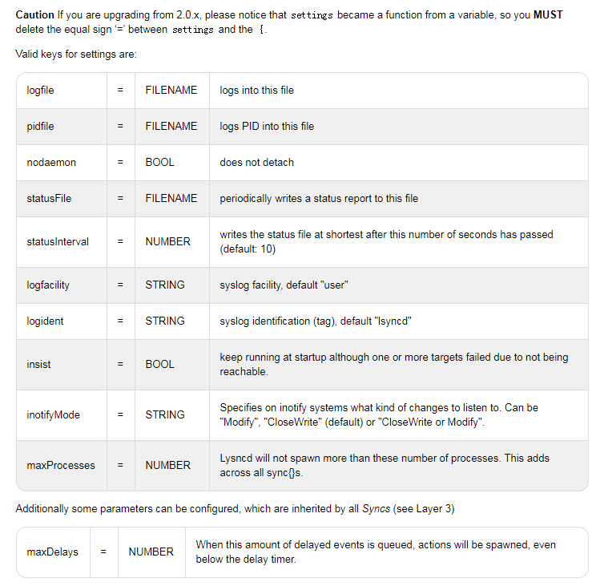

# 实时同步工具lsyncd的安装和使用

```shell
yum install lsync -y
```
### lsyncd 的使用

官方文档:http://axkibe.github.io/lsyncd
参考链接:http://www.vpsdx.com/3575.html



> settings

    里面是全局设置，--开头表示注释，下面是几个常用选项说明：
    
    logfile 定义日志文件
    stausFile 定义状态文件
    nodaemon=true 表示不启用守护模式，默认
    statusInterval 将lsyncd的状态写入上面的statusFile的间隔，默认10秒
    inotifyMode 指定inotify监控的事件，默认是CloseWrite，还可以是Modify或CloseWrite or Modify
    maxProcesses 同步进程的最大个数。假如同时有20个文件需要同步，而maxProcesses = 8，则最大能看到有8个rysnc进程
    maxDelays 累计到多少所监控的事件激活一次同步，即使后面的delay延迟时间还未到


> sync

    default.rsync ：本地目录间同步，使用rsync，也可以达到使用ssh形式的远程rsync效果，或daemon方式连接远程rsyncd进程；
    default.direct ：本地目录间同步，使用cp、rm等命令完成差异文件备份；
    default.rsyncssh ：同步到远程主机目录，rsync的ssh模式，需要使用key来认证
    init 这是一个优化选项，当init = false，只同步进程启动以后发生改动事件的文件，原有的目录即使有差异也不会同步。默认是true
    delay 累计事件，等待rsync同步延时时间，默认15秒（最大累计到1000个不可合并的事件）。也就是15s内监控目录下发生的改动，会累积到一次rsync同步，避免过于频繁的同步。（可合并的意思是，15s内两次修改了同一文件，最后只同步最新的文件）
    delete 为了保持target与souce完全同步，Lsyncd默认会delete = true来允许同步删除。它除了false，还有startup、running值，请参考 Lsyncd 2.1.x ‖ Layer 4 Config ‖ Default Behavior
    excludeFrom 排除选项，后面指定排除的列表文件，如excludeFrom = “/etc/lsyncd.exclude”，如果是简单的排除，可以使用exclude = LIST
        监控路径里的任何部分匹配到一个文本，都会被排除，例如/bin/foo/bar可以匹配规则foo
        如果规则以斜线/开头，则从头开始要匹配全部
        如果规则以/结尾，则要匹配监控路径的末尾
        ?匹配任何字符，但不包括/
        *匹配0或多个字符，但不包括/
        **匹配0或多个字符，可以是/
        
    rsync
        bwlimit 限速，单位kb/s，与rsync相同（这么重要的选项在文档里竟然没有标出）
        compress 压缩传输默认为true。在带宽与cpu负载之间权衡，本地目录同步可以考虑把它设为false
        perms 默认保留文件权限。

> rsyncssh模式独有的配置项

    host
    targetdir
    rsync_path
    password_file
    
    rsync
        bwlimit 限速，单位kb/s，与rsync相同（这么重要的选项在文档里竟然没有标出）
        compress 压缩传输默认为true。在带宽与cpu负载之间权衡，本地目录同步可以考虑把它设为false
        perms 默认保留文件权限。

> lsyncd.conf可以有多个sync，各自的source，各自的target，各自的模式，互不影响

## examples


```
-- 全局配置 
settings {
    -- 日志文件存放位置
    logfile ="/usr/local/lsyncd/var/lsyncd.log",
 
    -- 状态文件存放位置
    statusFile ="/usr/local/lsyncd/var/lsyncd.status",
 
    -- 将lsyncd的状态写入上面的statusFile的间隔，默认10秒
    --statusInterval = 10
 
    -- 是否启用守护模式，默认 true
    --nodaemon=true 
 
    -- inotify监控的事件 ,默认是 CloseWrite,还可以是 Modify 或 CloseWrite or Modify
    inotifyMode = "CloseWrite",
 
    -- 最大同步进程
    maxProcesses = 8,
 
    --累计到多少所监控的事件激活一次同步,即使后面的delay延迟时间还未到
    --maxDelays = 1

sync {
    -- rsync , rsyncssh , direct 三种模式
    default.rsync,
    source    = "/home/user/src/",
    target    = "foohost.com:~/trg/",
    delay     = 15, 
    rsync = {
        -- rsync 的二进制处理文件
        binary = "/usr/bin/rsync",
 
	    -- 归档模式
        archive = true,
 
	    -- 压缩传输
        compress = true,
 
	    -- 增量
        verbose   = true,
 
	    -- 密码文件
        password_file = "/etc/rsyncd.pwd",
 
	    -- 其他 rsync 的配置参数, 限速(--bwlimit KBPS),使用 rsync -v 查看详细参数
        -- _extra    = {"--bwlimit=200"}
    }

}

sync{
        default.rsyncssh,
        source="/var/www/live_site_resources",
        host="192.168.129.90",
        targetdir="/var/www/live_site_resources",
        delete="running",
        exclude={ ".*", "*.tmp" },

        ssh = {
            port = 1234
        }
}
```

## 开机启动
> systemctl enable lsyncd