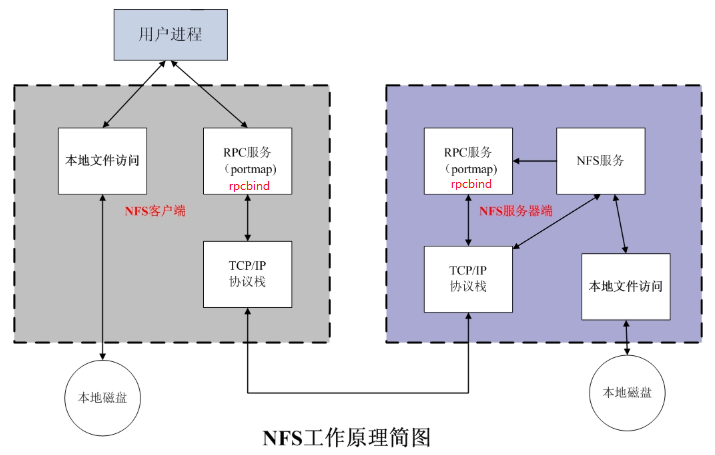

# NFS服务搭建与配置

本文讲解在 CentOS 5.x、CentOS 6.x 和 CentOS 7.x 环境下，如何安装与部署 NFS 服务。

**注意**：一台机器不要同时做 NFS 的服务端和 NFS 的客户端。如果同时作了 NFS 的服务端和客户端，那么在关机的时候，会一直夯住，可能十分钟之后甚至更久才能关闭成功。

# NFS 工作原理简介



启动 NFS SERVER 之前，首先要启动 RPC 服务（CentOS 5.x 下为 portmap 服务，CentOS 6.x 和 CentOS 7.x 下为 rpcbind 服务，下同），否则 NFS SERVER 就无法向 RPC 服务注册了。

另外，如果 RPC 服务重新启动，原来已经注册好的NFS端口数据就会丢失，因此，此时 RPC 服务管理的NFS程序也需要重新启动以重新向RPC注册。

**要特别注意的是**：一般修改NFS配置文件后，是不需要重启NFS的，直接在命令行执行 **/etc/init.d/nfs reload** 「针对CentOS 5.x 或 CentOS 6.x」 或 **systemctl reload nfs.service** 「针对CentOS 7.x」 或 **exportfs -rv** 即可使修改的 /etc/exports 生效。

# NFS 服务所需的安装包

## 安装 NFS 和 RPC 「服务端、客户端都安装」

```javascript
1 [root@backup ~]# rpm -qa nfs-utils rpcbind
2 [root@backup ~]# yum install nfs-utils rpcbind -y    #nfs需要的安装包
3 [root@backup ~]# rpm -qa nfs-utils rpcbind
4 nfs-utils-1.2.3-64.el6.x86_64
5 rpcbind-0.2.0-11.el6_7.x86_64
```

## 查看用户信息

```javascript
 1 [root@nfs01 ~]# tail /etc/passwd
 2 haldaemon:x:68:68:HAL daemon:/:/sbin/nologin
 3 ntp:x:38:38::/etc/ntp:/sbin/nologin
 4 saslauth:x:499:76:Saslauthd user:/var/empty/saslauth:/sbin/nologin
 5 postfix:x:89:89::/var/spool/postfix:/sbin/nologin
 6 sshd:x:74:74:Privilege-separated SSH:/var/empty/sshd:/sbin/nologin
 7 tcpdump:x:72:72::/:/sbin/nologin
 8 oldboy:x:500:500::/home/oldboy:/bin/bash
 9 rpc:x:32:32:Rpcbind Daemon:/var/cache/rpcbind:/sbin/nologin        #yum安装rpc服务时创建的
10 rpcuser:x:29:29:RPC Service User:/var/lib/nfs:/sbin/nologin        #yum安装rpc服务时创建的
11 nfsnobody:x:65534:65534:Anonymous NFS User:/var/lib/nfs:/sbin/nologin    #yum安装nfs服务时创建的
```

## NFS 版本查看

### 服务端版本查看

```javascript
nfsstat -s
```

### 客户端版本查看

```javascript
nfsstat  -c
```

# NFS服务端搭建

## 配置exports

```javascript
 1 [root@nfs01 ~]# mkdir /data
 2 [root@nfs01 ~]# ll -d /data/
 3 drwxr-xr-x. 3 root root 4096 Apr 11 09:49 /data/
 4 [root@nfs01 ~]# chown -R nfsnobody.nfsnobody /data/    
 5 [root@nfs01 ~]# ll -d /data/                       
 6 drwxr-xr-x. 3 nfsnobody nfsnobody 4096 Apr 11 09:49 /data/
 7 [root@nfs01 ~]# cat /etc/exports    
 8 # share /data for web created by zhangliang at 2016-05-21
 9 /data   172.16.1.0/24(rw,sync)
10 #172.16.1.0/24(rw,sync) 没有空格
11 #/data  172.16.1.0/24(rw,sync,root_squash,all_squash,anonuid=XXXX,anongid=XXXX) # 推荐配置
```

**其他配置示例：**

```javascript
1 # 指定 IP 配置
2 /opt    192.168.0.1(ro) 192.168.0.2(rw)
3 # 指定 网段
4 /data   172.16.1.0/24(rw,sync)
```

## 启动rpcbind服务

### CentOS 5.x 和 CentOS 6.x 启动方式

```javascript
 1 [root@nfs01 ~]# /etc/init.d/rpcbind start    
 2 [root@nfs01 ~]# netstat -anp | grep 'rpc'    
 3 tcp        0      0 0.0.0.0:111                 0.0.0.0:*                   LISTEN      1346/rpcbind        
 4 tcp        0      0 0.0.0.0:38420               0.0.0.0:*                   LISTEN      1368/rpc.statd      
 5 tcp        0      0 :::13894                    :::*                        LISTEN      1368/rpc.statd      
 6 tcp        0      0 :::111                      :::*                        LISTEN      1346/rpcbind        
 7 udp        0      0 0.0.0.0:673                 0.0.0.0:*                               1346/rpcbind        
 8 udp        0      0 127.0.0.1:703               0.0.0.0:*                               1368/rpc.statd      
 9 udp        0      0 0.0.0.0:15306               0.0.0.0:*                               1368/rpc.statd      
10 udp        0      0 0.0.0.0:111                 0.0.0.0:*                               1346/rpcbind        
11 udp        0      0 :::673                      :::*                                    1346/rpcbind        
12 udp        0      0 :::50537                    :::*                                    1368/rpc.statd      
13 udp        0      0 :::111                      :::*                                    1346/rpcbind        
14 unix  2      [ ACC ]     STREAM     LISTENING     10120  1346/rpcbind        /var/run/rpcbind.sock
15 unix  2      [ ]         DGRAM                    10207  1368/rpc.statd      
16 [root@nfs01 ~]# rpcinfo -p localhost    
17    program vers proto   port  service
18     100000    4   tcp    111  portmapper
19     100000    3   tcp    111  portmapper
20     100000    2   tcp    111  portmapper
21     100000    4   udp    111  portmapper
22     100000    3   udp    111  portmapper
23     100000    2   udp    111  portmapper
24     100024    1   udp  15306  status
25     100024    1   tcp  38420  status
26 #### 由上可知，暂时只有自己的端口服务，没有其他的
```

### CentOS 7.x 启动方式

```javascript
 1 [root@nginx_cdn ~]# systemctl start rpcbind.service  
 2 [root@nginx_cdn ~]# netstat -anp | grep 'rpc' 
 3 tcp        0      0 0.0.0.0:111             0.0.0.0:*               LISTEN      1930/rpcbind        
 4 tcp6       0      0 :::111                  :::*                    LISTEN      1930/rpcbind        
 5 udp        0      0 0.0.0.0:832             0.0.0.0:*                           1930/rpcbind        
 6 udp        0      0 0.0.0.0:111             0.0.0.0:*                           1930/rpcbind        
 7 udp6       0      0 :::832                  :::*                                1930/rpcbind        
 8 udp6       0      0 :::111                  :::*                                1930/rpcbind        
 9 unix  2      [ ACC ]     STREAM     LISTENING     17999    1/systemd            /var/run/rpcbind.sock
10 [root@nginx_cdn ~]# rpcinfo -p localhost    
11    program vers proto   port  service
12     100000    4   tcp    111  portmapper
13     100000    3   tcp    111  portmapper
14     100000    2   tcp    111  portmapper
15     100000    4   udp    111  portmapper
16     100000    3   udp    111  portmapper
17     100000    2   udp    111  portmapper
```

## 启动 NFS

### CentOS 5.x 和 CentOS 6.x 启动方式

```javascript
 1 [root@nfs01 ~]# /etc/init.d/nfs start    
 2 Starting NFS services:                                     [  OK  ]
 3 Starting NFS quotas:                                       [  OK  ]
 4 Starting NFS mountd:                                       [  OK  ]
 5 Starting NFS daemon:                                       [  OK  ]
 6 正在启动 RPC idmapd：                                      [确定]
 7 [root@nfs01 ~]# rpcinfo -p localhost    
 8    program vers proto   port  service
 9     100000    4   tcp    111  portmapper
10     100000    3   tcp    111  portmapper
11     100000    2   tcp    111  portmapper
12     100000    4   udp    111  portmapper
13     100000    3   udp    111  portmapper
14     100000    2   udp    111  portmapper
15     100024    1   udp  15306  status
16     100024    1   tcp  38420  status
17     100011    1   udp    875  rquotad
18     100011    2   udp    875  rquotad
19     100011    1   tcp    875  rquotad
20     100011    2   tcp    875  rquotad
21     100005    1   udp  11473  mountd
22     100005    1   tcp  62369  mountd
23     100005    2   udp  17528  mountd
24     100005    2   tcp  47308  mountd
25     100005    3   udp  11312  mountd
26     100005    3   tcp  51724  mountd
27     100003    2   tcp   2049  nfs
28     100003    3   tcp   2049  nfs
29     100003    4   tcp   2049  nfs
30     100227    2   tcp   2049  nfs_acl
31     100227    3   tcp   2049  nfs_acl
32     100003    2   udp   2049  nfs
33     100003    3   udp   2049  nfs
34     100003    4   udp   2049  nfs
35     100227    2   udp   2049  nfs_acl
36     100227    3   udp   2049  nfs_acl
37     100021    1   udp  25181  nlockmgr
38     100021    3   udp  25181  nlockmgr
39     100021    4   udp  25181  nlockmgr
40     100021    1   tcp  20093  nlockmgr
41     100021    3   tcp  20093  nlockmgr
42     100021    4   tcp  20093  nlockmgr
```

### CentOS 7.x 启动方式

```javascript
 1 [root@nginx_cdn ~]# systemctl start nfs.service 
 2 [root@nginx_cdn ~]# rpcinfo -p localhost 
 3    program vers proto   port  service
 4     100000    4   tcp    111  portmapper
 5     100000    3   tcp    111  portmapper
 6     100000    2   tcp    111  portmapper
 7     100000    4   udp    111  portmapper
 8     100000    3   udp    111  portmapper
 9     100000    2   udp    111  portmapper
10     100024    1   udp  44741  status
11     100024    1   tcp  23203  status
12     100005    1   udp  20048  mountd
13     100005    1   tcp  20048  mountd
14     100005    2   udp  20048  mountd
15     100005    2   tcp  20048  mountd
16     100005    3   udp  20048  mountd
17     100005    3   tcp  20048  mountd
18     100003    3   tcp   2049  nfs
19     100003    4   tcp   2049  nfs
20     100227    3   tcp   2049  nfs_acl
21     100003    3   udp   2049  nfs
22     100003    4   udp   2049  nfs
23     100227    3   udp   2049  nfs_acl
24     100021    1   udp  48638  nlockmgr
25     100021    3   udp  48638  nlockmgr
26     100021    4   udp  48638  nlockmgr
27     100021    1   tcp  16146  nlockmgr
28     100021    3   tcp  16146  nlockmgr
29     100021    4   tcp  16146  nlockmgr
```

## 加入开始自启动

### CentOS 5.x 和 CentOS 6.x 环境

#### 使用 /etc/rc.local

```javascript
1 [root@nfs01 ~]# tail /etc/rc.local    
2 # You can put your own initialization stuff in here if you don't
3 # want to do the full Sys V style init stuff.
4 
5 touch /var/lock/subsys/local
6 
7 # start rpc and nfs server
8 /etc/init.d/rpcbind start
9 /etc/init.d/nfs start
```

#### 使用chkconfig

```javascript
1 [root@nfs01 ~]# chkconfig rpcbind on    
2 [root@nfs01 ~]# chkconfig nfs on    
3 [root@nfs01 ~]# ls /etc/rc.d/rc3.d/* | grep -E 'rpc|nfs'  
4 /etc/rc.d/rc3.d/K61nfs-rdma
5 /etc/rc.d/rc3.d/K69rpcsvcgssd
6 /etc/rc.d/rc3.d/S13rpcbind
7 /etc/rc.d/rc3.d/S14nfslock
8 /etc/rc.d/rc3.d/S19rpcgssd
9 /etc/rc.d/rc3.d/S30nfs
```

**查看rpc服务和NFS服务的开机启动顺序**

```javascript
 1 [root@nfs01 ~]# head /etc/init.d/rpcbind 
 2 #! /bin/sh
 3 #
 4 # rpcbind       Start/Stop RPCbind
 5 #
 6 # chkconfig: 2345 13 87                    #运行级别  开机顺序  关机顺序【其中 2345 指的是 运行级别】
 7 # description: The rpcbind utility is a server that converts RPC program \
 8 #              numbers into universal addresses. It must be running on the \
 9 #              host to be able to make RPC calls on a server on that machine.
10 #
11 # processname: rpcbind
12 [root@nfs01 ~]# head /etc/init.d/nfs    
13 #!/bin/sh
14 #
15 # nfs           This shell script takes care of starting and stopping
16 #               the NFS services.
17 #
18 # chkconfig: - 30 60
19 # description: NFS is a popular protocol for file sharing across networks.
20 #              This service provides NFS server functionality, which is \
21 #              configured via the /etc/exports file.
22 # probe: true
```

### CentOS 7.x 环境

```javascript
1 [root@nginx_cdn ~]# systemctl enable rpcbind.service 
2 [root@nginx_cdn ~]# systemctl enable nfs.service
```

**查看具体状态情况**

```javascript
1 [root@nginx_cdn ~]# systemctl status rpcbind.service 
2 ● rpcbind.service - RPC bind service
3    Loaded: loaded (/usr/lib/systemd/system/rpcbind.service; enabled; vendor preset: enabled)
4 ………………
5 [root@nginx_cdn ~]# systemctl status nfs.service 
6 ● nfs-server.service - NFS server and services
7    Loaded: loaded (/usr/lib/systemd/system/nfs-server.service; enabled; vendor preset: disabled)
8 ………………
```

## 查看有哪些参数生效

```javascript
1 [root@nfs01 ~]# cat /var/lib/nfs/etab 
2 /data   172.16.1.0/24(rw,sync,wdelay,hide,nocrossmnt,secure,root_squash,no_all_squash,no_subtree_check,secure_locks,acl,anonuid=65534,anongid=65534,sec=sys,rw,root_squash,no_all_squash)
```

**参数说明：**

- ro：只读设置，这样 NFS 客户端只能读、不能写（默认设置）；

- rw：读写设置，NFS 客户端可读写； 
- sync：将数据同步写入磁盘中，效率低，但可以保证数据的一致性（默认设置）； 
- async：将数据先保存在内存缓冲区中，必要时才写入磁盘；如果服务器重新启动，这种行为可能会导致数据损坏，但效率高；
-  root_squash：当客户端用 root 用户访问该共享文件夹时，将 root 用户映射成匿名用户（默认设置）； 
- no_root_squash：客户端的 root 用户不映射。这样客户端的 root 用户与服务端的 root 用户具有相同的访问权限，这可能会带来严重的安全影响。没有充分的理由，不应该指定此选项； 
- all_squash：客户端所有普通用户及所属组都映射为匿名用户及匿名用户组；
- no_all_squash「推荐设置」：客户端所有普通用户及所属组不映射（默认设置）； 
- subtree_check：如果共享，如：/usr/bin之类的子目录时，强制NFS检查父目录的权限； 
- no_subtree_check：即使共享 NFS 服务端的子目录时，nfs服务端也不检查其父目录的权限，这样可以提高效率（默认设置）； 
- secure：限制客户端只能从小于1024的tcp/ip端口连接nfs服务器（默认设置）； 
- insecure：允许客户端从大于1024的tcp/ip端口连接服务器； 
- wdelay：检查是否有相关的写操作，如果有则将这些写操作一起执行，这样可以提高效率（默认设置）；
-  no_wdelay：若有写操作则立即执行，当使用async时，无需此设置； a
- nonuid=xxx：将远程访问的所有用户主都映射为匿名用户主账户，并指定该匿名用户主为本地用户主（UID=xxx）； 
- anongid=xxx：将远程访问的所有用户组都映射为匿名用户组账户，并指定该匿名用户组为本地用户组（GID=xxx）；

## 检查是否成功

```javascript
1 [root@nfs01 ~]# showmount -e 172.16.1.31  # 其中 172.16.1.31 为 NFS 服务端IP 
2 Export list for 172.16.1.31:
3 /data 172.16.1.0/24
```

# NFS客户端配置

## 启动rpcbind服务

### CentOS 5.x 和 CentOS 6.x 环境

```javascript
1 [root@web01 ~]# /etc/init.d/rpcbind start        
2 Starting rpcbind:                                          [  OK  ]
```

### CentOS 7.x 环境

```javascript
1 [root@nginx_proxy01 ~]# systemctl start rpcbind.service
```

## 检查共享信息

```javascript
1 [root@web01 ~]# showmount -e 172.16.1.31    
2 Export list for 172.16.1.31:
3 /data 172.16.1.0/24
```

## NFS挂载

在**2台机器**都挂载 NFS，好用于后面的测试。

```javascript
1 [root@web01 ~]# mount -t nfs 172.16.1.31:/data /mnt
```

## 查看挂载信息

### 查询方式1

```javascript
1 [root@web01 ~]# df -h        #有时可能会被卡主
2 Filesystem         Size  Used Avail Use% Mounted on
3 /dev/sda3          8.8G  1.5G  6.9G  18% /
4 tmpfs              495M     0  495M   0% /dev/shm
5 /dev/sda1          190M   40M  141M  23% /boot
6 172.16.1.31:/data  8.8G  1.5G  6.9G  18% /mnt
```

### 查询方式2

```javascript
 1 [root@web01 ~]# cat /proc/mounts                     # 优先使用，监控时使用该命令
 2 rootfs / rootfs rw 0 0
 3 proc /proc proc rw,relatime 0 0
 4 sysfs /sys sysfs rw,relatime 0 0
 5 devtmpfs /dev devtmpfs rw,relatime,size=490920k,nr_inodes=122730,mode=755 0 0
 6 devpts /dev/pts devpts rw,relatime,gid=5,mode=620,ptmxmode=000 0 0
 7 tmpfs /dev/shm tmpfs rw,relatime 0 0
 8 /dev/sda3 / ext4 rw,relatime,barrier=1,data=ordered 0 0
 9 /proc/bus/usb /proc/bus/usb usbfs rw,relatime 0 0
10 /dev/sda1 /boot ext4 rw,relatime,barrier=1,data=ordered 0 0
11 none /proc/sys/fs/binfmt_misc binfmt_misc rw,relatime 0 0
12 sunrpc /var/lib/nfs/rpc_pipefs rpc_pipefs rw,relatime 0 0
13 172.16.1.31:/data/ /mnt nfs4 rw,relatime,vers=4,rsize=131072,wsize=131072,namlen=255,hard,proto=tcp,port=0,timeo=600,retrans=2,sec=sys,clientaddr=172.16.1.8,minorversion=0,local_lock=none,addr=172.16.1.31 0 0
```

## 测试

在客户端和服务端之间测试 「2个客户端，1个服务端」

1、任意客户端创建文件夹或创建文件并且输入数据，在服务端是否可以查看；

2、服务端创建文件夹或创建文件并且输入数据，在任意客户端是否可以查看；

3、在客户端A 删除客户端B 创建的文件

4、在客户端B 删除客户端A 创建的文件

## 加入开机自启动

如果是 CentOS 7 环境，那么必须保证 /etc/rc.d/rc.local 文件具有可执行权限，否则该脚本不会执行也不会生效。

### 开机自启动方式1

```javascript
1 [root@web01 mnt]$ ll /etc/rc.local 
2 lrwxrwxrwx. 1 root root 13 Nov 14  2018 /etc/rc.local -> rc.d/rc.local
3 [root@web01 mnt]# tail -3 /etc/rc.local    
4 
5 # mount nfs
6 mount -t nfs 172.16.1.31:/data /mnt
```

### 开机自启动方式2

```javascript
1 [root@web01 mnt]$ cat /etc/fstab 
2 # 添加如下信息
3 172.16.1.31:/data                        /mnt   nfs   defaults   0 0
```

### 存在问题

加入了开机自启动，当重启 NFS 客户端机器时，如果此时 NFS 服务端机器已关机，或者网络存在问题等等。使 NFS 客户端连接 NFS 服务端失败，那么此时会造成 NFS 客户端机器起不来的情况。

因此为了避免该情况发生，不建议机器开机自启动就挂载 NFS。

如果一台机器必须挂载 NFS，那么我们就做好监控。当该机器未挂载 NFS 时就告警给我们，然后我们去手动挂载。

当然如果实际环境中你们的 NFS 服务极其稳定，且几乎不再改变 NFS 服务端地址，那么此时你也可以加入开机自启动。

这些都是根据实际具体情况具体分析的。