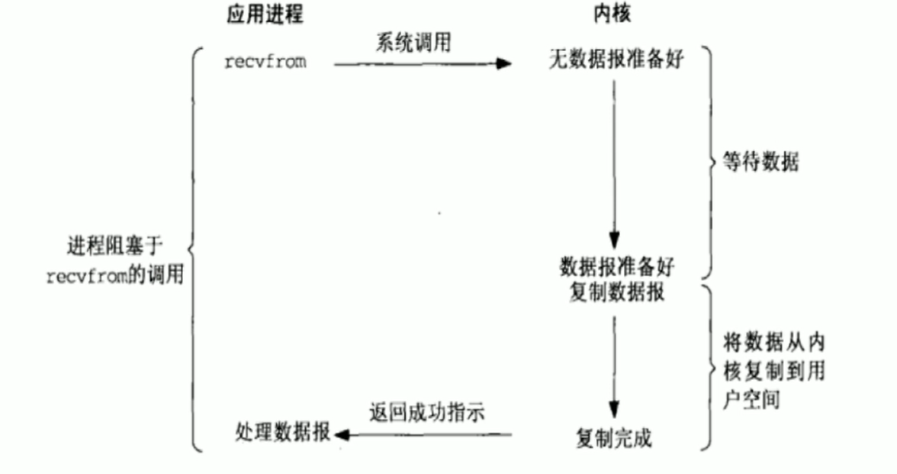

# nginx的io复用模型

## 1. I/O模型简介

- 同步/异步: 关注的是消息通信机制
  - 同步: synchronous, 被调用者等待被调用者返回消息, 才能继续执行
  - 异步: asynchronous, 被调用者通过状态/通知或回调机制主动通知调用者被调用者的运行状态
- 阻塞/非阻塞:关注调用者在等待结果返回之前所处的状态
  - 阻塞: blocking, 指I/O操作需要彻底完成后才能返回到用户空间, 调用结果返回之前, 调用者被挂起
  - 非阻塞: nonblocking, 值I/O操作被调用后立即返回给用户一个状态值, 无需等到IO操作彻底完成, 最终的调用结果返回之前, 调用者不会被挂起
- 生产中常用I/O 模型
  - 阻塞型, 非阻塞型, 复用型, 信号驱动型, 异步

## 2. I/O模型详解

### 2-1. 同步阻塞IO模型

- 同步阻塞IO模型是组件但的IO模型, 用户线程在内核进行IO操作时被阻塞
- 用户线程通过系统调用read发起IO读操作, 由用户空间转到内核空间,内核等到数据包到达后, 然后将接收到数据拷贝到用户空间, 完成read操作
- 用户需要等待read将数据读取到buffer后, 才能继续处理接受数据.整个IO请求的过程中, 用户的线程时被阻塞的, 这导致用户再发起IO请求时, 不能做任何事情, 对CPU的资源利用率不够

### 2-1.同步非阻塞IO模型

- 用户进程发起IO请求时立即返回, 但并未读取到任何数据, 用户线程需要不断的发起IO请求, 知道数据到达后, 才能读取到数据, 继续执行. 即“轮询”机制
- 整个IO请求的过程中, 虽然用户线程每次发起IO请求可以立即返回, 但是为了等到数据, 仍需要不断地轮询,重复请求, 消耗大量CPU的资源
- 是比较浪费CPU的方式, 一般很少直接使用这种模型, 而是在其他IO模型中使用非阻塞IO这一特性

### 2-3. IO多路复用模型

- 多个链接 共用一个等待机制, 本模型会阻塞进程, 但是进程阻塞在select或poll这两个系统调用上, 而不是阻塞在真正的IO操作上
- 用户首先将需要进行IO操作添加select中, 继续执行做其他的工作(异步), 同时等待select系统调用返回. 当数据到达时, IO被激活, select函数返回. 用户线程正式发起read请求, 读取数据并继续执行.
- 从流程上看, 使用select函数进行IO请求和同步阻塞模型没有太大区别, 甚至还多了添加监视IO, 以及调用select函数的额外操作, 效率更差. 并阻塞了两次, 但是第一次阻塞在select上时, select可以监控多个IO上是否已有Io操作准备就绪, 即可达到同一个线程内同事处理多个IO请求的目的. 而不像阻塞IO那种, 一次只能监控一个IO.
- 虽然上述方式允许单线程内处理多个IO请求, 但是每个IO请求的过程还是阻塞的(在select函数上阻塞), 平均时间甚至比同步阻塞IO模型还要长,. 如果用户线程只是注册自己需要的IO请求, 然后去做自己的事情, 等到数据到来时在进行处理, 则可以提高CPU的使用率
- IO多路复用是最常使用的IO模型, 但是异步程度还不够彻底, 因为它使用了会阻塞线程的select系统调用. 因此Io多路复用只能称为异步阻塞IO模型, 而非真正的异步IO.
- IO多路复用是指内核一旦发现进程指定的一个或者多个IO条件准备读取, 就通知该进程
- 使用场合:
  - 当客户端处理多个描述符是(一般是交互式输入和网络套接口), 必须使用IO复用
  - 当一个客户端同时处理多个套接字时, 此情况可能的但是很少出现
  - 当一个TCP服务器纪要处理监听套接字, 又要处理已连接套接字, 一般也要用到IO复用
  - 当一个服务器既要处理TCP, 又要处理UDP, 一般要使用IO复用
  - 当一个服务器要处理多个服务或多个协议, 一般要使用IO复用

### 2-4. 信号驱动IO模型: signal-driven I/O

- 用户进程可以通过sigaction系统调用注册一个信号处理程序, 然后主程序可以继续向下执行, 当有IO操作准备就绪时, 由内核通知触发一个SIGIO信号通知处理程序执行, 然后将用户进程所需的数据从内核空间拷贝到用户空间
- 此模型的优势在于等待数据报到达期间进程不被阻塞. 用户主程序可以继续执行, 只要等待来自信号处理函数的通知
- 该模型并不常用

### 2-5. 异步IO模型

- 异步IO与信号驱动IO最主要的区别时信号驱动Io是由内核通知何时可以进行IO操作, 而异步IO则是由内核告诉用户线程IO操作合适完成. 信号驱动Io当内核通知触发信号处理程序时, 信号处理程序还需要阻塞在从内核空间缓冲区拷贝到用胡空间缓冲区这个阶段, 而异步Io直接是在第二阶段完成后, 内核直接通知用户线程可以进行后续操作
- 相比于Io多路复用, 异步Io并不十分常用, 不少高性能并发服务程序使用IO多路复用模型+多线程任务处理的交媾基本可以满足需求. 目前操作系统对异步Io的支持并非特别完善, 更多的是采用IO多路复用模型模拟异步Io的方式(Io事件触发时不直接通知用户线程, 二十将数据读写完毕后放到用户指定的缓冲区中)

## 3. I/O模型的具体实现

- select: linux实现对应, IO复用模型, BSD4.2最早实现, 跨平台, window上也实现
- poll: linux实现, 对应IO复用模型, System V nunix 最早实现
- epoll: linux实现, 对应IO复用模型, 具有信号驱动IO模型的某些特性
- kqueue: FreeBSD实现, 对应IO复用模型, 具有信号驱动Io模型某些特性
- /dev/poll: SUN的solaris实现, 对应Io复用模型, 具有信号驱动IO模型的某些特性
- iocp: windows实现, 对应第五种(异步Io)模型

## 4. select/poll/epoll

- 水平触发: 报告fd后没处理, 那么下次poll时会再报告该fd
- 边缘触发: 只通知一次

### 4-1. epoll特性

- 在linx2.6 内核提出的select和epoll的增强版
- 支持水平触发LT和边缘触发ET, 最大的特点在于边缘触发, 它只告诉进程那些fd刚刚变为就绪状态, 并且只会通知一次
- 使用“事件”的就绪通知方式, 通过epoll_ctl注册fd, 一旦fd就绪, 内核就会采用类似callbac的回调机制来激活该fd, epoll_wait便可收到通知
- 没有最大并发连接的限, 能打开的fd的上限远大于1024(1G的内存能监听约10万个端口)
- 非轮询方式不会随着fd的数量增大而效率下降, 只有活跃的fd才会调用callback函数, 即epoll最大的优点在于它只管理“活跃”的连接, 而跟连接总数无关
- 使用mmap(Memory Mapping)加速与内核空间的消息传递