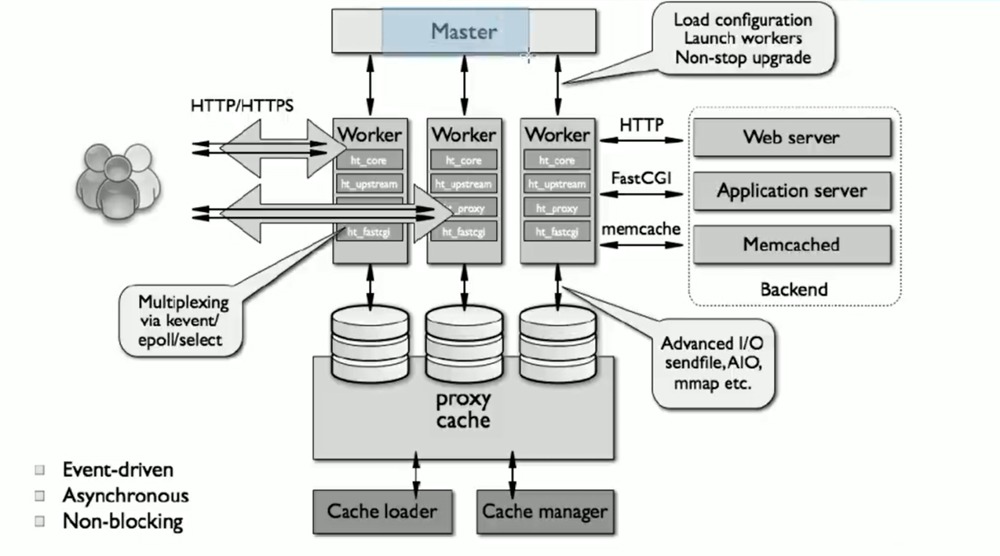

# nginx介绍([官方文档](https://nginx.org/en/docs))

## 1. nginx 特新

- 模块化设计, 较好的扩展性
- 高可靠性
- 支持热部署, 不停机更新配置文件, 升级版本, 更换日志文件
- 低内存消耗, 10000 个keep-alive连接模式下的非活动连接, 仅消耗2.5M内存
- event-driven, aio, mmap,sendfile

## 2. 基本功能

- 静态资源web服务器
- http协议反向代理服务器
- pop3/imap4协议反向代理服务器
- fastcgi(lnmp). uwsgi(python)等协议
- 模块化(非dso, 动态加载). 如zip, ssl模块

## 3. web服务相关的功能

- 虚拟主机(server)
- 支持keep-alive和管道连接
- 访问日志(基于日志缓冲提高性能)
- url rewrite
- 路劲别名
- 基于ip及用户的访问控制
- 重新配置和在线升级而无需中断客户的工作进程
- memcached的get接口

## 4. nginx架构

## 5. nginx的程序运行架构

> master/worker结构

- master: 负责加载和分析配置文件, 管理worker进程, 平滑升级
- 一个或多个worker进程: 处理并响应用户请求
- 缓存相关进程: cache loader: 载入对象, cache manager: 管理缓存对象

## 6. nginx模块

- nignx高度模块化, 但其模块早期不支持dso机制(动态加载), 1.9.11版本支持动态装载和卸载
- 核心模块: core module
- 标准模块: 
  - http模块: ngx_http_*
    - http core modules 默认功能
    - http optional modules 编译时指定
  - mail 模块: ngx_mail_*
  - stream 模块: ngx_stream_*
- 第三方模块
