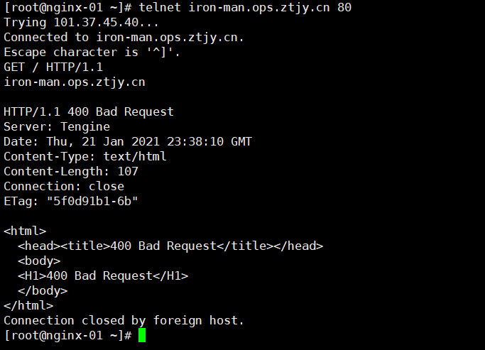

# nginx安装及基础配置

## 1. nginx安装

### 1-1. yum安装

```bash
yum install yum-utils
#设置yum源
#编辑 /etc/yum.repos.d/nginx.repo

[nginx-stable]
name=nginx stable repo
baseurl=http://nginx.org/packages/centos/$releasever/$basearch/
gpgcheck=1
enabled=1
gpgkey=https://nginx.org/keys/nginx_signing.key
module_hotfixes=true

[nginx-mainline]
name=nginx mainline repo
baseurl=http://nginx.org/packages/mainline/centos/$releasever/$basearch/
gpgcheck=1
enabled=0
gpgkey=https://nginx.org/keys/nginx_signing.key
module_hotfixes=true

#默认是稳定版, 可自行切换成主线分支安装
yum repolist all | grep nginx
yum-config-manager --enable nginx-mainline

#安装
yum install nginx -y

# 查看nginx主要的安装位置
rpm -ql nginx
```

### 1-2. 编译安装

[第三方模块](https://www.nginx.com/resources/wiki/modules/)

```bash
#下载包
wget http://nginx.org/download/nginx-1.18.0.tar.gz

#centos7设置
#关闭防火墙,设置禁止开机启动
systemctl stop firewalld
systemctl disable firewalld

#关闭SELINUX, 将SELINUX=enforcing改为SELINUX=disabled
vim /etc/selinux/config

#设置为permissive模式，临时生效
setenforce 0

#安装编译环境
#编译工具
yum install gcc gcc-c++ -y

#正则表达式库
yum install pcre pcre-devel -y

#openssl
yum install openssl openssl-devel -y

#创建组用户
groupadd -r -g 307 nginx
useradd -g 307 -r -u 307 nginx

#解压
tar xf nginx-1.18.0.tar.gz
cd nginx-1.18.0


#目录创建
mkdir -p /tmp/nginx

# 从 NGINX 1.9.11 开始，使用--add-dynamic-module=PATH替换--add-module=PATH。然后您可以nginx.conf配置

load_module /path/to/modules/ngx_http_headers_more_filter_module.so;

#配置安装
./configure \
--group=nginx \
--user=nginx \
--prefix=/usr/local/nginx \
--sbin-path=/usr/sbin/nginx \
--conf-path=/etc/nginx/nginx.conf \
--error-log-path=/var/log/nginx/error.log \
--http-log-path=/var/log/nginx/access.log \
--http-client-body-temp-path=/tmp/nginx/client_body \
--http-proxy-temp-path=/tmp/nginx/proxy \
--http-fastcgi-temp-path=/tmp/nginx/fastcgi \
--pid-path=/var/run/nginx.pid \
--lock-path=/var/lock/nginx \
--with-http_stub_status_module \
--with-http_ssl_module \
--with-http_gzip_static_module \
--with-pcre \
--with-stream \
--with-http_realip_module \
--with-http_v2_module \
--with-stream_ssl_module
--add-module=/path/to/echo-nginx-module
--add-module=/path/to/headers-more-nginx-module

#编译 && 安装
make && make install


#添加启动脚本
vim /etc/rc.d/init.d/nginx

//输入以下内容保存
#############################################
#!/bin/sh
#
# nginx - this script starts and stops the nginx daemon
#
# chkconfig:   - 85 15 
# description:  Nginx is an HTTP(S) server, HTTP(S) reverse \
#               proxy and IMAP/POP3 proxy server
# processname: nginx
# config:      /etc/nginx/nginx.conf
# config:      /etc/sysconfig/nginx
# pidfile:     /var/run/nginx.pid

# Source function library.
. /etc/rc.d/init.d/functions

# Source networking configuration.
. /etc/sysconfig/network

# Check that networking is up.
[ "$NETWORKING" = "no" ] && exit 0

nginx="/usr/sbin/nginx"
prog=$(basename $nginx)

NGINX_CONF_FILE="/etc/nginx/nginx.conf"

[ -f /etc/sysconfig/nginx ] && . /etc/sysconfig/nginx

lockfile=/var/lock/nginx

make_dirs() {
   # make required directories
   user=`nginx -V 2>&1 | grep "configure arguments:" | sed 's/[^*]*--user=\([^ ]*\).*/\1/g' -`
   options=`$nginx -V 2>&1 | grep 'configure arguments:'`
   for opt in $options; do
       if [ `echo $opt | grep '.*-temp-path'` ]; then
           value=`echo $opt | cut -d "=" -f 2`
           if [ ! -d "$value" ]; then
               # echo "creating" $value
               mkdir -p $value && chown -R $user $value
           fi
       fi
   done
}

start() {
    [ -x $nginx ] || exit 5
    [ -f $NGINX_CONF_FILE ] || exit 6
    make_dirs
    echo -n $"Starting $prog: "
    daemon $nginx -c $NGINX_CONF_FILE
    retval=$?
    echo
    [ $retval -eq 0 ] && touch $lockfile
    return $retval
}

stop() {
    echo -n $"Stopping $prog: "
    killproc $prog -QUIT
    retval=$?
    echo
    [ $retval -eq 0 ] && rm -f $lockfile
    return $retval
}

restart() {
    configtest || return $?
    stop
    sleep 1
    start
}

reload() {
    configtest || return $?
    echo -n $"Reloading $prog: "
    killproc $nginx -HUP
    RETVAL=$?
    echo
}

force_reload() {
    restart
}

configtest() {
  $nginx -t -c $NGINX_CONF_FILE
}

rh_status() {
    status $prog
}

rh_status_q() {
    rh_status >/dev/null 2>&1
}

case "$1" in
    start)
        rh_status_q && exit 0
        $1
        ;;
    stop)
        rh_status_q || exit 0
        $1
        ;;
    restart|configtest)
        $1
        ;;
    reload)
        rh_status_q || exit 7
        $1
        ;;
    force-reload)
        force_reload
        ;;
    status)
        rh_status
        ;;
    condrestart|try-restart)
        rh_status_q || exit 0
            ;;
    *)
        echo $"Usage: $0 {start|stop|status|restart|condrestart|try-restart|reload|force-reload|configtest}"
        exit 2
esac
################################################

#为此脚本赋予执行权限
chmod +x /etc/rc.d/init.d/nginx
#设置开机自启动
chkconfig --add nginx
chkconfig nginx on
```

## 2. nginx配置

### 2-1. 必备配置([帮助文档](https://nginx.org/en/docs/dirindex.html))

<font size=5 color=red> 这边只是简单说明,在配置时最好查看官方详细文档</font>

```nginx
# 指定worker进程的运行身份, 如组不指定, 默认和用户名同名
user nginx;

# 指定存储nginx主进程PID的文件路径
pid /var/run/nginx.pid;

# 指定包含进来的其他配置文件片段
include file|mask

# 模块加载配置文件: /usr/share/nginx/modules/*.conf
# 指明要装载的动态模块路径:/usr/lib64/nginx/modules
load_module file
```

### 2-2. 性能相关

```nginx
# worker进程的数量, 通常为当前cpu的物理核心数
worker_processes number|auto

# 指定cpu核心可以提高cpu缓存命中率
    # cpu mask:
    # 00000001     1号核心
    # 00000010     2号核心
    # 10000000    8号核心
worker_cpu_affinity cpumask|auto
worker_cpu_affinity 0001 0010 0100 1000 0101 1010;

# 指定worker进程的nice值, 设定worker进程优先级: [-20:20]
# 优先级由静态优先级和内核根据进程执行情况所做的动态调整（目前只有±5的调整）共同决定。nice值是进程的静态优先级，它的取值范围是–20～+19，–20是最高优先级，+19是最低优先级。因此，如果用户希望Nginx占有更多的系统资源，那么可以把nice值配置得更小一些，但不建议比内核进程的nice值（通常为–5）还要小。
worker_priority number

# worker 进程所能打开的文件数量上限, 如65535
worker_rlimit_nofile number
```

> 查看cpu详情, 进程运行在那个cpu, nice

```bash
cat /proc/cpuinfo

ps axo pid,cmd,psr,nice | grep nginx

# 前台每2秒刷一次
watch -n 2 'ps axo pid,cmd,psr,nice | grep nginx'
```

### 2-3. 调试和定位问题

```nginx
# 是否以守护进程运行, 默认on
daemon on | off

# 是否以master/worker模型运行, 默认为on, off 将不启动worker
master_process on|of

# 错误日志文件及级别, 出于调试需要, 可设定为debug, 但debug仅在编译时使用了"--with-debug" 选项时才有效
error_log file|stderr|syslog [level]
```

### 2-4. 事件相关

```nginx
events {
    # 每个进程打开的连接上限
    worker_connections number

    # use method, 指明并发连接请求处理方法, 默认自动选择最有方法
    use epoll

    # accept_mutex on|off 互斥
    #处理新的连接请求的方法, on指由各个worker轮流处理新请求, off指每个新请求到达都会通知所有的worker进程, 但只有一个进程获得连接, 造成"惊群", 影响性能
    accept_mutex on
}
```

### 2-5. ngx_http_ core_module

```nginx
http {
    # include /etc/nginx/conf.d/*.conf;
    server {
        listen address[PORT] | PORT [ssl] | [default_server] | [backlog=number] | [rcvbuf=size] | [sndbuf=zize];
        # backlog 超过并发连接数后, 新请求进入后援队列长度
        # rcvbuf 接受缓冲区大小
        # sndbuf 发送缓冲区

        server_name SERVER_NAME SERVER_NAME1;
        # server_name _;匹配所有
        # server_name "";匹配没有传递Host头部的情况
        # server_name 可以用通配符, 正则一般不建议使用
        # 匹配顺序
        # 1. 精确匹配: www.example.com
        # 2. 左侧*通配符: *.example.com
        # 3. 右侧*通配符: www.example.*
        # 4. 正则
        # 5. default_server

        # 根路径
        root /path/root;

         #在keepalived模式下的连接是否启用TCP_NODELAY
        # off, 延迟发送合并多个请求后再发送
        # on, 不延迟发送
        tcp_nodelay on|off;

        # 是否启用sendfile, 在内核中封装报文直接发送, 默认off
        sendfile on|off;

        tcp_nopush on | off;

        # 是否再报文的server显示nginx版本
        server_tokens on|off|build|string;


        location [= | ~ | ~* | ^~] uri {
            # = uri精准匹配
            # ^~ 最左部分匹配, 不区分大小写, 并且停止搜索
            # ~ 区分大小写正则匹配
            # ~* 不区分大小写正则匹配
            # 不带符号
            # 优先级: =, ^~, ~/~*,不带符号
        }
        location / {
            # 别名
            alias path;
            # 默认网页文件
            index file;
            # 错误重定向
            error_page code ... [=[response]] uri;
            error_page 400 404 /404.html;
            error_page 400 =200 /404.html;
            # 按顺序检查文件是否存在,, 返回第一个找到的文件或文件夹(结尾加斜杠线表示文件夹), 如果所有文件或文件夹都找不到, 会进行内部重定向到最后一个参数. 只有最后一个参数可以引起重定向, 之前的参数只设置内部URI的指向. 最后一个参数是回退URI且必须存在, 否则出现内部500错误
            try_files file ... uri;
            try_file file =code uri;
            try_file $uri /images/default.gif;
            try_file $uri $uri/index.html $uri.html =404;

            # 定义客户端相关配置
            # 设定保持连接超时时长, 0表示禁用长连接, 默认为75s
            keepalive_timeout timeout [header_timeout];

            # 一次长连接上允许请求的资源最大数量, 默认100
            keepalive_requests number;

            # 对哪种浏览器禁用长连接
            keepalive_disable none|brower;

            # 向客户端发送响应报文的超时时长, 此处是指两次写操作之间的间隔时长, 非在整个响应过程的传输时长
            # 即在这个时间段内客户端还未收到任何响应内容, 链接断开
            send_timeout time;

            # 接受每个客户端请求保本的body部分的缓冲区大小; 默认16k;超过将被暂存到磁盘上的由client_body_temp_path指定的位置
            client_body_buffer_size size;

            # 设置客户端请求正文的最大允许大小, 太大返回413, 0无限制 默认1m
            client_max_body_size 10m;

            # 设定存储客户端请求报文的body部分的临时存储路径及子目录结构和数量
            # 目录名为16进制的数字
            client_body_temp_path path [level1] [level2] [level3];
            client_body_temp_path /var/tmp/client_body 1 2 2;
            # 1级目录占1位16进制, 即2^4=16个目录, 0-f
            # 2级目录占2位16进制, 即2^8=256个目录, 00-ff
            # 3级目录占2位16进制, 即2^8=256个目录, 00-ff


            ## 对客户端限制的相关配置
            # 限制客户端的传输速率, 单位是bytes/second, 默认0无限制
            limit_rate rate;

            # 限制客户端使用除了指定请求方法之外的其他方法, 仅用于location下
            # method: GET, HEAD, POST, PUT, DELETE, MKCOL, COPY, MOVE, OPTIONS, PROPFIND, PROPPATCH, LOCK, UNLOCK, PATCH
            limit_except method ... {...};
            # 除了get和head之外的其他方法仅允许192.168.1.0/24网段主机使用
            limit_except GET {
                # 基于ip的访问控制功能, 至上而下检查, 一但匹配, 将生效, 所以条件严格的要放前面
                allow address | CIDR | unix: | all;
                deny address | CIDR | unix: | all;
                allow 192.168.1.0/24;
                deny all;
            }

            ## 文件操作优化配置
            # 是否启用aio
            aio on| off | threads[=pool];

            # 直接io, 当文件大于等于给定大小是同步写磁盘, 而非缓存, off默认立即写磁盘
            directio size | off;

            # 文件缓存
             #缓存内容
            #    1. 文件元数据: 描述符, 大小, 最近一次修改时间
            #    2.打开的目录结构
            #    3.没有找到的或者没有权限访问的文件相关信息
            # max=N 可缓存的文件个数缓存上限, lru算法
            # inactive=time: 缓存项的非活动时长, 在此处指定的时长内未被命中或命中的次数少于open_file_cache_min_uses指令所指定的次数的缓存项即为非活动项, 将被删除
            open_file_cache off;
            open_file_cache max=N [inactive=time];
            # 默认值1
            open_file_cache_min_uses number;

            # 是否缓存查找时发生错误的文件一类的信息, 默认off
            open_file_cache_errors on| off;

            # 缓存项有效性检查    频率, 默认60s
            open_file_cache_valid time;

        }
    }
}
```

### 2-6. ngx_http_auth_basic_module

> 用户访问控制, 使用basic机制进行用户认证

#### 2-6-1. 使用httpd-tools包工具创建用户

```shell
# 查看包
rpm -ql httpd-tools

# 创建htpasswd -m 账号 密码, cd 认证文件要存放的目录
cd /etc/nginx/conf.d
htpasswd -cm .nginx_basic nignxuser
```

#### 2-6-2. 配置

```nignx
http {
    server{
        listen 80;
        server_name 192.168.178.132;
        auth_basic "Login Info";
        auth_basic_user_file /etc/nginx/conf.d/.nginx_basic;

    }
}
```

### 2-7. ngx_http_stub_status_module

> 用户输出nginx的基本状态信息

```nginx
http {
    server{
        listen 80;
        server_name 192.168.178.132;
        auth_basic "Login Info";
        auth_basic_user_file /etc/nginx/conf.d/.nginx_basic;
        location / {
            stub_status;
        }
    }
}
```

### 2-8 ngx_http_log_module

> 指定日志格式,记录请求

```nignx
http {
    # 日志格式, 可以使用nginx内嵌变量
    log_format name string ...;
    server{
        listen 80;
        server_name 192.168.178.132;
        auth_basic "Login Info";
        auth_basic_user_file /etc/nginx/conf.d/.nginx_basic;
        location / {
            # 配置日志文件, 如果加了buffer日志会不及时
            access_log off;
            access_log path [format] [buffer=size] [gzip=level] [flush=time] [if=condition];

            # 缓存日志文件相关元数据
            # max 缓存最大文件描述符数量
            # min_uses 在inactive指定的时长内访问大于等于此值方可被当作活动项
            # inactive 非活动时长
            # valid 验证缓存中各缓存项是否活动的时间间隔
            open_log_file_cache maxN [inactive=time] [min_users=N] [valid=time];
            stub_status;
        }
    }
}
```

### 2-9 ngx_http_gzip_module

> 用gzip方法压缩响应数据, 节约带宽

```nginx
http {
    # 日志格式, 可以使用nginx内嵌变量
    log_format name string ...;
    server{
        listen 80;
        server_name 192.168.178.132;
        auth_basic "Login Info";
        auth_basic_user_file /etc/nginx/conf.d/.nginx_basic;
        location / {
            gzip on | of;
            #  静态压缩，使用现成的扩展名为 .gz 的预压缩文件, 访问文件a.js nginx会去找a.js.gz
            gzip_static on;
            # 启用压缩的最小协议版本, 默认1.1,  gzip_static 开启最好这个也配指以下, 配置1.0,否则gzip_static可能会不生效
            gzip_http_version 1.0|1.2;
            # 压缩比 1到9, 不是压缩级别越高越好，其实gzip_comp_level 1的压缩能力已经够用了，后面级别越高，压缩的比例其实增长不大，反而很吃处理性能
            gzip_comp_level level;
            gzip_comp_level 1;
            # 匹配浏览器不使用压缩
            gzip_disable regex ...;
            # 启用压缩功能的响应报文大小阈值, 即响应多大启用压缩
            gzip_min_length length;
            gzip_min_length 1k;
            # 支持实现压缩功能是缓冲去数量及每个缓存区大小
            gzip_buffers number size;
            gzip_buffers 4 16k;
            # 指明那种类型的资源执行压缩操作, 即压缩过滤器, 默认包含有text/html, content-type字段内容
            gzip_types mime-type ...;
            gzip_types application/json;
            # 启用压缩是否在响应报文中首部插入 "Vary: Accept-Encoding"
            gzip_vary on | off;
            # 做代理服务器时, 对后端服务器响应报文在何种情况下执行压缩
            gzip_proxied off | ...;
            stub_status;
        }
    }
}
```

### 2-10 ngx_http_ssl_module

> 加密模块

```nginx
http {
    # 日志格式, 可以使用nginx内嵌变量
    log_format name string ...;
    server{
        listen 80 ssl;
        server_name 192.168.178.132;
        auth_basic "Login Info";
        auth_basic_user_file /etc/nginx/conf.d/.nginx_basic;
        location / {
            #ssl on | off 为虚拟主机启用https protocol时, 建议使用listen指令代替
            # pem格式文件证书
            ssl_certificate file;
            # 与证书匹配的私钥文件
            ssl_certificate_key file;
            # 支持版本,默认为后三个
            ssl_protocols [SSLv2] [SSLv3] [TLSv1] [TLSv1.1] [TLSv1.2];
            ssl_session_timeout 5m;

            # none: 通知客户端支持ssl session cache , 但实际不支持
            # builtin[:size] 使用openssl内建缓存, 为worker进程私有
            # share:name:size 在各worker之间共享一个缓存
            ssl_session_cache off | none | [builtin[:size]] | [share:name:size];
            stub_status;
        }
    }
}
```

> 测试长连接方法, 使用telnet ip:port



```shell
telnet 192.168.178.132 80
# 输入请求头
GET / HTTP/1.1
host: 192.168.178.132
```

### 2-11. add_header

```nginx
# no-cache: 数据内容不能被缓存, 每次请求都重新访问服务器, 若有max-age, 则缓存期间不访问服务器.
# no-store: 不仅不能缓存, 连暂存也不可以(即: 临时文件夹中不能暂存该资源).
# private(默认): 只能在浏览器中缓存, 只有在第一次请求的时候才访问服务器, 若有max-age, 则缓存期间不访问服务器.
# public: 可以被任何缓存区缓存, 如: 浏览器、服务器、代理服务器等.
# max-age: 相对过期时间, 即以秒为单位的缓存时间.
# no-cache, private: 打开新窗口时候重新访问服务器, 若设置max-age, 则缓存期间不访问服务器.
# -  private, 正数的max-age: 后退时候不会访问服务器.
-#   no-cache, 正数的max-age: 后退时会访问服务器.
add_header Cache-Control private | no-store | no-cache | must-revalidate | proxy-revalidate;
```
