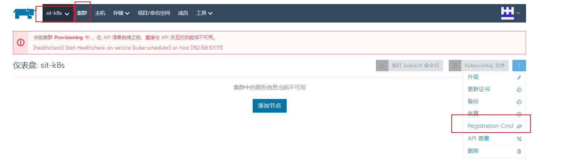

# Rancher的安装及k8s集群添加

## 1. IP规划

- rancher
  - 101.100 (rancher_101-100)
  - 101.101 (预留)
- k8s-master
  - 101.102 (k8s-master_101-102)
  - 101.103 (k8s-master_101-103)
  - 101.104 (预留)
  - 101.105 (预留）
- k8s-node
  - 101.106 以上

## 1. 安装docker

> 所有机器都必须安装docker, 包括rancher部署主机， k8s master, node

### 1-1. 添加docker 阿里源

```shell
yum -y install yum-utils
yum-config-manager --add-repo http://mirrors.aliyun.com/docker-ce/linux/centos/docker-ce.repo
```

### 1-2. 安装docker及配置

```shell
yum install -y docker-ce-20.10.7-3.el7
systemctl enable docker && systemctl start docker

# 配置
cat > /etc/docker/daemon.json <<-EOF
{
  "registry-mirrors": ["https://docker.mirrors.ustc.edu.cn"], 
  "insecure-registries": ["192.168.100.41"],
  "max-concurrent-downloads": 10,
  "exec-opts": ["native.cgroupdriver=systemd"],
  "log-driver": "json-file",
  "log-level": "warn",
  "log-opts": {
    "max-size": "10m",
    "max-file": "3"
    },
  "data-root": "/var/lib/docker",
  "storage-driver": "overlay2",
  "storage-opts": [
        "overlay2.override_kernel_check=true"
    ]
}
EOF
systemctl daemon-reload && systemctl restart docker
```

## 2.安装rancher ([中文文档](http://docs.rancher.cn/docs/rancher2.5/overview/_index/))

> 安装完docker后，直接docker启动rancher, 只要rancher服务器上装就好了

```shell
docker run -d --privileged --restart=unless-stopped \
  -p 443:443 \
  rancher/rancher:v2.5.8
```

> nginx 配置, 使用nginx会影响kubectl的使用(Unable to connect to the server: x509: certificate signed by unknown authority)
> 
> 所以在执行kubectl的主机上要做一条host解析, 直接解析到rancher的主机上就可以了

```nginx
upstream rancher {
    server 192.168.101.100:443;
}

map $http_upgrade $connection_upgrade {
    default Upgrade;
    ''      close;
}

server {
    # SPDY协议是HTTP协议的增强。新协议的功能包括数据流的多路复用、请求优先级，以及HTTP包头压缩。简单来说，通过SPDY协议可以提升网站的加载速度
    # 这边nginx没装这个模块(ngx_http_spdy_module)可以不用
    listen 443 ssl spdy;
    server_name rancher.homeking365.com;
    ssl_certificate /usr/local/cert/5170089__homeking365.com.pem;
    ssl_certificate_key /usr/local/cert/5170089__homeking365.com.key;

    location / {
        proxy_set_header Host $host;
        proxy_set_header X-Forwarded-Proto $scheme;
        proxy_set_header X-Forwarded-Port $server_port;
        proxy_set_header X-Forwarded-For $proxy_add_x_forwarded_for;
        proxy_pass http://rancher;
        proxy_http_version 1.1;
        proxy_set_header Upgrade $http_upgrade;
        proxy_set_header Connection $connection_upgrade;
        # This allows the ability for the execute shell window to remain open for up to 15 minutes. Without this parameter, the default is 1 minute and will automatically close.
        proxy_read_timeout 900s;
    }
}

server {
    listen 80;
    server_name rancher.homeking365.com;
    return 301 https://$server_name$request_uri;
}
```

> 访问: https://rancher.homeking365.com


## 3.k8s集群配置

>  所有k8s master 和 node 都需要

### 3-1. 安装docker

> 以上已经安装

### 3-2. 配置网桥

> 这个边是在原有镜像基础上改过了, 直接运行即可,实际只加了
> 
> net.bridge.bridge-nf-call-iptables = 1
> net.bridge.bridge-nf-call-ip6tables = 1
> net.ipv4.ip_forward = 1

```shell
echo """
kernel.sysrq = 0
kernel.core_uses_pid = 1
kernel.msgmnb = 65536
kernel.msgmax = 65536
kernel.shmmax = 68719476736
kernel.shmall = 4294967296
net.ipv6.conf.all.disable_ipv6 = 1
net.ipv6.conf.default.disable_ipv6 = 1
net.ipv4.icmp_echo_ignore_broadcasts = 1
net.ipv4.icmp_ignore_bogus_error_responses = 1
net.ipv4.conf.all.send_redirects = 0
net.ipv4.conf.default.send_redirects = 0
net.ipv4.conf.all.rp_filter = 1
net.ipv4.conf.default.rp_filter = 1
net.ipv4.conf.all.accept_source_route = 0
net.ipv4.conf.default.accept_source_route = 0
net.ipv4.tcp_syncookies = 1
net.ipv4.tcp_max_tw_buckets = 6000
net.ipv4.tcp_sack = 1
net.ipv4.tcp_window_scaling = 1
net.ipv4.tcp_rmem = 4096 87380 4194304
net.ipv4.tcp_wmem = 4096 16384 4194304
net.ipv4.tcp_max_orphans = 3276800
net.ipv4.tcp_max_syn_backlog = 262144
net.ipv4.tcp_timestamps = 0
net.ipv4.tcp_synack_retries = 1
net.ipv4.tcp_syn_retries = 1
net.ipv4.tcp_tw_recycle = 1
net.ipv4.tcp_tw_reuse = 1
net.ipv4.tcp_mem = 94500000 915000000 927000000
net.ipv4.tcp_fin_timeout = 1
net.ipv4.tcp_keepalive_time = 30
net.ipv4.ip_local_port_range = 1024 65000
net.ipv4.conf.all.accept_redirects = 0
net.ipv4.conf.default.accept_redirects = 0
net.ipv4.conf.all.secure_redirects = 0
net.ipv4.conf.default.secure_redirects = 0
net.core.wmem_default = 8388608
net.core.rmem_default = 8388608
net.core.rmem_max = 16777216
net.core.wmem_max = 16777216
net.core.netdev_max_backlog = 262144
vm.swappiness = 10
net.bridge.bridge-nf-call-iptables = 1
net.bridge.bridge-nf-call-ip6tables = 1
net.ipv4.ip_forward = 1
""" > /etc/sysctl.conf

sysctl -p
```

### 3-3.开启ipvs

> k8s 建议开启, 不开启ipvs将会使用iptables，但是效率低

```shell
cat > /etc/sysconfig/modules/ipvs.modules <<-"EOF"
#!/bin/bash
ipvs_modules="ip_vs ip_vs_lc ip_vs_wlc ip_vs_rr ip_vs_wrr ip_vs_lblc ip_vs_lblcr ip_vs_dh ip_vs_sh ip_vs_fo ip_vs_nq ip_vs_sed ip_vs_ftp nf_conntrack"
for kernel_module in ${ipvs_modules}; do
    /sbin/modinfo -F filename ${kernel_module} > /dev/null 2>&1
    if [ $? -eq 0 ]; then
        /sbin/modprobe ${kernel_module}
    fi
done
EOF

# 修改权限, 加载, 查看
chmod 755 /etc/sysconfig/modules/ipvs.modules && bash /etc/sysconfig/modules/ipvs.modules && lsmod | grep ip_vs

​```
```

## 4. 加入rancher

### 4-1. 创建集群


### 4-2. 选择自定义


### 4-3. 填写集群名, 设置集群参数


### 4-4. 添加集群主机




### 4-5. 复制以上命令在主机上运行即可

> --server https://rancher.homeking365.com 在系统设置中可以设置, 建议域名便于迁移
> 
> --node-name 参数最好也填以下, 因为有格式限制, 不填默认用主机名, 如果主机没不合规会失败

### 4-6. 如果要重新加加入主机的话, 最好是运行下以下命令(虽然不一定有用)

```shell
docker stop $(docker ps -aq)
docker rm -f $(docker ps -aq)
docker volume rm $(docker volume ls -q)
docker system prune -af

rm -rf /etc/ceph
rm -rf /etc/cni
rm -rf /etc/kubernetes
rm -rf /opt/cni
rm -rf /opt/rke
rm -rf /run/secrets/kubernetes.io
rm -rf /run/calico
rm -rf /run/flannel
rm -rf /var/lib/calico
rm -rf /var/lib/etcd
rm -rf /var/lib/cni
rm -rf /var/lib/kubelet
rm -rf /var/lib/rancher/rke/log
rm -rf /var/log/containers
rm -rf /var/log/pods

systemctl restart docker
```

## 5. 其他

### 5-1. 日志级别

```shell
docker exec -ti <container_id> loglevel --set debug

docker exec -ti <container_id> loglevel --set info
```

### 5-2. 重置admin密码

```shell
docker exec -it <container_id> reset-password
```
