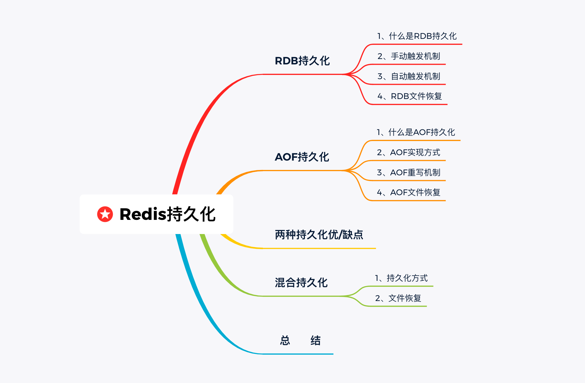
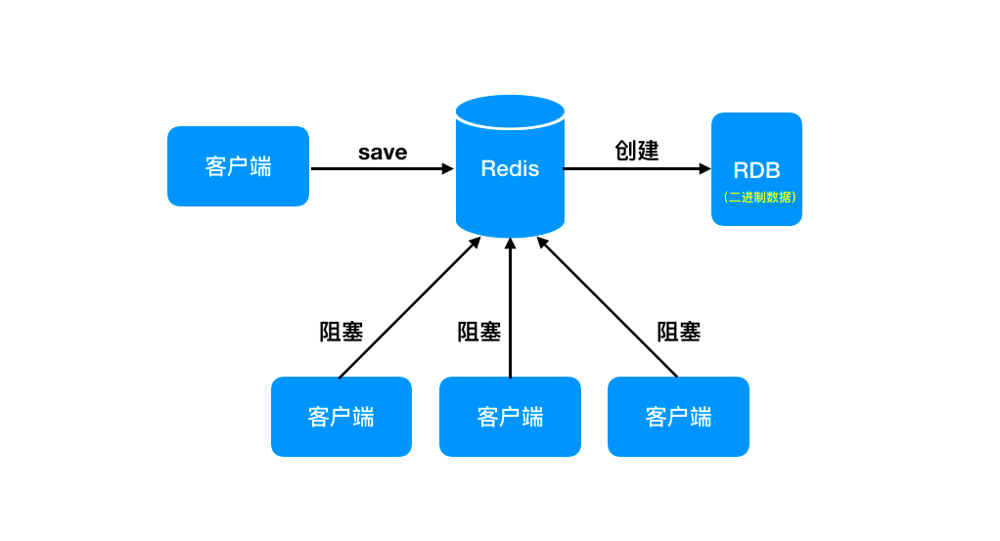
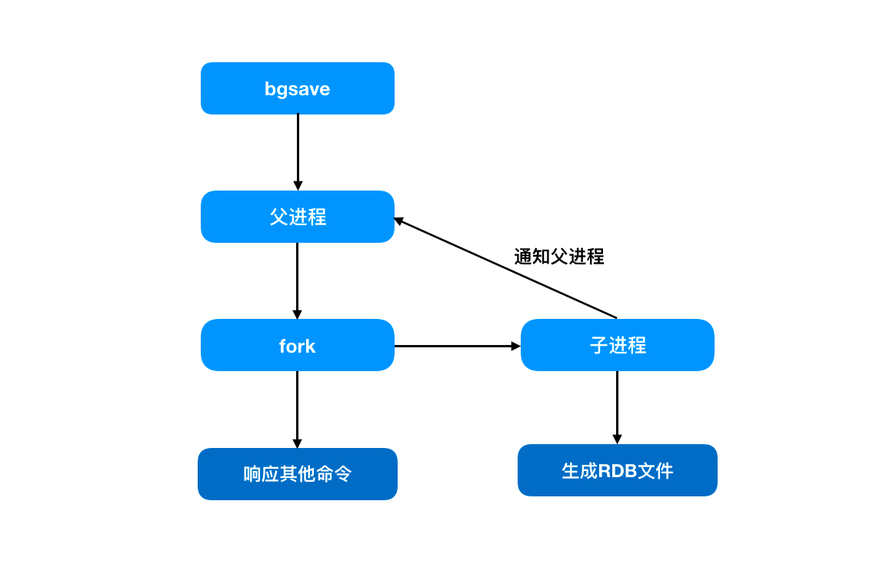
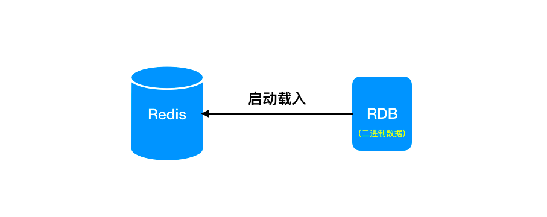
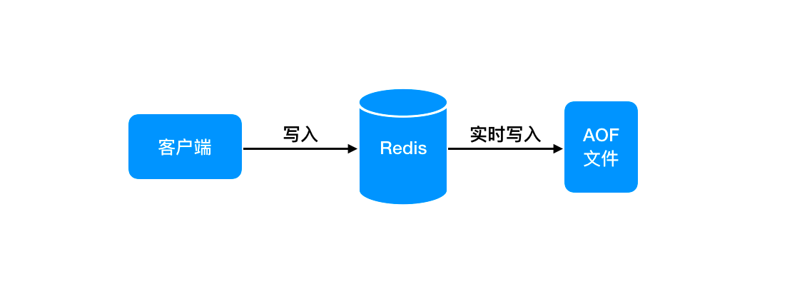
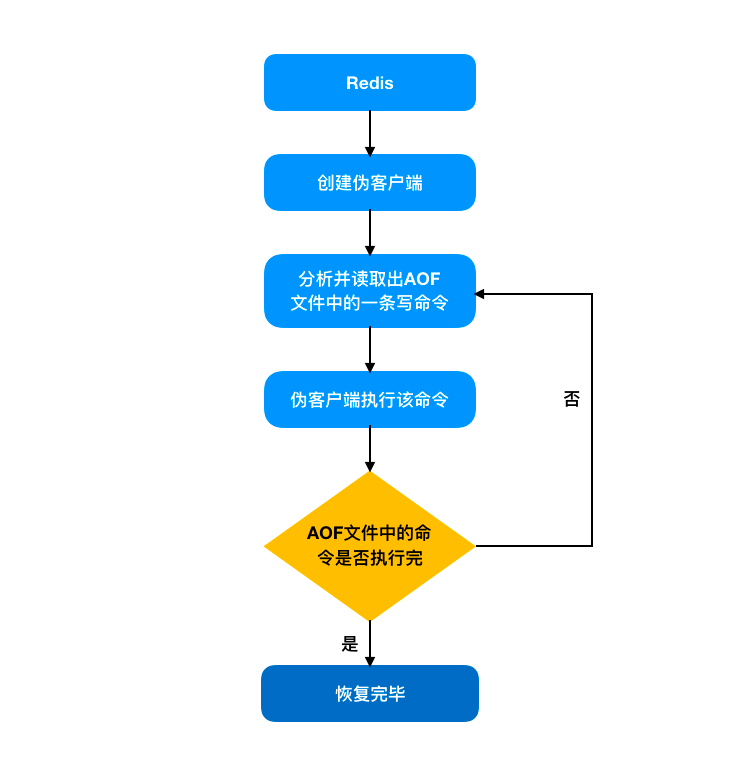

作为内存数据库，Redis 在数据存储与读取上的速度是毫不逊色的，这点毋庸置疑。但是对于内存来说，断电或遇到故障后数据就会丢失，这却是一个无法回避的问题。令人欣慰的是，基于这样的缺点，Redis 也提供了不同的持久化方案。


### RDB持久化

#### 1. 什么是RDB持久化

英文名称是 Redis DataBase，它还有一个常用的名字：快照持久化。所谓快照，在这里指的是某一时刻的内存数据，而持久化则是将这一时刻的数据以二进制形式写入到磁盘里。


#### 2. 手动触发机制

##### 1. save 命令

你可能会问了，那我通过什么样的方式来实现持久化呢？不知道你有没有用过 save 这个命令，在 Redis 里担任的角色是用来手动触发持久化的。也就是说在 Redis 客户端操作 save 命令就可以将内存数据写入到磁盘里。

不过你可千万不要好奇，生产环境要是这么玩儿的话，数据量少还行，数量大的话那估计八成得凉凉。为什么这么说呢？你稍微了解下它的运行原理就知道了。

前面的文章中，我们提到了 Redis 处理命令的方式是以单线程形式来进行的。客户端的请求都会放入一个队列里。当执行 save 命令时，如果执行时间很长的话，后面的请求就会被阻塞，客户端发送的所有命令都会被拒绝。

这种方式生产场景要慎用！

##### 1. bgsave 命令

还有一个 bgsave 命令。与 save 不同的是，执行过程中它并不会阻塞客户端的请求。而是将持久化工作交给子进程来执行，主进程仍负责客户端请求的处理工作。


#### 3. 自动触发机制

RDB 持久化既可以通过手动触发，也可以通过服务器配置项来定期执行。

自动触发通常是 Redis 中配置文件来执行的。有这么个配置你需要了解下：

save m n

其中 m 代表秒数，n 代表次数，放在一起表示的是 m 秒内发生 n 次变化时，会触发 bgsave。

了解了自动化配置，我们再来看下 Redis 配置文件 redis.conf 中的三个默认配置项：

```conf
save 900 1
save 300 10
save 60 10000
```

save 900 1 表示的是时间900秒内，如果 Redis 中数据至少发生一次变化，就会执行 bgsave。后边两个就不用介绍了，一样的原理。 

看到这三个配置项，不知道你会不会有疑问，这三个到底该执行哪一个？答案是设置多个 save m n 命令时，满足任何一个条件都会触发持久化。

#### 4. RDB 文件恢复

前面我们提到过了，持久化的目的就是为了解决内存异常导致的数据丢失问题。那么倘若如果真遇到了这样的情况，RDB 文件如何来实现数据恢复呢？


开启自动持久化后，数据会存储到名为 dump.rdb 的文件中。当 Redis 服务器重启时，检测到 dump.rdb 文件后，会自动加载进行数据恢复。

### AOF持久化

介绍完了 RDB 后，我们再来看一种叫作 AOF 的持久化方式。

#### 1. 什么是AOF持久化

英文名称是 Append Only File。同样地，它也有一个常用的名字：文件追加持久化。与RDB 不同的是，它是通过保存所执行的写命令来实现的，并且保存的数据格式是客户端发送的命令。


#### 2. AOF 实现方式

想要使用 AOF 持久化方式，需要启用配置文件中的 appendonly 参数。默认情况下，Redis 是不开启的。

```conf
appendonly yes
```

开启 AOF 持久化后每执行一条修改数据的命令，Redis 就会将该命令写入 aof_buf 缓冲区。后续写入 AOF 文件中的操作是由下面的配置来控制的：

这三个配置项分别表示：

```conf
# 每次写入都进行刷盘操作，对性能影响最大，占用磁盘 IO 较高，数据安全性最高
appendfsync always
# 1秒刷一次盘，对性能影响相对较小
appendfsync everysec
# 按照操作系统的机制进行刷盘，对性能影响最小，数据安全性低
appendfsync no
```

#### 3. AOF 重写机制

随着命令的不断写入，AOF 文件会变得越来越大，这时候该如何是好呢？别急，Redis 中提供了瘦身功能，也就是重写机制。

Redis 配置文件中有两个对应的参数是来决定重写机制的触发时机的。

```
# AOF 文件距离上次文件增长超过多少百分比
auto-aof-rewrite-percentage 100
# AOF 文件体积最小多大以上触发
auto-aof-rewrite-min-size 64mb
```

满足所设置的条件时，会自动触发 AOF 重写，此时 Redis 会扫描整个实例的数据，重新生成一个 AOF 文件来达到瘦身的效果。

#### 4. AOF 文件恢复



同样地，我们也需要对 AOF 文件进行恢复。和 RBD 不同的是，Redis 中是通过创建一个不带网络连接的伪客户端来进行实现的。为什么要创建伪客户端呢？你想想 AOF 文件中的数据格式，都是由命令组成的。通过客户端直接执行每条命令就可以将数据进行恢复。

在这里需要注意的是，如果服务器开启了 AOF 持久化功能，会优先使用 AOF 文件来进行恢复。只有在 AOF 关闭状态下，服务器才会使用 RDB 文件来进行还原。

### 两种持久化的优/缺点

到这里，对两种持久化也有了一定的认识，那么我们来看看它们分别有什么优点和缺点:

1. RDB 优点与缺点
   
   - 优点
     文件体积小：RDB 的文件内容是二进制格式，因此体积比实例内存小。恢复速度快：当 Redis 实例恢复时，加载 RDB 文件速度很快，能在很短时间内迅速恢复数据。
   
   - 缺点
     数据缺失：RDB 保存的是某一时刻的数据，当 Redis 实例某一时刻异常时，会导致数据丢失。消耗资源：RDB 文件的生成会消耗大量的 CPU 和内存资源，有一定代价。

2. AOF 优点与缺点
   
    优点
   
   - 数据更完整：AOF 中是及时写入的方式，数据保存更完整。恢复时降低数据的损失率
   
   - 易读性强：AOF 中保存的数据格式是客户端的写入命令，可读性性强。
     
     缺点
   
   - 文件体积大：AOF 中存储客户端所有的写命令，未经压缩，随着命令的写入，文件会越来越大。增加磁盘IO：AOF 文件刷盘如果采用每秒刷一次的方式会导致磁盘IO升高，影响性能。

### 混合持久化

既然 RDB 与 AOF 持久化都存在各自的缺点，那么有没有一种更好的持久化方式？

接下来要介绍的是混合持久化。其实就是 RDB 与 AOF 的混合模式，这是 Redis4 之后新增的。

1. 持久化方式
   混合持久化是通过 aof-use-rdb-preamble 参数来开启的。它的操作方式是这样的，在写入的时候先把数据以 RDB 的形式写入文件的开头，再将后续的写命令以 AOF 的格式追加到文件中。这样既能保证数据恢复时的速度，同时又能减少数据丢失的风险。

2. 文件恢复
   那么混合持久化中是如何来进行数据恢复的呢？在 Redis 重启时，先加载 RDB 的内容，然后再重放增量 AOF 格式命令。这样就避免了 AOF 持久化时的全量加载，从而使加载速率得到大幅提升。

### 总结

#### RDB持久化

将某一时刻的数据以二进制形式写入到磁盘里，服务重启时检测到对应文件自动加载进行数据恢复。

有手动触发和自动触发两种机制。

#### AOF持久化

以文件追加的方式写入客户端执行的写命令。

数据恢复时，通过创建伪客户端的方式执行命令，直到恢复完成。

#### 混合持久化

在写入的时候先把数据以 RDB 的形式写入文件的开头，再将后续的写命令以 AOF 的格式追加到文件中。

### 5. rdb文件读取

>  使用工具 git@github.com:DeceberSeventeen/redis-rdb-tools.git
> 
>  依赖:
> 
> ```shell
> git clone git@github.com:DeceberSeventeen/redis-rdb-tools.git
> pip install rdbtools
> pip install python-lzf
> 
> python setup.py install
> ```

> 读取rdb
> 
> database,type,key,size_in_bytes,encoding,num_elements,len_largest_element,expiry
> 数据库, 键类型, 键名, 占用内存空间大小, 编码, 元素个数, 最大元素大小, 失效时间

```shel
rdb -c memory /var/lib/redis/r-bp113f6330ec31e4-db-4.rdb -f ~/workspace/rds.text
```

> 使用awk过滤大key

```shell
rdb -c memory ./dump.rdb | awk 'FS="," OFS=","{if ($4 > 500) print$1,$2,$3,$4,$5,$6,$7}'
```
