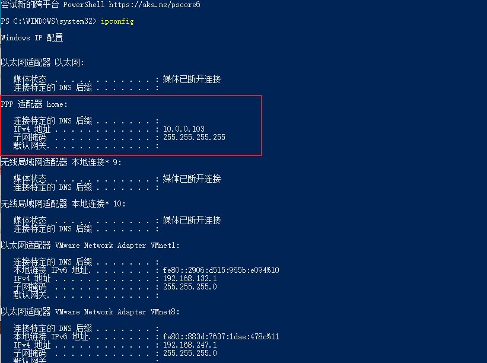

# 配置指定网段走vpn链接

## 1. 设置vpn连接为非默认网关

### 1-1. 照图做


### 1-2. 最好配置静态ip, 否则每次重连vpn ip都会变

> dns可以不用管..用本地默认的就好了


## 2. 配置路由

### 2-1.查看vpn ip池的ip, 需连接vpn

> 打开cmd或powershell

```bat
ipconfig
```



### 2-2. 添加路由映射

> 配置好后, 重连vpn

```bat
# 192.168.2.0需要被路由的ip, 10.0.0.103 vpn池分配的ip
route -p add 192.168.2.0 mask 255.255.255.0 10.0.0.103

# 查看路由表, -4 ipv4
route print -4

# 删除路由表
route delete 192.168.2.0
route delete 192.168.2.0 mask 255.255.255.0 10.0.0.103
```

