**前期准备**

- 数据库的安装（在这里仅提供MySQL的安装）

**参考文档**

- Confluence安装参考文档：[https://confluence.atlassian.com/doc/installing-confluence-on-linux-143556824.html](https://link.jianshu.com/?t=https://confluence.atlassian.com/doc/installing-confluence-on-linux-143556824.html)
- MySQL安装参考文档：[https://dev.mysql.com/doc/mysql-yum-repo-quick-guide/en/](https://link.jianshu.com/?t=https://dev.mysql.com/doc/mysql-yum-repo-quick-guide/en/)

**1. Confluence服务器的安装**

**1.1 下载并安装**

cd /home/wqq   wget https://downloads.atlassian.com/software/confluence/downloads/atlassian-confluence-6.3.2-x64.bin ./atlassian-confluence-6.3.1-x64.bin

- 安装过程过程中会让你选择安装类型，选择2（custom）
- 其余选择默认安装，按回车即可。

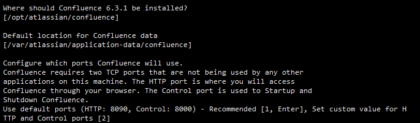

安装默认参数

此时Confluence服务器安装完成

**1.2 启动Confluence**

lsof -i:8090   #前提：已安装lsof，否则：netstat -nltcp | grep confluence #若没有显示处于listen状态，则进行以下操作 cd /opt/atlassian/confluence/bin   ./start-confluence.sh

**2. 安装MySQL**

**2.1 查看Linux系统参数，选择对应版本安装**

uname -a   cat /etc/issue rpm -qi centos-release

**2.2 下载MySQL的yum仓库**

[https://dev.mysql.com/downloads/repo/yum/](https://link.jianshu.com/?t=https://dev.mysql.com/downloads/repo/yum/)

cd /home/wqq wget https://repo.mysql.com//mysql57-community-release-el6-11.noarch.rpm rpm -Uvh mysql57-community-release-el6-11.noarch.rpm

**本节以下内容可选看，非安装必要操作**

**noarch**

[noarch](https://link.jianshu.com/?t=https://baike.baidu.com/item/noarch)是no architecture的缩写，说明这个包可以在各个不同的cpu上使用。

包有这么几种（后缀）：*.386.rpm,*.486.rpm,*.586. rpm,*.686.rpm，这是与[CPU](https://link.jianshu.com/?t=https://baike.baidu.com/item/CPU)的[指令集](https://link.jianshu.com/?t=https://baike.baidu.com/item/指令集)有关.

**默认安装版本**

默认安装最新版本，可以自定义安装的MySQL版本，编辑/etc/yum.repos.d/mysql-community.repo即可

**$releasever和$basearch**

- [$releasever](https://link.jianshu.com/?t=http://blog.csdn.net/jiangtongcn/article/details/8546303)的值,这个表示当前系统的发行版本，可以通过如下命令查看：

rpm -qi centos-release

其中的Version：6就是我们系统的版本号

- [$basearch](https://link.jianshu.com/?t=http://blog.csdn.net/jiangtongcn/article/details/8546303)是我们的系统硬件[架构](https://link.jianshu.com/?t=http://lib.csdn.net/base/architecture)(CPU指令集)就是我们常说的i386\i486\i586\i686...

使用如下命令即可：

arch

**2.3 安装MySQL**

yum install mysql-community-server groupadd mysql useradd -r -s /sbin/nologin -g mysql mysql chown -R mysql:mysql  /var/lib/mysql service mysqld status; service mysqld restart;

**2.4 修改MySQL密码**

mysql -uroot -p grant all on *.* to 'root'@'%' identified  by 'xxxxxxxx';

**3. Confluence的配置**

- 用浏览器访问[http://xxxx:8090/](https://link.jianshu.com/?t=http://xxxx:8090/)，其中xxxx为confluence服务器的IP地址
- 安装向导：[https://confluence.atlassian.com/doc/confluence-setup-guide-135691.html](https://link.jianshu.com/?t=https://confluence.atlassian.com/doc/confluence-setup-guide-135691.html)

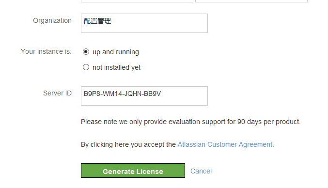

Paste_Image.png

图片中显示错误，在这里应选择*not installed yet*

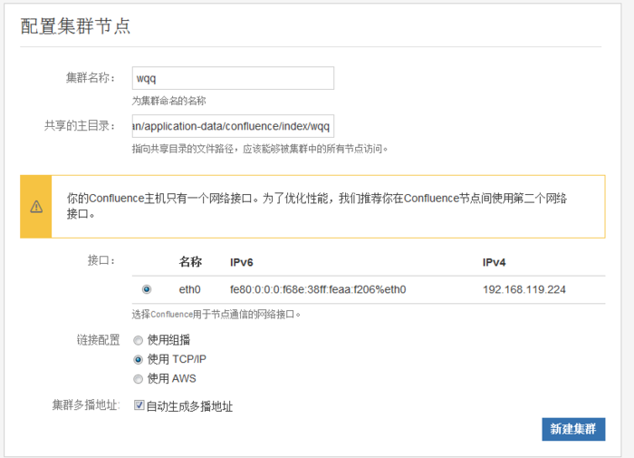

配置集群节点

cd /var/atlassian/application-data/confluence/index mkdir wqq

**为了使Confluence与MySQL相关联，需要：**

1. 安装JDBC Drivers
2. 创建数据库、管理员帐户、密码
3. 设置mysql的配置文件（/etc/my.cnf)

**3.1 JDBC Drivers的安装**

[https://confluence.atlassian.com/doc/database-jdbc-drivers-171742.html](https://link.jianshu.com/?t=https://confluence.atlassian.com/doc/database-jdbc-drivers-171742.html)

cd /home/wqq wget https://cdn.mysql.com//Downloads/Connector-J/mysql-connector-java-5.1.43.tar.gz tar -xz mysql-connector-java-5.1.43.tar.gz cd mysql-connector-java-5.1.43 mv mysql-connector-java-5.1.43-bin.jar  /opt/atlassian/confluence/confluence/WEB-INF/lib

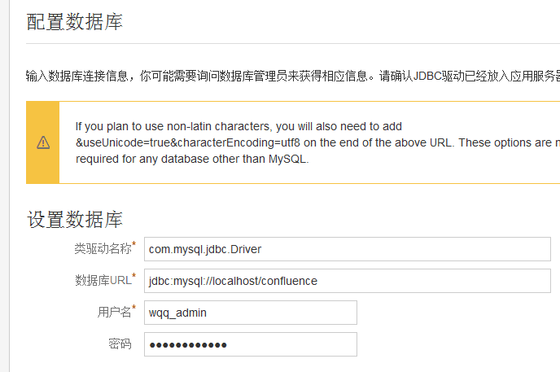

配置数据库

JDBC（Java DataBase Connectivity,java数据库连接）是一种用于执行SQL语句的Java API，可以为多种关系数据库提供统一访问，它由一组用Java语言编写的类和接口组成。JDBC提供了一种基准，据此可以构建更高级的工具和接口，使数据库开发人员能够编写数据库应用程序

**3.2 创建与Confluence关联的数据库及管理员帐户、密码**

create database wqqconfluence grant all on wqqconfluence.* to 'wqq_admin'@'%' identified  by 'xxxxxxxx'; flush privileges;  show grants for wqq_admin;

设置数据库

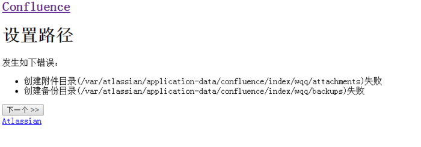

设置路径

cd /var/atlassian/application-data/confluence/index chmod 777 wqq

配置系统管理员账户

密码：xxxxxxxx

**3.3 设置MySQL的配置文件（/etc/my.cnf)**

[https://confluence.atlassian.com/doc/database-setup-for-mysql-128747.html](https://link.jianshu.com/?t=https://confluence.atlassian.com/doc/database-setup-for-mysql-128747.html)

vi /etc/my.cnf

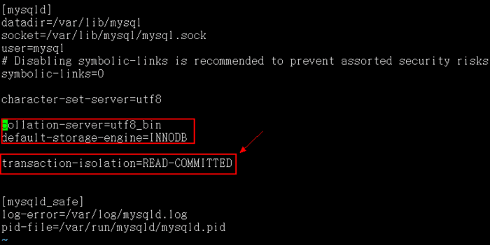

/etc/my.cnf

**4. Confluence的备份与还原**

[https://confluence.atlassian.com/doc/configuring-backups-138348.html#ConfiguringBackups-EnablingBackupPathConfiguration](https://link.jianshu.com/?t=https://confluence.atlassian.com/doc/configuring-backups-138348.html#ConfiguringBackups-EnablingBackupPathConfiguration)

**4.1 Confluence的备份路径**

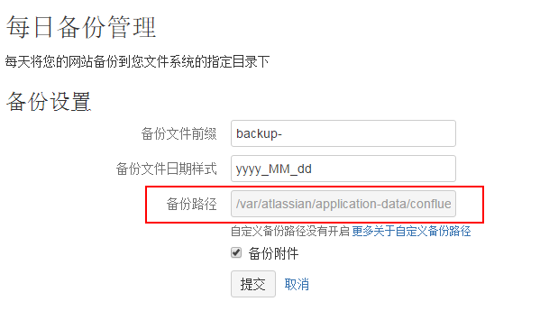

备份

备份路径默认是不可自定义的，出于安全因素，不建议更改默认备份路径，如果非要更改，参考以下操作：

cd /var/atlassian/application-data/confluence vi confluence.cfg.xml

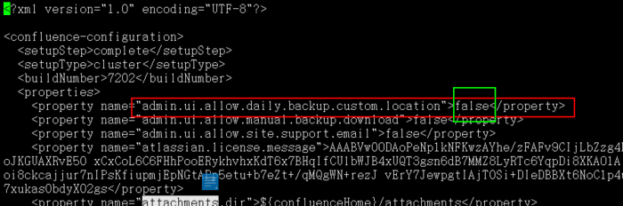

Paste_Image.png

把false改为true，管理员便可拥有自定义备份路径的权限

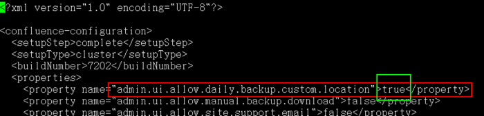

Paste_Image.png

改完配置文件，重启Confluence服务

cd /opt/atlassian/confluence cd bin ./stop-confluence.sh ./start-confluence.sh 

刷新页面，可看到已经能修改默认的备份路径

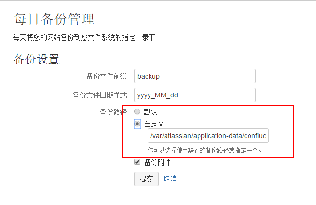

**注意：confluence.cfg.xml涉及重要信息，尽量修改一下权限**

less confluence.cfg.xml  chmod 640 confluence.cfg.xml

**4.2 Confluence的备份**

备份

- 一定要勾选备份附件，否则备份不完整
- 一定要勾选存档至备份文件，若不勾选，则不显示下面标注的第二行，只备份到temp目录下，24小时后便被删除。

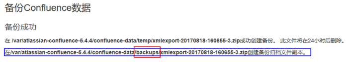

备份成功

**4.3 Confluence的还原**

把备份文件（假如为：backup-2017_08_17.zip）拷贝至指定目录（/var/atlassian-confluence-5.4.4/confluence-data/restore），索引中便会出现backup-2017_08_17.zip这个选项，点击还原即可。

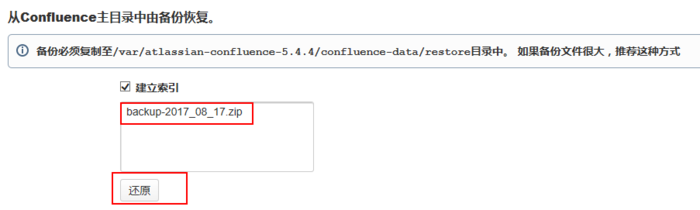

Paste_Image.png

备注：在回滚之前要编辑一些参数，否则回滚失败

/opt/atlassian/confluence/ vim bin/setenv.sh

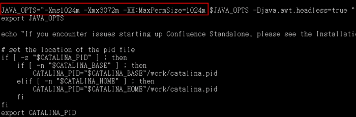

setenv.sh

备注：删除配置文件即可重新配置一个新的Confluence。

**5.汉化**

当安装的confluence为英文版时，实现汉化的过程如下：

1、 下载Confluence-5.4.4-language-pack-zh_CN.jar

下载网址： <http://pan.baidu.com/s/1qYjtsi4>

2、把Confluence-5.4.4-language-pack-zh_CN.jar复制到/opt/atlassian-confluence-5.4.4/confluence/WEB-INF/lib目录中

3、修改配置文件

  cd /var/atlassian-confluence-5.4.4/confluence-data

  vi confluence.cfg.xml

  在配置文件中添加下面标红的那句话

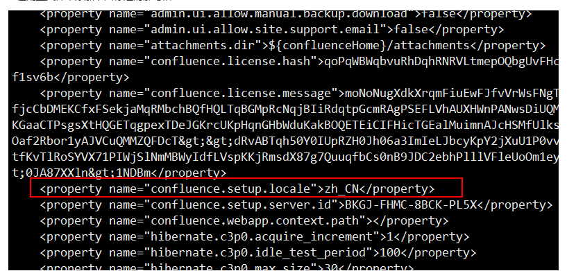

4、重启confluence服务

cd /opt/atlassian-confluence-5.4.4/bin

./stop-confluence.sh

./start-confluence.sh