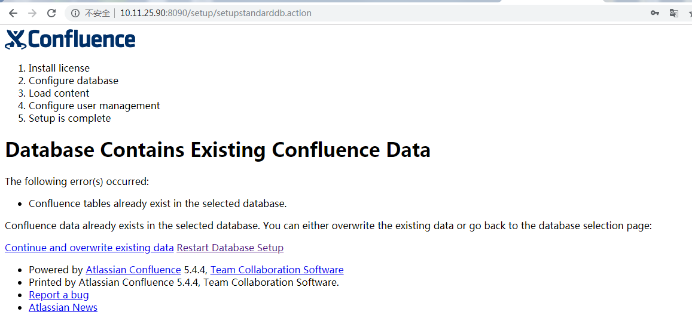

## confluence5.4.4破解版转正版+迁移教程

### 一、环境
老的生产服务器CentOS release 6.6 (Final)
新的服务器CentOS release 6.8 (Final)

### 二、创建空数据库
目标数据库服务器mysql版本(5.6.36)及配置要和生产环境保持一致
创建数据库CREATE DATABASE confluence CHARACTER SET utf8 COLLATE utf8_bin;
创建数据库用户CREATE USER 'confluence' IDENTIFIED BY 'confluence@123';
赋予权限GRANT ALL ON confluence.* TO 'confluence'@'目标confluence服务器ip' IDENTIFIED BY 'confluence@123';
更新权限FLUSH PRIVILEGES;
### 三、安装jdk1.7.0_67
将192.168.119.102机器/usr/local/jdk-7u67-linux-x64.gz复制到目标confluence服务器/usr/local目录
在目标confluence服务器切换到/usr/local目录，执行命令tar xvf jdk-7u67-linux-x64.gz
配置环境变量，执行命令vim /etc/profile
在文件最后添加以下语句
```shell
JAVA_HOME=/usr/local/jdk1.7.0_67
CLASSPATH=.:$JAVA_HOME/lib/tools.jar
PATH=$JAVA_HOME/bin:$PATH
export JAVA_HOME CLASSPATH PATH
```
保存退出，然后执行命令source /etc/profile使profile文件生效
### 四、安装正版confluence5.4.4
将atlassian-confluence-5.4.4-x64.bin上传到目标confluence服务器/opt/目录。（官网下载地址https://www.atlassian.com/software/confluence/downloads/binary/atlassian-confluence-5.4.4-x64.bin）

root用户登录目标confluence服务器，切换到/opt/目录。

执行命令./atlassian-confluence-5.4.4-x64.bin，安装过程中选择默认即可。

安装完成之后，执行停止服务命令sh /opt/atlassian/confluence/bin/stop-confluence.sh

修改confluence启动用户，执行命令vim /opt/atlassian/confluence/bin/user.sh，找到CONF_USER，将其值改为""，保存退出。

将confluence生产环境的mysql驱动拷贝到目标confluence服务器/opt/atlassian/confluence/confluence/WEB-INF/lib目录。

启动confluence服务，执行命令sh /opt/atlassian/confluence/bin/start-confluence.sh。

在浏览器中输入 目标机器ip:8090

输入购买的license key，点击生产安装。

数据库选择mysql；

点击JDBC连接，输入上述配置的数据库信息,下一步；

如果出现如图的情况，稍等一会，然后再在浏览器中键入目标ip:8090



点击Example Site

点击Manage Users and Groups within Confluence

设置管理员账号密码，下一步出现Setup Successful，即安装成功。

停止confluence服务sh /opt/atlassian/confluence/bin/stop-confluence.sh

重命名home目录mv /var/atlassian /var/atlassian_newmv

### 五、备份生产数据
切换到生产confluence机器192.168.119.102，停止服务sh /opt/atlassian-confluence-5.4.4/bin/stop-confluence.sh

备份home目录zip -r /opt/wiki_home.zip /var/atlassian/application-data/（注意：先把home目录中的备份/var/atlassian/application-data/confluence/backups移到其他地方，避免home目录过大）

切换到192.168.119.121，备份生产confluence数据库mysqldump confluence -uroot -p > /opt/confluence1103.sql

### 六、迁移
将上面备份的wiki_home.zip复制到目标confluence服务器，解压后将atlassian整个目录移至/var/目录下

将生产confluence安装目录复制到目标confluence服务器/opt/目录

将备份的sql脚本复制到目标数据库服务器/opt/目录

在目标数据库服务器上创建数据库、赋予权限并导入备份sql
``` sql
CREATE DATABASE confluence_new CHARACTER SET utf8 COLLATE utf8_bin;

GRANT ALL ON confluence_new.* TO 'confluence'@'目标confluence服务器ip' IDENTIFIED BY 'confluence@123';

FLUSH PRIVILEGES;
USE confluence_new;
```
```shell
source /opt/confluence1103.sql
```

在目标confluence服务器上删除atlassian-extras-2.4.jar（破解版的jar包）

rm -rf /opt/atlassian-confluence-5.4.4/confluence/WEB-INF/lib/atlassian-extras-2.4.jar

在目标confluence服务器上，将正版atlassian-extras-2.4.jar复制到/opt/atlassian-confluence-5.4.4/confluence/WEB-INF/lib/目录，在/opt/atlassian-confluence-5.4.4/confluence/WEB-INF/lib/目录执行命令cp /opt/atlassian/confluence/confluence/WEB-INF/lib/atlassian-extras-2.4.jar .

在目标confluence服务器上，重命名老的confluence.cfg.xml，执行以下命令

cd /var/atlassian/application-data/confluence/

mv confluence.cfg.xml confluence.cfg.xml.bak20181103

在目标confluence服务器上，将新的confluence.cfg.xml文件复制到老的home目录，执行以下命令

cp /var/atlassian_new/application-data/confluence/confluence.cfg.xml /var/atlassian/application-data/confluence/

在目标confluence服务器上，执行命令vim /var/atlassian/application-data/confluence/confluence.cfg.xml ，根据实际情况修改数据库设置（就是第五章步骤4创建的数据库），保存退出

在目标confluence服务器上,删除插件缓存（解决启动后报空指针异常的错误）
```shell
rm -rf /var/atlassian/application-data/confluence/bundled-plugins
rm -rf /var/atlassian/application-data/confluence/plugins-cache
rm -rf /var/atlassian/application-data/confluence/plugins-osgi-cache
rm -rf /var/atlassian/application-data/confluence/plugins-temp
rm -rf /var/atlassian/application-data/confluence/bundled-plugins_language
```
在目标confluence服务器上，启动confluence，sh /opt/atlassian-confluence-5.4.4/bin/start-confluence.sh
### 七、重建内容索引（可选）
有些客户在执行迁移后遇到Confluence搜索功能的问题，或者他们的{ recently-updated}宏的内容未正确更新。文件中的错误 atlassian-confluence.log 证实了这些问题。因此，为了避免这些问题，强烈建议您 在执行迁移后执行内容索引的重建，参考重建confluence内容索引

对于Confluence 5.5及以下

关闭confluence
```shell
sh /opt/atlassian-confluence-5.4.4/bin/stop-confluence.sh
```

备份<confluence-home>/index/
```shell
mv /var/atlassian/application-data/confluence/index  /var/index.bak
```

（可选）： 如果您的 INDEXQUEUEENTRIES 表非常大（10000多个条目），我们建议您删除此表的内容以缩短重建时间。

a. 首先，运行以下SQL查询以查看是否有超过10000个条目：

SELECT COUNT(entryid) FROM INDEXQUEUEENTRIES;

b. 如果是这样，请运行以下命令以删除此表的内容：

DELETE FROM INDEXQUEUEENTRIES;

启动confluence
```
sh /opt/atlassian-confluence-5.4.4/bin/start-confluence.sh
```
超级管理员登录confluence，切换到站点管理-内容索引页面，点击重新创建按钮

（可选）：如果需要，从步骤2的备份中还原以下目录：

a. * <confluence-home>/index/plugin - 这是 使用情况跟踪插件 存储使用情况统计信息的地方

b. * <confluence-home>/index/edge - 这是存储常规内容的流行度数据的地方

c. * <confluence-home>/index/questions-edge - 这是 Confluence Questions 存储流行度数据的地方

### 八、授权用户管理
从生产环境导入的数据，授权用户有1000多，超出了500授权的数量，超级管理员登录，进入站点管理-全局权限页面，取消chinaredstar、confluence-users的全局权限；

进入用户目录页面，编辑LDAP，BASE DN修改成

OU=电商零售,OU=集团,OU=Chinaredstar,DC=group,DC=redstar,DC=corp

保存后再同步LDAP

把chinaredstar组赋予全局权限

再次编辑LDAP，BASE DN修改原样，即OU=集团,OU=Chinaredstar,DC=group,DC=redstar,DC=corp

同步LDAP

wiki如果存在未知用户创建的文档，该用户再次登录下即可

### 九、修改nginx域名跳转
进入192.168.119.127

编辑wiki nginx配置，执行命令
```shell
vim /etc/nginx/conf.d/wiki.conf
```

将ip及端口号改为新服务的ip及端口号

测试nginx，执行命令
```shell
nginx -t
```

重载nginx配置，执行命令
```shell
nginx -s reload
```

