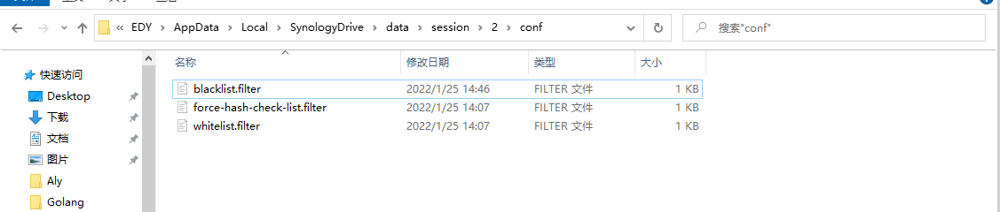
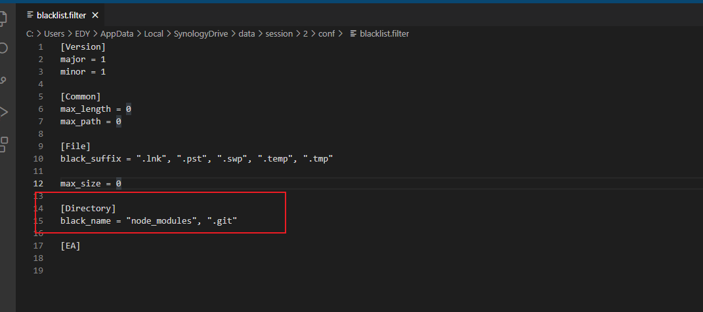

## 1. 排除目录

- window

> 进入目录 C:\Users\EDY\AppData\Local\SynologyDrive\data\session\2\conf
>
> 这边的 2 是可以变得每个同步到会话都不一样，找到要配置的同步配置  blacklist.filter
>
> 好像设置没有用



> 配置如下

```ini
[Version]
major = 1
minor = 1

[Common]
max_length = 0
max_path = 0

[File]
black_ext = "tmp", "temp", "swp", "lnk", "pst"

max_size = 0

[Directory]
black_name = "node_modules", ".git"

[EA]


```




